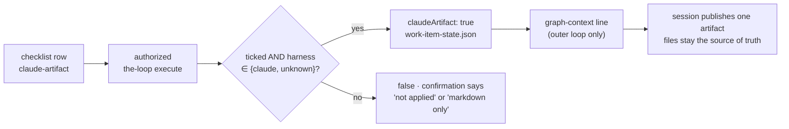

# The spec chain as one Claude artifact (issue-471): reviewer briefing

## TL;DR

A work item's spec chain is markdown files, which read poorly. Claude Code can publish a
page as a Claude artifact, and comments on it already reach the session. So
`phase-selection` now offers one more box, **`claude-artifact`**, off by default. Ticked
by an authorized `the-loop execute` on a work item that runs on the `claude` harness, it
freezes `claudeArtifact: true` into `work-item-state.json`. The session prompt then
tells the session to publish the spec chain as **one** artifact, a tab per file, and to
republish it on every change. On any other harness the tick is *not applied*, and the
confirmation says so. **The files stay the source of truth**: no gate, lock or `check`
changed. Risk tier 3.

## Where to focus

1. **`classify_phase_selection` in `graph/hooks/selection.py`.** The row is read only
   where the surface row is (`_asks_surface`), and resolved against the harness this
   item ends up on (`resolved_harness`). An unknown harness (`""`) does not rule it out;
   the session's own guard does. Check that this is the right fail direction.
2. **`CLAUDE_ARTIFACT_LINE` in `graphlink.py`.** It is the whole CLI-to-session
   contract. Rendered only in the outer-loop branch.
3. **The skill text**, `reference/workflow.md` § The spec chain as one Claude artifact.
   Its rule 5 (a comment is feedback, never a gate answer) is the security-relevant one.
4. **Skim:** the `is True` reads in `graph/state.py`, `runtime.py`, `archive.py`; the
   Slack non-phase token; the docs.

## Decisions taken without asking

| Decision | Why |
|---|---|
| The files, not the artifact, are the source of truth | Every gate locks and reads files; a hosted page is not reviewable in a pull request. |
| Freeze the *effective* value, not the raw tick | The record and the confirmation then agree; a codex item never says `true`. |
| Offer it only where the surface row is | A contribution authors one `contribution.md` on another's thread; the ad-hoc and review loops have no spec chain. |
| No new config key | The issue asks for it at phase-selection; it is a property of the work item (issue-183's argument). |
| An artifact comment never answers a gate | Its author is not checked against `routing.authorizedUsers`. |

## What it costs

- One more line in every outer-loop confirmation (`Spec artifacts: markdown files only
  (the default).`).
- Publishing quality is the session's, under the skill; no automated test can check the
  page itself.
- A Slack *Execute* press cannot tick the box, as with harness, model and effort today.
