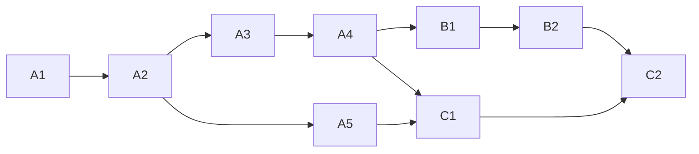

<!-- Authored per the the-loop:writing skill. -->

# Tasks: publish a work item's spec chain as one Claude artifact

## Task list

- [x] **A1: red tests.** `test_claude_artifact.py` (gate, state, runtime, prompt) and the
      Slack pin, failing before the change. *Req:* R1–R4.2 · *Test:* T1–T6.
- [x] **A2: the gate.** Token, rendering, parsing, harness resolution, confirmation,
      result data, frozen graph. *Req:* R1.1–R1.4, R2 · *Test:* T1, T2. *Deps:* A1.
- [x] **A3: the frozen record.** `WorkItemState.claude_artifact`, the runtime freeze, the
      attribute catalogue, the archive and `graph` output. *Req:* R3 · *Test:* T3, T4.
      *Deps:* A2.
- [x] **A4: the prompt.** `GraphContext.claude_artifact` and the outer-loop line.
      *Req:* R4.1, R4.2 · *Test:* T5. *Deps:* A3.
- [x] **A5: the Slack mirror.** Non-phase token. *Req:* R1.5 · *Test:* T6. *Deps:* A2.
- [x] **B1: the skill.** `SKILL.md` bullet, `reference/workflow.md` section,
      `reference/collaboration.md` surface row. *Req:* R4.3–R4.5. *Deps:* A4.
- [x] **B2: the docs.** Capability docs (`process-graph.md`, `spec-workflow.md`) with
      history rows, `docs/cli/commands/graph.md` checklist. *Deps:* B1.
- [x] **C1: verify.** Run the testing plan; record `evidence/verification.md`.
      *Test:* T7. *Deps:* A1–A5.
- [x] **C2: review and ship.** Self-review rounds, security review, documentation record,
      reviewer briefing, PR. *Test:* T8. *Deps:* B2, C1.

