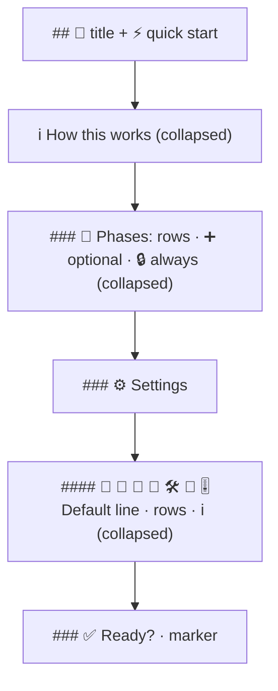

# Make the phase-selection comment easier to read (issue-472): reviewer briefing

## TL;DR

The `phase-selection` comment was about 1,000 words of bold paragraphs. It is now laid
out to be skimmed. A **quick start** comes first. **🧩 Phases** and **⚙️ Settings** are
two groups, with an emoji heading per question. Each setting states its **Default:**
before its rows. Every explanation is collapsed under `
`. The rows, and so the
reply parser and the Slack mirror, are **unchanged**. Visible text: 989 → 554 words.
Risk tier 3.

Compare the rendered [`checklist-before.md`](checklist-before.md) and
[`checklist-after.md`](checklist-after.md).

## Where to focus

1. **`_checklist_body` in `graph/hooks/selection.py`.** Read it next to
   `checklist-after.md`. Is the wording right, and is anything you rely on now
   collapsed?
2. **`_unfold` in `channels/digest.py`.** It is the only behavioural change outside the
   comment: Slack drops `
` tags and draws a `
` bold.
3. **Skim:** `_channel_lines` and `_choice_lines` (same content, new layout), the four
   updated assertions, and the docs.

## Decisions taken without asking

| Decision | Why |
|---|---|
| Rows never go inside `
` | A collapsed box is a default nobody sees. |
| The default is stated before the rows | "What happens if I leave this alone?" is the skimmer's question. |
| Question wording kept as headings | Readers, tests and the Slack control already use it. |
| Plain-text `
` | GitHub does not reliably render markdown inside it. |
| No GitHub alert blocks (`> [!TIP]`) | The Slack digest would print the marker literally. |

## What it costs

- The comment is longer in total (1,176 words), all of it behind a click.
- A pre-existing flaky test, `test_control_integration.py`, fails on base `26e4104` too
  (about 1 run in 8). It is unrelated and is recorded in `verification.md`.
