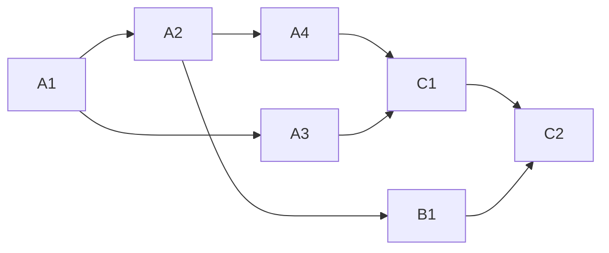

<!-- Authored per the the-loop:writing skill. -->

# Tasks: make the phase-selection comment easier to read

## Task list

- [x] **A1: red tests.** `test_selection_layout.py` (T1–T4) and the digest cases (T5),
      failing before the change. *Req:* R1–R3 · *Test:* T1–T5.
- [x] **A2: the renderer.** Rewrite `_checklist_body`, `_channel_lines` and
      `_choice_lines` to the layout; rows unchanged. *Req:* R1, R2, R3.1–R3.3 ·
      *Test:* T1–T4. *Deps:* A1.
- [x] **A3: the Slack digest.** Unfold `
` in `to_mrkdwn` and `condense`.
      *Req:* R3.4 · *Test:* T5. *Deps:* A1.
- [x] **A4: existing tests.** Update the assertions that named the old wording.
      *Test:* T6. *Deps:* A2.
- [x] **B1: the docs.** The checklist example in `docs/cli/commands/graph.md`, the
      capability doc's criterion and history row. *Deps:* A2.
- [x] **C1: verify.** Run the testing plan; commit the before and after renderings;
      record `evidence/verification.md`. *Test:* T6, T7. *Deps:* A2–A4.
- [x] **C2: review and ship.** Self-review rounds, security review, documentation
      record, reviewer briefing, PR. *Test:* T8. *Deps:* B1, C1.

