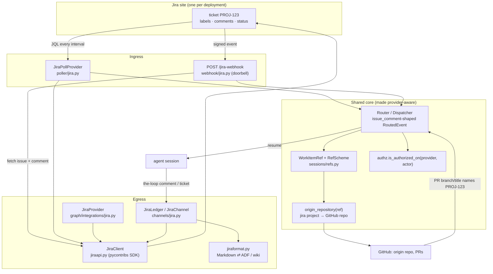
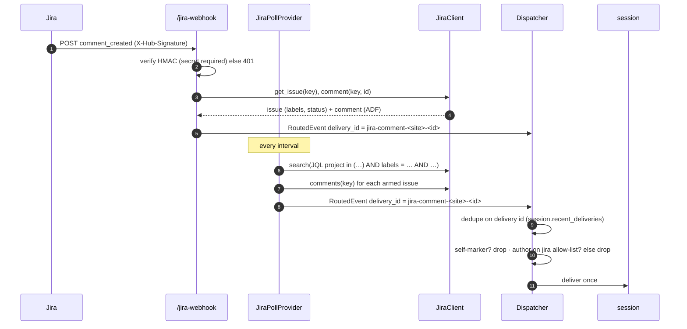
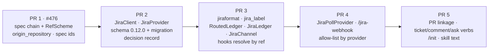

<!-- Authored per the the-loop:writing skill. -->

# Design: Jira as a first-class work-item source and update channel

> Phase 2 of 4. Derived from the approved [`requirements.md`](requirements.md). Reviewed
> together with [`testing-plan.md`](testing-plan.md) at the `design-approval` gate.

## Overview

**A Jira ticket becomes a `WorkItemRef` with its own scheme, and every GitHub-only seam is
turned into a dispatch on the ref's provider.** No new subsystem is introduced. The
extension points the issue lists — the poll-provider registry, the `Integration`
protocol, the channel and ledger registries, the room grammar — each gain a Jira row.
The places that hard-code `"github"` (13 provider checks, the `issue-<n>` spec id, six
`resolve("github", …)` calls in graph hooks, the `_github_ref` gate on the CLI verbs)
learn to ask the ref instead.

Four choices shape the rest. Each one is explained under *Trade-offs & decisions*.

1. **One Jira site per deployment, and each Jira project maps to one origin repository.**
   A Jira ticket has no repository, but its spec chain, worktree and pull requests need
   one. `integrations.jira.projects.<KEY>.repository` provides it.
2. **The Jira poll provider and webhook emit the same `issue_comment`-shaped
   `RoutedEvent` the GitHub poller already synthesises.** The router, dispatcher, control
   keywords and gate hooks then run unchanged, apart from where they read the actor's
   identity.
3. **The webhook is a doorbell.** A verified Jira delivery only names the issue and the
   comment. The receiver then fetches both through the API, so one code path (the
   poller's) parses Jira data.
4. **The pycontribs `jira` SDK on REST v3 with ADF for Cloud, REST v2 with wiki markup
   for Data Center.** A small Markdown↔ADF/wiki converter on `markdown-it-py` handles the
   body formats.

The answers to the requirements' open questions, applied as defaults until the
`design-approval` gate says otherwise:

| Question | Default taken here |
|---|---|
| Q1 — one work item or five | One work item, delivered as **five stacked PRs** (see *Delivery plan*) |
| Q2 — ref grammar | `jira:<site>/<KEY>-<n>`, e.g. `jira:acme.atlassian.net/PROJ-123` |
| Q3 — comment format | REST v3 + ADF on Cloud; REST v2 + wiki markup on Data Center, which has no v3 |

## Architecture



The diagram shows two directions. **Ingress** turns Jira activity into the event shape the
core already routes. **Egress** is every write the-loop makes to Jira: phase labels, gate
records, comments and the closing transition. All of it goes through one `JiraClient`
that holds the credential.

## Components & interfaces

The requirement map first. The sections after it go component by component, in the
order the components are delivered.

| Requirement | Component(s) | Delivered in |
|---|---|---|
| R1 ref | `sessions/refs.py` (RefScheme), `sessions/registry.py` | PR 1 |
| R2 spec id | `RefScheme.spec_id`, `graph/refs.py`, `graphlink.py`, `lifecycle/contract.py` | PR 1 |
| R3 integration | `jiraapi.py`, `graph/integrations/jira.py`, schema + migration 0.12.0 | PR 2 |
| R4 ledger/channel | `channels/jira.py`, `jiraformat.py`, `jiralabels.py`, `workchannels.py`, provider-routed hooks | PR 3 |
| R5 poll | `poller/jira.py`, `poller/daemon.py`, `poller/poller.py` (authz by provider) | PR 4 |
| R6 webhook | `webhook/jira.py`, `webhook/server.py`, `webhook/daemon.py` | PR 4 |
| R7 allow-list | `identity.py`, `authz.py`, schema | PR 4 |
| R8 linkage, verbs, init | `webhook/router.py` linkage, `core/tickets.py` dispatch, `commands/*`, `commands/init.md` | PR 5 |
| R9 decision + docs | `docs/decisions/decision-<nnn>.md`, capability docs, skill text | PRs 2–5, each with its own docs |

### C1 — `RefScheme`: per-provider ref grammar (R1, R2)

**The `WorkItemRef` dataclass keeps its five fields. What changes is that parsing,
rendering, `url`, `slug` and the spec id come from a scheme looked up by provider.** The
existing GitHub behaviour moves into a `GitHubScheme`, unchanged. A new `JiraScheme` sits
beside it. This turns the 13 `provider == "github"` checks into one table lookup.

```python
# cli/the_loop/sessions/refs.py
class RefScheme(Protocol):
    provider: str
    def parse(self, text: str) -> "WorkItemRef": ...      # raises ValueError
    def render(self, ref: "WorkItemRef") -> str: ...      # inverse of parse
    def url(self, ref: "WorkItemRef") -> str: ...         # "" when not resolvable
    def spec_id(self, ref: "WorkItemRef") -> Optional[str]: ...
    def default_host(self) -> str: ...

SCHEMES: Dict[str, RefScheme] = {"github": GitHubScheme(), "jira": JiraScheme()}
```

**The Jira mapping onto the existing fields:**

| `WorkItemRef` field | GitHub (unchanged) | Jira |
|---|---|---|
| `provider` | `github` | `jira` |
| `host` | `github.com` or a GHE host | the site, lower-cased (`acme.atlassian.net`) |
| `owner` | repository owner | project key (`PROJ`) |
| `repo` | repository name | `""` |
| `number` | issue number | issue number (`123`) |

| Derived | GitHub (unchanged) | Jira |
|---|---|---|
| `.ref` | `github:octo/repo#15` | `jira:acme.atlassian.net/PROJ-123` |
| `.slug` | `github-octo-repo-15` | `jira-acme.atlassian.net-PROJ-123` |
| `.url` | `https://github.com/octo/repo/issues/15` | `https://acme.atlassian.net/browse/PROJ-123` |
| spec id | `issue-15` | `jira-proj-123` |

- **Grammar.** `^jira:(?P<site>{_HOST_RE})/(?P<key>[A-Z][A-Z0-9_]{1,9})-(?P<n>[1-9][0-9]{0,9})$`.
  The site must be a bare hostname: no scheme, no path, no user-info. The ten-character
  key cap is Jira's own default limit. Anything else raises `ValueError` naming the
  expected form (R1.3).
- **`WorkItemRef.parse`** reads the provider prefix and delegates to its scheme. A
  `github:` ref takes exactly today's path, so the existing round-trip, slug and
  host-normalisation tests hold unchanged (R1.4).
- **Slug.** The Jira slug still ends in `-<digits>`, so `_REGISTRY_FILE_RE` and the
  workspace `_SAFE_COMPONENT_RE` accept it without change. tmux already maps `.` to `_`.
- **Spec id (R2).** It is always `jira-<key lower>-<n>`, and GitHub ids always start
  `issue-`, so the two id spaces are disjoint by prefix. A project whose key is `ISSUE`
  becomes `jira-issue-7`, never `issue-7` (R2.2). `graphlink.spec_id_for` and
  `lifecycle/contract.py:137` both call `ref.spec_id`, so there is one derivation (R2.4);
  the unconditional `f"issue-{n}"` at `contract.py:137` is removed. The inverse,
  `graph/refs.derive_ref`, recognises `jira-<key>-<n>` and rebuilds the ref from the one
  configured site.
- **GitHub-only call sites (R1.5).** The eight `WorkItemRef(provider="github", …)`
  constructors only ever build GitHub refs and stay as they are. Each shared path that
  reads `owner/repo` to mean "the repository" calls `origin_repository(ref)` (C2)
  instead. A GitHub-only verb given a Jira ref (for example `pr create --repository`)
  raises `ValueError("<ref> is a Jira work item; <verb> needs a GitHub repository")`.

### C2 — `origin_repository(ref, config)`: where a Jira item's code lives (R1, R8)

**A pure function returns the GitHub repository a work item's spec chain and PRs live in.**
For a GitHub ref that is the ref's own `host/owner/repo`. For a Jira ref it is
`integrations.jira.projects.<KEY>.repository`. A project that is not configured, a
project configured without a `repository` (a mirror-only project, C7), or a site that is
not the configured one raises `UnknownJiraProject`. That error is the fail-closed
path for abuse cases 7 and 8.

These shared paths switch from `ref.owner/ref.repo` to it:

| Site | Today | After |
|---|---|---|
| `webhook/dispatcher.py:692` `_repo_payload` | `f"{owner}/{repo}"` | `origin_repository(ref)` |
| `graphlink.py:1072` `origin_repo` for `derive_ref` | `f"{owner}/{repo}"` | `origin_repository(ref)` |
| `graphlink.py:1412` `_checkout_belongs_to` | compares owner/repo | compares `origin_repository(ref)` |
| `graphlink.py:584, 898` `link_pr(repository=…)` | owner/repo | `origin_repository(ref)` |
| `core/sessions.py:1487` control-start payload | owner/repo | `origin_repository(ref)` |
| `webhook/dispatcher.py:2023` PR endpoint ref | copies owner/repo | builds a GitHub ref in `origin_repository(ref)` |

The worktree for a Jira item is then cut from the mapped repository exactly as for a
GitHub issue, at `.worktrees/<host>/<owner>/<repo>/<jira slug>`.

### C3 — `JiraClient`: the one holder of the credential (R3)

**`cli/the_loop/jiraapi.py` mirrors `ghapi.py`.** A frozen `JiraApiConfig` is read from
`integrations.jira`, and a `JiraClient` wraps one `jira.JIRA` instance per process.

```python
@dataclass(frozen=True)
class JiraApiConfig:
    site: str                         # "acme.atlassian.net"
    deployment: str                   # "cloud" | "cloud-scoped" | "data-center"
    email_env: Tuple[str, ...]        # cloud*: env vars holding the account email
    token_env: Tuple[str, ...]        # every deployment: env vars holding the token
    cloud_id: str = ""                # cloud-scoped only
    close_transition: str = ""        # optional: a transition name to close with

    @classmethod
    def from_cli_config(cls, config: Mapping) -> "JiraApiConfig": ...
    def server(self) -> str:          # where requests go
        # cloud / data-center: https://<site>
        # cloud-scoped:        https://api.atlassian.com/ex/jira/<cloudId>
    def credentials(self) -> "JiraAuth": ...   # read at call time; raises MissingCredential
    @property
    def rest_version(self) -> str:    # "3" for cloud*, "2" for data-center
```

| Deployment | SDK construction |
|---|---|
| `cloud` | `JIRA(server=https://<site>, basic_auth=(email, token), options={"rest_api_version": "3"}, get_server_info=False)` |
| `cloud-scoped` | same, with `server=https://api.atlassian.com/ex/jira/<cloudId>` |
| `data-center` | `JIRA(server=https://<site>, token_auth=pat, options={"rest_api_version": "2"}, get_server_info=False)` |

`JiraClient` exposes only what the-loop uses, with plain return types:

- `get_issue(key) -> JiraIssue`. The result carries `key`, `labels`, `status_category`,
  `summary`, `description_md` and `moved_to` (set when Jira redirected a moved key).
- `labels(key)`, `set_labels(key, labels)`, `remove_label(key, label)`
- `comments(key) -> List[JiraComment]`. Each comment carries `id`, `author_id`,
  `body_md`, `created`, `url` and `is_self`.
- `add_comment(key, markdown) -> JiraComment`
- `transitions(key)`, `transition(key, transition_id)`
- `search(jql, fields) -> Iterator[JiraIssue]`, built on `enhanced_search_issues`
  (`/rest/api/3/search/jql`) for Cloud and `search_issues` for Data Center. Paginated.
- `create_issue(project, summary, description_md, labels) -> JiraIssue`
- `myself() -> str`, which returns the bot's own account id. It is cached and used for
  the self-author check.

The client also does four housekeeping jobs:

- It converts bodies through `jiraformat` (C6) for its deployment's REST version.
- It maps the SDK's `JIRAError` to `JiraApiError(status, message)`, with any
  `Authorization` header and the email removed from the message.
- It installs a logging filter on the SDK's logger that redacts `Authorization` and
  `basic_auth`.
- It reads credentials at call time, as `GitHubApiConfig.token()` does, so rotating a
  token takes effect without a restart.

### C4 — `JiraProvider`: the control-plane integration (R3)

**`graph/integrations/jira.py` implements `Integration` over `JiraClient`.** `resolve()`
gains a `jira` branch before its final `raise`, and also refuses a `cli` transport with
the same retirement message GitHub's branch uses.

```python
OPERATIONS = frozenset({"add-comment", "set-labels", "create-label", "remove-label",
                        "get-labels", "list-comments", "get-thread", "transition"})
```

| Op | Jira behaviour | Return (same shape as GitHub's) |
|---|---|---|
| `add-comment` | `add_comment(key, body)`, with the Jira self-marker added | `{"result": {"html_url": <comment permalink>}}` |
| `set-labels` | merges into the existing labels after `jira_label()` | `{"result": "ok"}` |
| `create-label` | no-op: Jira creates labels on first use (R3.1) | `{"result": "exists", "note": "jira creates labels on use"}` |
| `remove-label` | removes `jira_label(label)` | `{"result": "ok" \| "absent"}` |
| `get-labels` | | `{"labels": [...]}` |
| `list-comments` | each comment as `{id, body, author:{login: accountId}, user:{login}, created_at, createdAt, html_url, url}` | `{"comments": [...]}` |
| `get-thread` | always an issue | `{"kind": "issue"}` |
| `transition` | `to="done"` picks the configured `close_transition`, else the single available transition whose target is in status category `done`; **zero or several candidates → `IntegrationError` listing them** (R3.7) | `{"result": "ok", "transition": name}` |

**Hooks pick the integration by the ref, not by name.** A helper
`integration_for(ctx.work_item, config)` replaces each `resolve("github", ctx.config)` in
`sideeffects.py`, `selection.py`, `goal.py`, `review.py`, `runtime.py` and
`channels/inbound.py`. It calls `resolve(WorkItemRef.parse(ref).provider, config)`.
Tests keep patching `the_loop.graph.integrations.resolve`.

**Closing a ticket (`finish-tasks`, `ticket close`)** calls `transition(to="done")` for a
Jira ref. `close_ticket` dispatches through C9.

### C5 — Jira-safe labels (R4.4)

**`jiralabels.jira_label(name)` is a pure, deterministic mapping, and it is applied only
at the Jira boundary.** Config and state keep the configured names.

```text
1. strip
2. ":" followed by whitespace  →  ":"          ("the-loop: auto-execute" → "the-loop:auto-execute")
3. any other run of whitespace →  "-"
4. result empty, longer than 255 chars, or still containing whitespace → ConfigError
```

| Configured | On Jira |
|---|---|
| `the-loop: auto-execute` | `the-loop:auto-execute` |
| `the-loop: rr` | `the-loop:rr` |
| `loop:design` | `loop:design` (already safe) |

The mapping is applied in four places:

- the `JiraProvider` label operations;
- the JQL the poller builds;
- the labeled check on inbound Jira events;
- config validation, which rejects a label with no safe form at load (R4.4).

The capability doc and the `/init` Jira step print the mapping table.

### C6 — `jiraformat`: Markdown → ADF / wiki, and back (R4.5, R4.6, R5.5)

**One module converts both ways, built on `markdown-it-py` tokens.** It covers the subset
`render()`, the PR briefing and the checklist actually use.

| Markdown | ADF (v3) | Wiki (v2) |
|---|---|---|
| `#`…`######` | `heading{level}` | `h1.`…`h6.` |
| paragraphs, `**b**`, `_i_`, `` `code` `` | `paragraph` + `strong`/`em`/`code` marks | `*b*`, `_i_`, `{{code}}` |
| `[t](u)` | `link` mark | `[t\|u]` |
| `-`/`1.` lists | `bulletList`/`orderedList` | `*` / `#` |
| `- [ ]` / `- [x]` | `taskList` / `taskItem{state: TODO\|DONE}` | `* (/)` / `* (x)` |
| fenced code | `codeBlock{language}` | `{code:lang}…{code}` |
| tables | `table`/`tableRow`/`tableHeader`/`tableCell` | `\|\|h\|\|` / `\|c\|` |
| `> quote` | `blockquote` | `{quote}` |
| `<details>`, HTML comments, raw HTML | dropped; `<summary>` text kept as a bold paragraph | same |

- **The phase-selection checklist becomes real Jira checkboxes.** `- [ ]` renders as an
  ADF `taskList`, so a Jira user ticks boxes in place. The reverse converter
  (`adf_to_markdown`) turns `taskItem{state: DONE}` back into `- [x] token`. As a
  result, `selection.py`'s `_CHECK_LINE` parser reads a Jira checklist unchanged
  (R5.5).
- **Inbound bodies** (comments, the ticket description) go through `adf_to_markdown`
  (Cloud) or `wiki_to_markdown` (DC), which is the body the router and the gate hooks see.
- **The Jira self-marker (R4.6).** The HTML comment `<!-- the-loop:agent-comment -->`
  does not survive ADF, so Jira gets a **visible** sentinel. The attribution line
  becomes `🤖 the-loop, autonomous comment · [the-loop:agent-comment]`. The constant
  `JIRA_SELF_MARKER = "[the-loop:agent-comment]"` lives in `authz.py`, and
  `is_self_authored(body)` matches either marker. The author check backs it up:
  `JiraComment.is_self` is true when the comment's `author_id == client.myself()`. The
  ingress drops a comment if either test holds.

### C7 — Jira ledger and Jira channel (R4.1–R4.3)

**The ledger becomes provider-routed.** `load_ledger` stops ignoring its config and
returns a `RoutedLedger` that records each event on the tracker of that event's work item:

```python
class RoutedLedger:            # channels/base.py
    name = "ticket"
    def __init__(self, ledgers: Mapping[str, Ledger], default: str): ...
    def record(self, event):   # provider of event.work_item; `default` for work-item.create
```

- `ledgers` holds `github` → `GitHubLedger` always, and `jira` → `JiraLedger` when
  `integrations.jira` is configured.
- `channels.ledger` (enum `github | jira`) now has one meaning: which tracker
  `work-item.create` opens tickets in. Everything else follows the ref, so a PR event
  still goes to GitHub and a Jira work item's events go to its ticket.
- R4.1 is satisfied by this reading. "Recorded as the GitHub ledger records it on the
  issue" holds per ref. The alternative, sending even GitHub PR events to Jira, has no
  ticket to write to.

**`JiraLedger` (`channels/jira.py`) reuses `GitHubLedger`'s body selection.** The
event-type → body logic (`ask_body`, `relay_body`, `mirror_body`, `stamp`) is extracted
to `channels/bodies.py`, and both ledgers call it. `JiraLedger` then converts the body
with C6 and posts it through `JiraClient.add_comment`, carrying the Jira self-marker.
`work-item.create` with `channels.ledger: jira` calls `create_issue` in
`detail["project"]`.

**`JiraChannel` is a subscriber channel addressed by the room grammar (R4.2).** It is
loaded by `_load_jira` in `CHANNEL_PROVIDERS` when `channels.jira.enabled`, and it
honours `subscribe` and `verbosity` like Slack. It has no `publish` list, because it takes
no input (see below). `workchannels.CHANNEL_TYPES`
gains a row: `"jira": (re.compile(r"^[A-Z][A-Z0-9_]{1,9}-[1-9][0-9]{0,9}$"), "a Jira
issue key, e.g. PROJ-123")`. The key cannot contain `/` or `@`, so it fits the existing
target regex. `JiraChannel.post` comments on the declared room ticket. The room must be
in a project listed under `integrations.jira.projects`, with or without a `repository`.
That list is the allow-list of where the-loop may write.

**Mirror-only setup (PR #476 review).** A GitHub-ticketed work item can mirror its
progress into a Jira ticket, the way it mirrors into Slack, with no Jira ingress,
ledger or work-item support configured. It needs only three things:

- the credential part of `integrations.jira` (site, deployment, `api`);
- the room's project listed under `projects`, **without** a `repository`;
- `channels.jira.enabled: true` with a `subscribe` list, for example `[work-item.started,
  phase.started, phase.completed, session.awaiting_input, work-item.closed]`.

An authorized user then declares the room on the work item with `the-loop add-channel
jira@PROJ-123`. It differs from Slack in two deliberate ways:

- **No central fallback.** A work item with no declared `jira@` room is not mirrored,
  because Jira has no counterpart to `channels.slack.channel`.
- **Output only.** `JiraChannel` is not `Conversational`. It mirrors, opens no thread,
  and nothing written on the mirror ticket reaches the session. Jira as an *input* is
  the separate path in which the work item itself is a Jira ticket (C8).

**Phase label (R4.3).** `set-phase-label` is unchanged. Through C4 it now runs against
Jira for a Jira ref, removing stale `loop:*` labels and setting the one current label.

### C8 — Ingress: poll provider, webhook doorbell, allow-list (R5, R6, R7)



**`JiraPollProvider` (`poller/jira.py`, `name = "jira"`) implements `PollProvider`.**

- **Scopes are project keys.** They come from `polling.sources[].projects`, each of which
  must also appear under `integrations.jira.projects` **with** a `repository`. Polling a
  mirror-only project is a config error. The schema's `provider` enum gains `jira`.
- **`from_source(source, *, default_labels, config)`.** The GitHub-typed `api` keyword
  becomes optional, and a `config` keyword carries the full CLI config. The GitHub
  provider ignores `config`, and `poller/daemon.py:_build_providers` passes both.
- **`listing()`** runs one JQL query per scope:
  `project = "PROJ" AND labels = "the-loop:auto-execute" AND statusCategory != Done ORDER BY updated DESC`,
  with one `labels = "…"` clause per auto-execute label (R5.2, issue-381). Every value
  goes through `jql_string(v)`, which wraps it in `"` and escapes `\` and `"`. Keys and
  labels are also grammar-checked at config load, so the quoting is a second line of
  defence.
- **`list_comments(item)`** returns every comment, with no cursor, the same as GitHub:
  the poll ledger's `seenComments` set is the cursor. That gives the same at-most-once /
  retry semantics, and keeps the cursor across rate-limit back-off (R5.6).
- **`comment_event`** builds the poller's existing `issue_comment`-shaped payload:
  - `comment.id`, `comment.body` (the Markdown projection from C6),
    `comment.user.login = accountId`, `comment.html_url`;
  - `issue.number`, `issue.title`, `issue.labels`, `issue.html_url`;
  - a top-level `"x-the-loop-provider": "jira"`;
  - `delivery_id = f"jira-comment-{site}-{comment.id}"`.

  `work_items` is the Jira ref itself, so the router never calls the GitHub
  `extract_work_items` on it.
- **`presence_event`** marks an issue armed when it carries every label. **`owns(ref)`**
  is true for `jira:` refs on the configured site.
- **`closure(ref)`** returns `Closure(state="closed", reason=status.name)` when the
  status category is `done` (R5.4).
- **Rate limits.** A 429 or 5xx raises `ProviderError`, which marks the scope degraded
  for that cycle. The poller's existing back-off and `REPROBE_EVERY_CYCLES` handle the
  rest. The `Retry-After` header is honoured by the SDK's `max_retries` (set to 2).

**Webhook doorbell (`webhook/jira.py`) (R6).**

- `webhook/server.py` gains a second POST route, `/jira-webhook`. It is registered
  **only** when `integrations.jira.webhook.secretEnv` resolves to a non-empty secret;
  without one the path returns 404 (abuse case 2).
- The handler reads `X-Hub-Signature`, calls the existing `verify_signature(secret, body,
  header)` and treats anything but `True` as 401, before `json.loads` (R6.2, abuse
  case 1).
- It then reads only `webhookEvent`, `issue.key` and `comment.id` from the body. Every
  other field is ignored, and both objects are re-fetched through `JiraClient`.

| `webhookEvent` | What the doorbell does |
|---|---|
| `comment_created` | fetch the comment and its issue, then emit the same event as the poller's `comment_event` (R6.3) |
| `jira:issue_updated` | fetch the issue; emit `presence_event` if it is now armed, or `closure_event` if its status category is `done` |
| anything else | 202, ignored, logged at debug |

- **Duplicates (R6.4).** Both ingresses use the delivery id `jira-comment-<site>-<id>`,
  and `session.recent_deliveries` is persisted in the registry and shared by both
  processes. A comment seen twice is therefore settled once. The webhook-delivery GUID
  (`X-Atlassian-Webhook-Identifier`) is logged, not used as the key.

**Allow-list (R7).**

- `identity.parse_authorized_users` already keeps unknown keys as channels, so
  `{name: …, jira: "<accountId>"}` parses today. The schema adds an explicit `jira`
  property: a string or a list of strings, holding the Cloud `accountId` or the DC user
  `key`.
- `authz` gains `is_authorized_on(provider, actor, principals)`, which matches the exact
  id against `ids_for(principals, provider)`. A missing actor is **not** authorized for
  `jira`: the GitHub "no actor means CI" exemption does not carry over (R7.2, R7.3).
- The poller and the dispatcher read the provider from the work item's ref and call it.
  `RoutingConfig` keeps `principals` (it already does) so the Jira ids are available.

### C9 — Linkage, CLI verbs, onboarding (R8)

**PR → Jira linkage (R8.1).** `linked_work_item_sources` gains a fourth source,
`SOURCE_JIRA_KEY`. It applies only when `integrations.jira` is configured, and finds
`\b([A-Z][A-Z0-9_]{1,9})-([1-9][0-9]{0,9})\b` in the PR's head branch and title (not
its body). A match yields a candidate Jira ref only if all three hold:

1. the key is a configured project;
2. that project's `origin_repository` is **this PR's repository**;
3. the ref is **registered** in the session registry.

Unregistered or cross-repository matches are dropped and logged at debug (abuse case
7). `linkage.WorkItemVerifier.is_missing` keeps returning `False` for Jira, because the
registration check above already did that work.

**Verbs (R8.2).** `core/github_ops.py`'s `_github_ref` gate becomes
`core/tickets.py:tracker_for(ref)`. It returns `GitHubTickets` (today's functions, moved)
or `JiraTickets`:

| Verb | Jira behaviour |
|---|---|
| `ticket show <jira ref>` | issue fields + comments as Markdown, same JSON shape |
| `ticket create --project PROJ` | `create_issue`. `--repository` stays GitHub-only; the two flags are exclusive |
| `ticket close <jira ref>` | `transition(to="done")` |
| `comment --work-item <jira ref>` | publishes through the bus; `RoutedLedger` records it on Jira |
| `ask --work-item <jira ref>` | same, as `session.awaiting_input` |

The service routes (`/work-items/*`) and MCP tools pass the ref through to the same
facade, so they work with no route changes. **`pr create --work-item <jira ref>`**
opens the PR in `origin_repository(ref)` and records it against the Jira work item.

**Skill and commands (R8.3, R9.3).**

- `work-on.md`, `create-ticket.md`, `finish-tasks.md` and `reference/automation.md`
  replace the "register against the PR's ref" workaround with the normal flow on the
  `jira:` ref.
- The MCP path stays documented as the fallback when the CLI is absent.

**`/init` (R8.4).** A Jira group is added to `commands/init.md` and
`reference/onboarding.md`. It asks for:

- the site and the deployment kind;
- the env-var names for the email and token, plus the cloud id when scoped;
- the projects and the repository each maps to;
- the webhook secret env var.

It also prints the Jira-safe label table and creates no labels, because Jira creates
them on use. Credentials are named by environment variable only.

## UI/UX design

N/A. This is control-plane and CLI work with no user-facing visual surface. The only
"UI" is Jira's own rendering of the comments the-loop posts, which C6's conversion
table governs and the testing plan checks with rendered snapshots.

## Data models

**Ref grammar.** `jira:<site>/<KEY>-<n>`. The field mapping is in C1.

**Config: `integrations.jira` (replacing the 0.11 stub), schema version `0.12.0`.**

```yaml
integrations:
  jira:
    site: acme.atlassian.net          # bare host; required
    deployment: cloud                 # cloud | cloud-scoped | data-center; required
    cloudId: ""                       # required when deployment = cloud-scoped
    api:
      emailEnv: [JIRA_EMAIL]          # cloud*: required; names env vars, never values
      tokenEnv: [JIRA_API_TOKEN]      # required
    projects:                         # required, ≥1; key grammar ^[A-Z][A-Z0-9_]{1,9}$
      PROJ: {repository: acme/web}    # origin repository (owner/repo, on integrations.github.host)
      OPS: {}                         # no repository: mirror-only — a jira@ room, never a work-item source
    closeTransition: ""               # optional transition name for ticket close
    webhook:
      secretEnv: THE_LOOP_JIRA_WEBHOOK_SECRET   # optional; route served only when it resolves
polling:
  sources:
    - provider: jira
      projects: [PROJ]                # each must be under integrations.jira.projects, with a repository
channels:
  ledger: github                      # github | jira — the tracker work-item.create opens in
  jira:
    enabled: false
    subscribe: [...]                  # as channels.slack.subscribe
    verbosity: normal                 # no `publish`: the Jira channel takes no input
routing:
  authorizedUsers:
    - {name: Ada, github: ada, jira: "5b10ac8d82e05b22cc7d4ef5"}
```

**Schema guard rails.** All of these are expressed in JSON Schema, so the config load path (`cli_config.py`) and the
`validate-the-loop-config` pre-commit hook enforce them:

- `emailEnv` and `tokenEnv` items match `^[A-Z_][A-Z0-9_]*$`. A value shaped like a
  token or an email fails the pattern (R3.5).
- `site` matches the host pattern.
- `deployment: cloud-scoped` requires `cloudId` (`if`/`then`).
- `transport` and `cli` are **not** properties of the new block.

**Migration `0.11.0 → 0.12.0` (`migrations._migrate_jira_stub`).**

- It drops `integrations.jira.transport` and `.cli`, with a move note naming the
  replacement (R3.6).
- It turns a string `api.tokenEnv` into a one-item list.
- A legacy `api.baseUrl` becomes `site` (scheme and path stripped) and `deployment:
  cloud`.
- `needs_migration` flags any of these keys, so `assert_current` refuses an old Jira
  stub with the `the-loop migrate-config` hint.
- A config with no `integrations.jira` migrates with no Jira changes.

**State.**

- No new state files. A Jira work item's registry entry, portable state and poll-ledger
  record are keyed by its ref and slug, exactly like a GitHub one.
- `Session.to_dict` keeps writing `{ref, provider, owner, repo, number}`. For Jira,
  `owner` is the project key and `repo` is `""`.
- `from_dict` already rebuilds from `ref` only.

## Error handling

| Failure | Response | Surfaced as |
|---|---|---|
| Jira configured but a credential env var empty | `resolve("jira")` raises `TransportUnavailable("jira: JIRA_API_TOKEN is not set …")`. Jira refs are refused by the verbs and the poller source is skipped | the error on the verb; one `poller.source_unavailable` log per cycle; `the-loop doctor` reports it (a Jira check is added there) |
| Ref on an unconfigured site or project | `UnknownJiraProject`; nothing is sent | verb error; dropped ingress logged at warning with the key, never the token |
| 401/403 from Jira | `JiraApiError(status)`. The poller scope is degraded; hooks return `block` with the reason | `poller.scope_failed`; the gate's block message |
| 404 on a key, or a moved key (`moved_to` set) | the verb fails naming both keys. On registration of a moved key, refuse to open a second spec folder and report both paths (R2.3) | verb error, warning log |
| 429 / 5xx | the SDK retries twice, then `ProviderError`; the scope is degraded for the cycle and the cursor is kept | `poller.scope_degraded` |
| `transition(done)` with 0 or >1 candidates | `IntegrationError` listing the available transitions; no transition is made | `ticket close` error; `finish-tasks` escalates on the ticket |
| Webhook signature missing/invalid | 401, body not parsed | warning log with the remote address, no body |
| Webhook for an unarmed or unknown issue | 202, ignored | debug log |
| ADF node the converter does not know | rendered as its plain text, plus a debug log naming the node type | debug log; nothing dropped silently |
| Label with no Jira-safe form | config load fails naming the label | config load / startup error |

Logging uses the module loggers the GitHub paths use, with the same levels and field
names (`work_item`, `provider`, `scope`, `delivery_id`). The SDK logger gets the
redaction filter (C3), so dev-time and runtime logs are identical and token-free.

## Security design

**The six trust boundaries from the requirements, and how each is enforced:**

| # | Boundary | Enforcement |
|---|---|---|
| 1 | Jira webhook → receiver | The route exists only with a secret. HMAC-SHA256 is checked over the raw body with `hmac.compare_digest` before parsing. Only `webhookEvent`, `issue.key` and `comment.id` are read; everything else is re-fetched with the daemon's credential, so a forged-but-signed body cannot inject content or identity |
| 2 | Jira API data → router | The author id comes from the API, not the body. Allow-list match is on the exact `accountId`/DC `key` through `is_authorized_on("jira", …)`. A missing author is unauthorized. Self-authored comments (marker or `author_id == myself`) are dropped before authorization |
| 3 | Ticket/comment text → prompt | Unchanged mechanism: event text enters the prompt inside the existing "UNTRUSTED data" frame, the same as GitHub. `mirror_body` (shared via `channels/bodies.py`) scrubs, defangs keywords and strips HTML when relaying |
| 4 | Config → JQL | Keys are checked against `^[A-Z][A-Z0-9_]{1,9}$` and labels against the Jira-safe form at load. Every JQL value is emitted through `jql_string()` quoting. No ticket-supplied value is ever placed in JQL |
| 5 | PR title/branch → linkage | A Jira key binds only to a **registered** work item whose project maps to **this PR's repository**. The PR body is not scanned. Unbound matches are dropped |
| 6 | Secrets | Named by env var only, with the schema pattern rejecting literal values. They are read at call time, sent only to `JiraApiConfig.server()` (the configured site or the Atlassian gateway), never logged (SDK logger filter, error message scrubbing), and never written to state |

- **AuthN/AuthZ.** Inbound: the HMAC on the webhook, then the allow-list on every comment;
  control keywords and gate answers follow the dispatcher's existing named-actor
  re-check. Outbound: the Jira service account's own token.
- **Least privilege.** The setup guidance requires a **dedicated service account**. For
  `cloud-scoped`, it lists the minimum scopes:
  - `read:jira-work` and `write:jira-work`;
  - `read:jira-user`, only to resolve `myself`.

  Data Center gets a PAT on the same account. No admin scope is needed: the webhook is
  registered by a Jira admin by hand, not by the-loop.
- **Fail closed.**
  - Partial credentials → no Jira integration, so Jira refs are refused.
  - Unknown site or project → refused before any request.
  - Unauthorized or missing author → no action.
  - Ambiguous transition → no transition.
  - No webhook secret → no route.
- **Abuse-case coverage** (the testing plan holds each as a negative test):

| Abuse case | Mechanism | Negative test |
|---|---|---|
| 1 unsigned/invalid webhook | HMAC before parse | `test_jira_webhook_rejects_bad_signature` |
| 2 no secret | route not registered | `test_jira_webhook_absent_without_secret` |
| 3 unlisted author | `is_authorized_on("jira")` | `test_jira_comment_from_unlisted_author_is_ignored` |
| 4 self marker | `is_self_authored` + `author_id == myself` | `test_jira_self_comment_never_resumes` |
| 5 unauthorized arming | arming still needs an authorized `the-loop start` (unchanged control flow) | `test_jira_label_alone_does_not_start` |
| 6 JQL injection | load-time grammar + `jql_string` | `test_jql_values_are_quoted`, `test_invalid_project_key_fails_config` |
| 7 PR names unregistered key | linkage registration + repository check | `test_pr_naming_unregistered_jira_key_does_not_link` |
| 8 unconfigured site | `UnknownJiraProject` before any request | `test_ref_on_unknown_site_sends_no_credential` |
| 9 token in logs | redaction filter + scrubbed errors | `test_jira_errors_and_logs_carry_no_secret` |
| 10 untrusted text in prompt | existing untrusted frame | `test_jira_comment_is_framed_untrusted` |

## Testing strategy

Every component is test-first against an **injected fake**, mirroring
`tests/ghfakes.py`. A `FakeJiraClient` subclasses `JiraClient`, overrides each method and
records calls, so no test touches a network.

- **Contract.** `JiraProvider(client=FakeJiraClient())` joins `ALL_PROVIDERS` in
  `test_integration_contract.py` (R3.3).
- **Unit tests** cover: ref parse, render and round-trip, and the GitHub regression set
  (R1, R2); `jira_label`; the converter, as golden-file tests over the real `render()`
  output, the PR briefing template and the checklist; JQL building; migration 0.12.0;
  schema patterns.
- **Integration tests** carry Gherkin docstrings under `cli/tests/test_*_integration.py`.
  Their scenarios:
  - *Scenario: an authorized Jira comment resumes the work item's session*
  - *Scenario: the same Jira comment by webhook and by poll is delivered once*
  - *Scenario: a Jira phase-selection checklist ticked in place is read at execute*
  - *Scenario: a PR naming a registered Jira key routes to the Jira work item*
  - *Scenario: finish-tasks transitions the Jira ticket to Done*
- **Abuse cases.** The ten above are negative tests.
- **Manual verification against a real Jira Cloud sandbox site.** It runs only if the
  operator provides one (credentials by reference). It covers what fakes cannot prove:
  ADF rendering, the `/search/jql` endpoint, webhook signing and the `myself` id.

The executable detail is in [`testing-plan.md`](testing-plan.md).

## Delivery plan

**Five stacked PRs, each a reviewable unit, merged in order into `main`.** Each one is
recorded against #475 with `the-loop pr create --work-item`. PR #476 carries this spec
chain and step 1.



- **Each PR stands on its own.** It is behind configuration, so with no
  `integrations.jira` block every PR is a no-op for a GitHub-only deployment.
- **Each PR updates its capability docs.** PR 1 covers work-item refs, PR 2
  integrations, PR 3 channels, PR 4 webhook triggers and polling, and PR 5 the CLI and
  onboarding.
- **PR 1 is a pure refactor plus the Jira scheme.** It can be reviewed against the
  "no GitHub regression" rule alone.

## Trade-offs & decisions

1. **pycontribs `jira` over thin REST, superseding decision-042 point 13.**
   - *Why the SDK:* it already handles three auth modes (Basic, Bearer PAT, and the
     scoped-token gateway), pagination, both `/search` and the Cloud
     `/search/jql` endpoint, transitions and retries. Thin REST would rebuild these by
     hand, as `ghapi.py` once did before decision-139 moved GitHub onto PyGithub.
   - *What it costs:* `jira==3.10.x` is pure Python. Over today's lock it adds
     `defusedxml`, `oauthlib`, `requests-oauthlib` and `requests-toolbelt`; `requests`
     is already present through PyGithub. It is a plain `dependencies` entry.
   - The new decision record (R3.8, R9.1) lands in PR 2.
2. **`markdown-it-py` for the converter.** The alternative is a regex converter: fewer
   dependencies, and wrong on nested lists and tables. `markdown-it-py` is the
   CommonMark reference port for Python, pure Python, with one dependency (`mdurl`).
   Minimalism ladder: no stdlib Markdown parser exists, and no current dependency
   parses Markdown.
3. **One Jira site per deployment.** Multi-site would put a site into every allow-list
   entry, every project map and every spec id, and nothing in the requirements needs
   it. The ref still names its site, so lifting this later breaks no ref, and a ref on
   another site fails closed today.
4. **Jira projects map to origin repositories in config, not in the ticket.** A ticket
   field, such as a component or custom field, is writable by any Jira user, and it
   would let them pick which repository a session checks out (boundary 5/6).
5. **The webhook re-fetches everything.** It costs two API calls per event, and buys a
   single parser and a body nobody outside the-loop's credential can shape.
6. **A visible self-marker on Jira.** A Jira comment cannot hide text. Entity properties
   could, but the webhook payload does not carry them, so every comment would need a
   fetch with `expand=properties`. The visible sentinel plus the `myself` author check
   is two independent tests, and either one suffices.
7. **Stricter than GitHub on two points:** there is no secret-less webhook, and a missing
   author is unauthorized. These are deliberate. Bringing GitHub's behaviour to match is
   out of scope; a follow-up issue will be proposed.

## Open questions

- **Q4. One Jira site per deployment.** Is this acceptable for now (decision 3)? If you
  need several sites, say so at this gate. It changes the allow-list and project-map
  shapes, not the ref.
- Q1–Q3 are answered by the defaults in *Overview* unless this gate overturns them.

## Review comments

> Appended by the-loop's `record-feedback` hook when a human gate approves with
> comments (issue-109). Append-only and attributed: an approval never silently
> discards a reviewer's suggestions, and the feedback travels with the document
> it concerns rather than living in a side-channel tracker.
