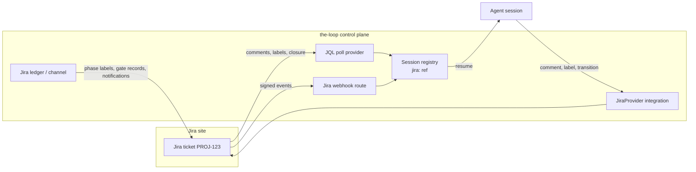

<!-- Authored per the the-loop:writing skill. -->

# Requirements: Jira as a first-class work-item source and update channel

> Phase 1 of 4 (requirements → design → testing plan → tasks). Tier 4
> (`human-approves-pr`, plus a named human security sign-off): the change adds a third-party
> credential, an inbound webhook route, a second identity grammar for the session registry,
> and edits `cli-config.schema.json`.

## Introduction

[Issue #475](https://github.com/MadaraUchiha-314/the-loop/issues/475): "Jira support: make
Jira a first-class work-item source and update channel."

**What is broken.** the-loop can work a Jira ticket only inside an agent session, through
whatever Jira tool the harness happens to have (an Atlassian MCP server, say). The control
plane — CLI, daemon, poller, webhook receiver, channel bus — knows only GitHub:

- a Jira ticket cannot be named as a work item (`jira:` is reserved and does not parse);
- a comment on a Jira ticket never resumes a session — today's workaround registers the
  session against the **PR** instead, so anything said on the ticket is invisible;
- phase labels, gate records and notifications never reach the ticket.

The extension points were built for this: `PollProvider`, the `Integration` protocol, the
`Channel` and `Ledger` protocols and the `<type>@<target>` room grammar are all
provider-agnostic, and an `integrations.jira` config block already exists in the schema. The
gaps G1–G9 in the issue are where each seam stops short.

**What this changes.** A Jira ticket becomes a work item on equal terms with a GitHub issue,
end to end:

The pull requests stay on GitHub. A PR that names a Jira key links to the Jira work item, so
PR activity and ticket activity reach the **same** session.

**Delivery.** The issue proposes five steps (identity → integration → ledger/channel →
ingress → edges). The work item was armed with the full loop, so this spec covers the whole
umbrella, and the design is expected to deliver it as a **stack of pull requests in that
order**, each recorded against this work item. Whether to split the steps into sub-issues
instead is open question Q1.

## Requirements

Requirement numbers map to the issue's gaps: R1–R2 ↔ G1–G2, R3 ↔ G5/G6, R4 ↔ G5/G7,
R5 ↔ G3, R6 ↔ G4, R7 ↔ G8, R8 ↔ G9, R9 ↔ the decision record and docs.

### Requirement 1 — a Jira ticket is a work-item ref

**User story:** As an operator, I want to name a Jira ticket as a work item, so that every
CLI verb, the session registry and the work-item state can address it the way they address
a GitHub issue.

#### Acceptance criteria (EARS)

1.1 The system SHALL accept a Jira work-item ref that names the Jira site and the issue key
(for example `jira:example.atlassian.net/PROJ-123`; the exact grammar is the design's).

1.2 WHEN a Jira ref is parsed and rendered back THEN the system SHALL produce the identical
string (round-trip), and its `url` SHALL be the ticket's browse URL on that site.

1.3 WHEN a ref names a site, project key or issue number that does not match the Jira key
grammar (`[A-Z][A-Z0-9_]+-[1-9][0-9]*`, site a bare hostname) THEN the system SHALL reject
it with an error naming the expected form, and SHALL NOT register, poll or route anything
for it.

1.4 Every existing `github:` ref — 63 construction or parse sites across 43 modules today —
SHALL parse, render, slug and key the registry, the poll
ledger and the work-item state exactly as before.

1.5 WHEN a Jira ref is used where only a GitHub ref is meaningful (for example as the
repository a PR is opened in) THEN the system SHALL refuse with an error that says so,
rather than coercing it.

### Requirement 2 — spec folder ids come from the provider

**User story:** As an operator running GitHub and Jira work items in one repository, I want
their spec folders never to collide, so that `PROJ-42` and `#42` keep separate state.

#### Acceptance criteria (EARS)

2.1 WHEN a work item's spec id is derived THEN the system SHALL derive it from the ref's
provider: a GitHub issue SHALL keep `issue-<n>`; a Jira ticket SHALL get an id that
contains its project key and number.

2.2 The derivation SHALL be injective across providers: no Jira ticket — including one in a
project whose key is `ISSUE` — SHALL map to an id a GitHub issue can map to.

2.3 Existing `docs/specs/issue-<n>/` folders and their `work-item-state.json` SHALL keep
working with no migration step. WHEN state already exists for a ref under an id other than
the one now derived THEN the system SHALL refuse to start a second folder for it and report
both paths.

2.4 Every place that derives a spec id (graph link, lifecycle contract, CLI verbs, prompts)
SHALL use the one provider-aware derivation.

### Requirement 3 — a Jira control-plane integration

**User story:** As the daemon, I want to comment on, label, read and transition a Jira
ticket with a token from my configuration, so that gate hooks and CLI verbs work on Jira
work items without an MCP server.

#### Acceptance criteria (EARS)

3.1 The system SHALL provide a `jira` integration implementing the operations the GitHub
integration implements — `add-comment`, `set-labels`, `create-label`, `remove-label`,
`get-labels`, `list-comments`, `get-thread` — plus `transition`. WHERE an operation has no
Jira meaning (Jira creates labels on first use) the integration SHALL treat it as a
successful no-op and say so in its result.

3.2 WHEN `integrations.jira` is configured THEN `resolve()` SHALL return the Jira
integration for a Jira ref, and the load-time operation check SHALL pass.

3.3 The integration SHALL be added to the shared provider contract suite that decision-042
(point 14) requires of every provider (`cli/tests/test_integration_contract.py`, which today
lists GitHub only), and SHALL pass it.

3.4 The configuration SHALL express all three Jira deployments:

| Deployment | Credential the config names |
|---|---|
| Jira Cloud | site URL, an env var holding the account email, an env var holding the API token |
| Jira Cloud, scoped token | the same, plus the cloud id (calls go through `https://api.atlassian.com/ex/jira/<cloudId>`) |
| Data Center / Server | site URL, an env var holding a personal access token (Bearer) |

3.5 The configuration SHALL name credentials **by environment variable only**; a literal
token or email value in the config SHALL fail schema validation.

3.6 The `cli` transport in the existing `integrations.jira` stub SHALL be removed
(issue-442 retired CLI transports); a config that still sets it SHALL fail validation with a
message naming the replacement.

3.7 WHEN the `transition` operation is asked to close a ticket THEN the integration SHALL
choose a transition whose target status is in the `Done` status category, or the one the
config names; IF none is available THEN it SHALL fail with the available transitions listed,
and SHALL NOT pick one by guess.

3.8 The SDK choice and its reversal of decision-042 point 13 ("thin REST with an API token")
SHALL be recorded in a new decision record before the integration merges. Any new runtime
dependency SHALL be justified in `design.md` (minimalism ladder) and SHALL be a plain
`dependencies` entry, no extras.

### Requirement 4 — Jira as ledger and as subscriber channel

**User story:** As a reviewer working in Jira, I want the phase label, gate records and
notifications on the ticket itself, so that I can follow the work item without opening
GitHub.

#### Acceptance criteria (EARS)

4.1 WHEN `channels.ledger` is `jira` THEN the system SHALL record each ledger event on the
work item's Jira ticket as the GitHub ledger records it on the issue.

4.2 The system SHALL offer Jira as a subscriber channel, addressable through the room
grammar as `jira@<KEY>-<n>` (`add-channel`, issue-375), honouring `channels.<name>.subscribe`
like the Slack channel.

4.3 WHILE a Jira work item advances THEN the system SHALL keep exactly one `loop:<phase>`
phase label on the ticket, as it does on a GitHub issue.

4.4 Jira label names cannot contain spaces. The system SHALL use a Jira-safe form for every
label it writes to Jira — the phase labels and the auto-execute labels — and the mapping
from the configured name to the Jira form SHALL be deterministic and documented. WHEN a
configured label has no Jira-safe form THEN config validation SHALL fail, naming it.

4.5 WHEN the system posts a comment to Jira THEN it SHALL convert `render()`'s Markdown to
the body format the API version in use takes (Atlassian Document Format for REST v3, wiki
markup for v2), preserving headings, lists, links, code blocks and tables.

4.6 Every comment the system posts to Jira SHALL carry a loop-prevention marker that
survives Jira's storage and is read back by the ingress (the HTML-comment marker GitHub uses
does not survive ADF). WHEN ingress sees a comment carrying that marker THEN it SHALL NOT
resume a session with it.

### Requirement 5 — ingress by polling

**User story:** As an operator without a public endpoint, I want the poller to watch my Jira
projects, so that a comment on an armed Jira ticket resumes its session.

#### Acceptance criteria (EARS)

5.1 The poller's `provider` setting SHALL accept `jira`, with scopes that are Jira project
keys on a configured site.

5.2 WHEN the poller runs THEN it SHALL list the armed tickets in the scoped projects — those
carrying **every** auto-execute label in its Jira-safe form (issue-381) — and the comments
added since its ledger cursor.

5.3 WHEN an armed ticket gets a new comment from an authorized user (Requirement 7) THEN the
system SHALL deliver it to the work item's session, exactly once, as it delivers a GitHub
issue comment.

5.4 WHEN an armed ticket's status category becomes `Done` THEN the system SHALL treat the
work item as closed, as it treats a closed GitHub issue.

5.5 Control comments (`the-loop start`, `execute`, `pause`, `resume`, `stop`, the
phase-selection checklist and its reply) SHALL work on a Jira ticket as on a GitHub issue.

5.6 WHEN the Jira API rate-limits or errors THEN the poller SHALL back off, keep its cursor,
and neither drop nor duplicate an event on recovery.

### Requirement 6 — ingress by webhook

**User story:** As an operator with a public endpoint, I want Jira to push ticket events, so
that comments reach the session without poll latency.

#### Acceptance criteria (EARS)

6.1 The webhook receiver SHALL accept Jira Cloud webhook deliveries on a route of their
own, without changing how GitHub deliveries are handled.

6.2 WHEN a Jira delivery arrives THEN the system SHALL verify its `X-Hub-Signature`
HMAC-SHA256 against the configured Jira webhook secret, reusing the existing constant-time
check, before parsing the body.

6.3 WHEN a verified `comment_created` event arrives for an armed Jira work item THEN the
system SHALL route it as Requirement 5.3 does; WHEN a `jira:issue_updated` event changes the
labels or moves the status category to `Done` THEN the system SHALL route it as
Requirements 5.2 and 5.4 do.

6.4 WHEN the poller and the webhook both see the same Jira comment THEN the session SHALL
receive it once.

### Requirement 7 — Jira identities on the allow-list

**User story:** As an operator, I want to say which Jira users may drive the-loop, so that a
comment on a ticket is authorized exactly as a GitHub or Slack one is.

#### Acceptance criteria (EARS)

7.1 Each `routing.authorizedUsers[]` entry SHALL accept a `jira` field holding Jira
`accountId`s (Cloud) or usernames (Data Center), scoped to a site.

7.2 WHEN a Jira comment's author is not listed THEN the system SHALL NOT treat it as a
control command or a gate answer, the same way an unlisted GitHub author is treated.

7.3 Identities SHALL be matched by the immutable id the API returns, never by display name
or email.

### Requirement 8 — linkage, CLI verbs and onboarding

**User story:** As an engineer, I want a PR that names a Jira key to reach the Jira work
item, and the CLI verbs and `/init` to cover Jira, so that a Jira-ticketed item needs no
workaround.

#### Acceptance criteria (EARS)

8.1 WHEN a PR's branch name or title contains a Jira key of a **registered** Jira work item
THEN linkage SHALL associate the PR with that work item, and PR events SHALL route to its
session.

8.2 `the-loop ticket show|create|close`, `the-loop comment` and `the-loop ask` SHALL accept a
Jira ref and act on the Jira ticket.

8.3 WHEN a Jira work item is started THEN `work-on` SHALL register the session against the
**Jira** ref; the PR-ref workaround in `skills/the-loop/reference/automation.md` SHALL be
replaced by the normal flow.

8.4 `/the-loop:init` SHALL offer Jira onboarding: site, deployment kind, credential env
vars, project scopes, Jira-safe labels, and the Jira webhook secret — credentials by
reference only.

### Requirement 9 — decision record and documentation

**User story:** As a maintainer, I want the design choice and the new behaviour written down
where readers look, so that Jira support does not live only in code.

#### Acceptance criteria (EARS)

9.1 A decision record SHALL cover the Jira SDK choice and supersede decision-042 point 13.

9.2 The affected capability docs under `docs/capabilities/` and the configuration reference
under `docs/config/` SHALL be updated in the PR that changes the behaviour they describe.

9.3 The skill text that tells a session how to handle a Jira-ticketed item (`work-on`,
`create-ticket`, `finish-tasks`, `reference/automation.md`) SHALL describe the control-plane
path, keeping the MCP path only as the fallback when the CLI is not installed.

## Non-functional requirements

- **No regression on GitHub.** Every existing test passes unchanged; a GitHub-only deployment
  needs no new config and loads no Jira dependency at import time beyond what the design
  justifies.
- **Observability.** Jira API calls, poll cycles and webhook verifications log at the same
  levels and with the same fields as their GitHub counterparts, with tokens never logged.
- **Rate limits.** Polling SHALL stay within Jira Cloud's documented rate limits at the
  default interval for a configuration of 10 projects.

## Security considerations

- **Actors & trust.**
  - *Trusted:* the operator (writes `cli-config.yaml`, holds the Jira credentials); users on
    `routing.authorizedUsers[].jira`.
  - *Untrusted:* every other Jira user who can comment on or edit a ticket in a watched
    project; the content of tickets and comments (titles, bodies, labels, ADF); webhook
    request bodies until their signature verifies; PR titles and branch names (anyone who can
    open a PR controls them).
- **Trust boundaries & data.**
  1. Jira webhook → receiver: unauthenticated network input until the HMAC verifies.
  2. Jira API responses (poll) → router: authentic but authored by untrusted users.
  3. Ticket/comment text → agent prompt: prompt-injection surface, same class as GitHub
     comments today.
  4. Config → JQL: project keys and labels interpolated into a query language.
  5. PR title/branch → linkage: decides which session a PR's events reach.
  6. Secrets: the Jira API token (and email), the webhook secret — read from env vars,
     held in the daemon, sent only to the configured site or the Atlassian gateway.
- **Abuse cases (EARS).**
  1. WHEN a Jira webhook delivery has a missing or invalid `X-Hub-Signature` THEN the system
     SHALL reject it with 401 and SHALL NOT parse or route its body.
  2. WHEN no Jira webhook secret is configured THEN the system SHALL NOT serve the Jira
     route at all. (Stricter than the GitHub route, which today only warns and accepts
     unsigned deliveries when no secret is set — `webhook/server.py:73-77`.)
  3. WHEN a comment's author is not on the Jira allow-list THEN the system SHALL NOT act on
     any control keyword or gate answer in it.
  4. WHEN a comment carries the-loop's own loop-prevention marker THEN the system SHALL NOT
     resume a session with it, so the daemon cannot trigger itself.
  5. WHEN an unauthorized user adds the auto-execute label to a ticket THEN the system SHALL
     NOT start work until an authorized user's `the-loop start`, as on GitHub.
  6. WHEN a configured project key or label contains characters outside its grammar THEN
     config validation SHALL fail, so no JQL is built from it; JQL values SHALL be quoted.
  7. WHEN a PR names the Jira key of a work item that is not registered, or a ref on a site
     that is not configured, THEN linkage SHALL NOT bind it.
  8. WHEN a ref or webhook names a Jira site that is not configured THEN the system SHALL
     NOT send any credential to it.
  9. WHEN logging a Jira request, response or error THEN the system SHALL NOT log the token,
     the email used for Basic auth, or the `Authorization` header.
  10. WHEN a ticket body or comment is placed into an agent prompt THEN it SHALL be framed as
      untrusted data, as GitHub content is today.
- **Fail closed.** Missing or partial Jira credentials → the Jira integration does not load
  and Jira refs are refused, with an error naming the missing env var; an ambiguous author
  identity → unauthorized; a Jira ref whose site is not configured → refused; a transition
  that cannot be chosen unambiguously → error, no transition.

## Out of scope

- **Jira-hosted pull requests or Bitbucket.** Code review stays on GitHub.
- **Confluence.** No Confluence support; it would argue for `atlassian-python-api`.
- **Jira OAuth 2.0 (3LO) apps or Forge/Connect apps.** Token auth only.
- **Data Center webhooks with a different signing scheme.** Requirement 6 covers Jira Cloud's
  `X-Hub-Signature`; DC deployments use polling.
- **Jira `blocked by` links driving the DAG across work items.** The cross-item DAG remains
  as `reference/workflow.md` describes it.
- **Migrating existing GitHub spec folders.** Ids for GitHub refs do not change (2.3).

## Open questions

- **Q1. One work item or five?** The issue says each step should get its own sub-issue and
  spec chain. This spec instead covers the umbrella and plans a stack of PRs against #475.
  Should the steps be split into sub-issues (this spec then becomes the umbrella's
  requirements only)?
- **Q2. Ref grammar.** The issue sketches `jira:<site>/PROJ#123`; this spec suggests
  `jira:<site>/PROJ-123`, which is the key Jira users type. Either satisfies R1; the design
  will pick one unless you prefer one now.
- **Q3. Comment format.** REST v3 + ADF (current API, structured, needs a Markdown → ADF
  converter) or REST v2 + wiki markup (simpler conversion, older API). The design's default
  is v3 + ADF.

## Review comments

> Appended by the-loop's `record-feedback` hook when a human gate approves with
> comments (issue-109). Append-only and attributed: an approval never silently
> discards a reviewer's suggestions, and the feedback travels with the document
> it concerns rather than living in a side-channel tracker.

### 2026-10-06 — approved

**@MadaraUchiha-314** wrote:

Approved
