<!-- Authored per the the-loop:writing skill. -->

# Tasks: Jira as a first-class work-item source and update channel

> Derived from the approved [`requirements.md`](requirements.md),
> [`design.md`](design.md) and [`testing-plan.md`](testing-plan.md). No approval gate:
> the DAG advances on shape (issue-281).

**The work is 28 implementation tasks in five groups, one group per stacked PR (design § Delivery
plan), then verification and review.** Each group starts with its red tests and ends with its docs. Each PR is opened
with `the-loop pr create --work-item github:MadaraUchiha-314/the-loop#475`, based on the
previous PR's branch. Every task is test-first: the named test is written, run red, then
made green, and the red→green is noted in the commit that carries it.

Two decisions from the gate are carried here:

- One Jira site per deployment. The design-approval reply did not object to Q4.
- T11 (real Jira sandbox) is conditional. No sandbox was offered at the gate, so task
  V1 escalates it rather than skipping it silently.

## Task list

### PR 1 — identity (#476: spec chain + refs, spec ids, origin repository)

- [x] 1.1 **Red tests for the Jira ref scheme and spec ids.** Add `test_jira_refs.py`
  with round-trip, grammar rejections (site, key, number), slug and URL, `spec_id`
  disjointness (including key `ISSUE`), `derive_ref` for `jira-<key>-<n>`, and
  `origin_repository` (mapped, mirror-only, unknown project, wrong site).
  - _Depends on:_ none
  - _Requirements:_ R1.1–R1.3, R1.5, R2.1, R2.2
  - _Test:_ T1, T7 (abuse case 8: `test_ref_on_unknown_site_sends_no_credential`) — red
- [x] 1.2 **`sessions/refs.py`: `RefScheme`, `GitHubScheme`, `JiraScheme`, `SCHEMES`.**
  - Move today's GitHub parse/render/url/slug into `GitHubScheme` byte for byte.
  - `WorkItemRef.parse`/`.ref`/`.url`/`.slug` delegate to the scheme, and a
    `spec_id` property is added.
  - Replace the 11 literal `provider == "github"` checks with scheme lookups wherever
    they mean "how is this ref shaped". Checks that mean "is this GitHub" stay.
  - _Depends on:_ 1.1
  - _Requirements:_ R1.1–R1.4
  - _Test:_ T1 — `test_jira_refs.py` green; `test_routing.py`, `test_graph_refs.py`, `test_graphlink.py`, `test_core_graphs.py` green **unmodified**
- [x] 1.3 **One spec-id derivation.**
  - `graphlink.spec_id_for` and `lifecycle/contract.py:137` both call `ref.spec_id`.
  - `graph/refs.derive_ref` inverts `jira-<key>-<n>`, taking the site from config.
  - Registering a ref whose Jira key moved refuses a second spec folder and reports
    both paths.
  - _Depends on:_ 1.2
  - _Requirements:_ R2.1–R2.4
  - _Test:_ T1 — `test_issue_project_key_never_collides_with_github`, `test_moved_jira_key_refuses_second_spec_folder`
- [x] 1.4 **`origin_repository(ref, config)` and the shared call sites.** Swap the six
  owner/repo reads listed in design C2: `dispatcher._repo_payload`, the PR endpoint ref,
  the `graphlink` `origin_repo`/`_checkout_belongs_to`/`link_pr` calls, and the
  `core/sessions` control-start payload. GitHub-only verbs given a Jira ref raise the
  named error.
  - _Depends on:_ 1.2
  - _Requirements:_ R1.5, R8 (worktree from the mapped repository)
  - _Test:_ T1 — `origin_repository` cases; T9 full suite
- [x] 1.5 **Docs for PR 1.**
  - Add the Jira ref grammar and spec ids to the capability doc that documents work-item
    refs (`docs/capabilities/control-plane.md`, or a new `work-items.md` if the review
    prefers one), with a history row.
  - Fix the `jira: is reserved` docstrings.
  - Record the docs touched in `evidence/documentation.md`.
  - _Depends on:_ 1.3, 1.4
  - _Requirements:_ R9.2
  - _Test:_ T9 — markdownlint

### PR 2 — control-plane integration (client, provider, config, decision)

- [x] 2.1 **Decision record.** Add `docs/decisions/decision-<nnn>.md`: the pycontribs
  `jira` SDK on REST v3/ADF (Cloud) and v2/wiki (DC), one site per deployment, and a
  project→repository map. It supersedes decision-042 point 13. Add its row in
  `decisions.md`.
  - _Depends on:_ 1.5
  - _Requirements:_ R3.8, R9.1
  - _Test:_ T9 — markdownlint
- [x] 2.2 **Red tests for config, schema and migration 0.12.0.** These are
  `test_jira_config.py` and new cases in `test_migrations.py`:
  - the stub migrates, idempotently;
  - an old stub is refused with the migration hint;
  - the schema rejects a literal token, a bad key, `cloud-scoped` without `cloudId`,
    and `transport`/`cli`;
  - a mirror-only project is valid.
  - _Depends on:_ 1.5
  - _Requirements:_ R3.4–R3.6
  - _Test:_ T8 — red
- [x] 2.3 **Schema + migration.**
  - Replace `integrations.jira` in `cli/the_loop/schemas/cli-config.schema.json` and
    its `.the-loop/` copy.
  - Add `migrations._migrate_jira_stub`, bump `CURRENT_CONFIG_VERSION` to `0.12.0`, and
    extend `needs_migration`.
  - _Depends on:_ 2.2
  - _Requirements:_ R3.4–R3.6
  - _Test:_ T8 — green, including `test_config_schema_parity.py`
- [x] 2.4 **Red tests for `JiraApiConfig`/`JiraClient` against `FakeJiraClient`.**
  - Add `cli/tests/jirafakes.py` and `test_jira_api.py`.
  - Cover the server URL and REST version per deployment, credentials read at call
    time, missing-credential errors, and error scrubbing.
  - _Depends on:_ 2.3
  - _Requirements:_ R3.4, R3.5
  - _Test:_ T2, T7 (abuse case 9: `test_jira_errors_and_logs_carry_no_secret`) — red
- [x] 2.5 **`jiraapi.py`.** `JiraApiConfig`, `JiraClient` over `jira.JIRA` (lazy, with
  `get_server_info=False`), the SDK-logger redaction filter, and `JiraApiError`. Add
  `jira>=3.10,<4` to `cli/pyproject.toml` dependencies and update `uv.lock`.
  - _Depends on:_ 2.4
  - _Requirements:_ R3.4, R3.5, R3.8
  - _Test:_ T2 — green
- [x] 2.6 **`JiraProvider` + `resolve()` branch.**
  - Red first: add `JiraProvider(client=FakeJiraClient())` to `ALL_PROVIDERS`, plus
    `test_jira_integration_provider.py` for per-op shapes, the `create-label` no-op, and
    `transition` with a single or ambiguous candidate.
  - Then add `graph/integrations/jira.py` and the `jira` branch in `resolve()`, which
    refuses `cli`.
  - _Depends on:_ 2.5
  - _Requirements:_ R3.1–R3.3, R3.7
  - _Test:_ T3 — red → green
- [x] 2.7 **Docs for PR 2.**
  - Capability doc for integrations (`docs/capabilities/control-plane.md` § integrations).
  - `docs/config/` reference for `integrations.jira`.
  - A `the-loop doctor` Jira credential check, with its test.
  - `evidence/documentation.md` rows.
  - _Depends on:_ 2.1, 2.6
  - _Requirements:_ R9.2
  - _Test:_ T2 (doctor check), T9

### PR 3 — Jira as ledger and channel

- [x] 3.1 **Red tests for labels and format.**
  - `test_jira_labels.py` covers the mapping table and the no-safe-form failure.
  - `test_jira_format.py` uses golden files under `cli/tests/fixtures/jira/`:
    Markdown→ADF, Markdown→wiki and ADF→Markdown for the checklist, request-review, ask
    and PR-briefing bodies, with taskList ⇄ `- [x]`, tables, code, and `
`
    dropped.
  - _Depends on:_ 2.7
  - _Requirements:_ R4.4, R4.5, R5.5
  - _Test:_ T2 — red
- [x] 3.2 **`jiralabels.py` + `jiraformat.py`.** Add `markdown-it-py` to dependencies.
  Label validation is wired into config load. `JiraClient` converts bodies by REST
  version.
  - _Depends on:_ 3.1
  - _Requirements:_ R4.4, R4.5
  - _Test:_ T2 — green; T10 bodies generated
- [x] 3.3 **Self-marker for Jira.**
  - Red first: `test_jira_self_comment_never_resumes`, with the marker variant and the
    `author_id == myself` variant.
  - Then add `authz.JIRA_SELF_MARKER`, make `is_self_authored` match either marker, set
    `JiraComment.is_self`, and have the Jira attribution line carry the sentinel.
  - _Depends on:_ 3.2
  - _Requirements:_ R4.6
  - _Test:_ T7 (abuse case 4) — red → green
- [x] 3.4 **Hooks resolve the integration from the ref.**
  - Red first: `test_set_phase_label_on_jira_keeps_one_loop_label`, plus a selection
    hook reading a Jira checklist through `list-comments`.
  - Then add `integration_for(ref, config)` and replace the six `resolve("github", …)`
    callers: `sideeffects`, `selection`, `goal`, `review`, `runtime` and
    `channels/inbound`.
  - _Depends on:_ 3.3
  - _Requirements:_ R4.3, R5.5
  - _Test:_ T4 — red → green; T9 GitHub hook tests unmodified
- [x] 3.5 **`RoutedLedger` + `JiraLedger`.**
  - Red first: `test_routed_ledger_records_jira_event_on_jira`,
    `test_pr_event_still_recorded_on_github` and `test_jira_ledger_stamps_visible_marker`.
  - Then extract `channels/bodies.py` from `GitHubLedger`, add `RoutedLedger`, and make
    `load_ledger` honour `channels.ledger`.
  - The schema enum gains `jira`. `work-item.create` → `create_issue`.
  - _Depends on:_ 3.4
  - _Requirements:_ R4.1
  - _Test:_ T4 — red → green
- [x] 3.6 **`JiraChannel` + room grammar (mirror-only included).**
  - Red first: `test_mirror_only_project_accepts_room_refuses_work_item`,
    `test_jira_channel_without_room_mirrors_nothing`,
    `test_comment_on_mirror_ticket_never_reaches_session`, and `jira@PROJ-1`
    parse/refusal tests.
  - Then add `_load_jira` in `CHANNEL_PROVIDERS`, a `jira` row in
    `workchannels.CHANNEL_TYPES`, and the `channels.jira` schema with `enabled`,
    `subscribe` and `verbosity`, and no `publish`.
  - _Depends on:_ 3.5
  - _Requirements:_ R4.2
  - _Test:_ T4 — red → green
- [x] 3.7 **Docs for PR 3.**
  - `docs/capabilities/channels.md`: the Jira ledger, the Jira channel, the mirror-only
    setup and the label mapping table.
  - `docs/config/` for `channels.jira` and `channels.ledger`.
  - Commit `evidence/jira-bodies.md` (T10).
  - `evidence/documentation.md` rows.
  - _Depends on:_ 3.6
  - _Requirements:_ R9.2
  - _Test:_ T10, T9

### PR 4 — ingress (poller, webhook doorbell, allow-list)

- [x] 4.1 **Allow-list by provider.**
  - Red first: `test_jira_authz.py`, covering an exact `accountId` match, an unlisted
    author, `test_missing_actor_is_unauthorized_on_jira`, and DC `key`.
  - Then add `authz.is_authorized_on`, the explicit `jira` property in the
    `authorizedUsers` schema, and poller/dispatcher calls keyed by the ref's provider.
  - _Depends on:_ 3.7
  - _Requirements:_ R7.1–R7.3
  - _Test:_ T5, T7 (abuse case 3) — red → green
- [ ] 4.2 **`JiraPollProvider`.**
  - Red first: `test_jira_poller.py`, covering one JQL clause per label,
    `test_jql_values_are_quoted`, comments, `test_done_status_category_is_closure`,
    `test_rate_limited_scope_keeps_cursor` and owns/presence.
  - Then add `poller/jira.py` registered under `jira`. `from_source` gains `config`.
    `_build_providers` passes it. The `polling.sources[].provider` enum gains `jira`,
    and the schema requires projects that have a `repository`.
  - _Depends on:_ 4.1
  - _Requirements:_ R5.1–R5.6
  - _Test:_ T5, T7 (abuse case 6) — red → green
- [ ] 4.3 **Webhook doorbell.**
  - Red first: `test_jira_webhook.py`, covering `test_jira_webhook_rejects_bad_signature`,
    `test_jira_webhook_absent_without_secret`,
    `test_doorbell_refetches_comment_and_issue` and the event mapping.
  - Then add `webhook/jira.py`, the conditional `/jira-webhook` route in `server.py`,
    and the secret env in `webhook/daemon.py`.
  - _Depends on:_ 4.2
  - _Requirements:_ R6.1–R6.3
  - _Test:_ T5, T7 (abuse cases 1, 2) — red → green
- [ ] 4.4 **Integration scenarios for ingress.** Add `test_jira_integration.py`, with
  Gherkin docstrings and `Requirement:` links:
  - _an authorized Jira comment resumes the work item's session_
  - _the same Jira comment by webhook and by poll is delivered once_
  - _a Jira phase-selection checklist ticked in place is read at execute_

  Also add `test_jira_label_alone_does_not_start` and
  `test_jira_comment_is_framed_untrusted`.
  - _Depends on:_ 4.3
  - _Requirements:_ R5.3, R5.5, R6.3, R6.4
  - _Test:_ T6, T7 (abuse cases 5, 10)
- [ ] 4.5 **Docs for PR 4.** Polling and the Jira webhook in
  `docs/capabilities/webhook-triggers.md`, `docs/config/` for `polling.sources[]` Jira
  and `routing.authorizedUsers[].jira`, Jira webhook setup steps (admin-registered,
  secret), and `evidence/documentation.md` rows.
  - _Depends on:_ 4.4
  - _Requirements:_ R9.2
  - _Test:_ T9

### PR 5 — edges (linkage, verbs, onboarding, skill text)

- [ ] 5.1 **PR → Jira linkage.**
  - Red first: `test_pr_naming_unregistered_jira_key_does_not_link` and
    `test_pr_in_other_repository_does_not_link`, plus the positive scenario _a PR naming
    a registered Jira key routes to the Jira work item_.
  - Then add `SOURCE_JIRA_KEY` in `webhook/router.linked_work_item_sources`, matching
    the branch and title only, with registration and repository checks.
  - _Depends on:_ 4.5
  - _Requirements:_ R8.1
  - _Test:_ T6, T7 (abuse case 7) — red → green
- [ ] 5.2 **Ticket verbs dispatch by tracker.**
  - Red first: tests for `ticket show/create --project/close`, `comment` and `ask` on a
    Jira ref, plus the scenarios _finish-tasks transitions the Jira ticket to Done_ and
    _the-loop comment on a Jira ref is recorded on the Jira ticket_.
  - Then add `core/tickets.tracker_for` (GitHub functions moved unchanged) and
    `JiraTickets`. `ticket create` gains a `--project` flag, mutually exclusive with
    `--repository`. `pr create` on a Jira ref uses `origin_repository`.
  - If a REST route shape changes, update `docs/api-specs/openapi`, and T12 becomes
    applicable.
  - _Depends on:_ 5.1
  - _Requirements:_ R8.2, R3.7
  - _Test:_ T6 — red → green; T9
- [ ] 5.3 **Skill, commands and `/init`.**
  - `commands/work-on.md`, `create-ticket.md`, `finish-tasks.md` and
    `skills/the-loop/reference/automation.md` replace the PR-ref workaround with the
    `jira:` flow, keeping MCP as the no-CLI fallback.
  - `commands/init.md` and `reference/onboarding.md` gain the Jira onboarding group.
    Credentials are named by environment variable only.
  - _Depends on:_ 5.2
  - _Requirements:_ R8.3, R8.4, R9.3
  - _Test:_ reviewed at self/critic review; T9 markdownlint
- [ ] 5.4 **Docs for PR 5.**
  - `docs/capabilities/cli.md` for the verbs.
  - README/docs-site lines that say Jira works "via MCP only".
  - `evidence/documentation.md` complete.
  - _Depends on:_ 5.3
  - _Requirements:_ R9.2
  - _Test:_ T9

### Verification and review (top of the stack)

- [ ] V1 **Verify.** Run `testing-plan.md` T1–T10 on the top of the stack. Then T11:
  - If a sandbox is configured, run the manual procedure and commit the redacted
    evidence.
  - Otherwise, leave T11 unticked, record why, and escalate on the PR with `the-loop
    ask`.

  Fill _Verification results_ and write `evidence/verification.md`.
  - _Depends on:_ 5.4
  - _Requirements:_ all
  - _Test:_ T1–T11
- [ ] V2 **Review chain.** This step happens in the graph's review nodes, not as an
  implementation task:
  - self and critic rounds per `the-loop critic policy`;
  - the security review, where tier 4 requires a named human sign-off;
  - capability-docs record;
  - the reviewer briefing on each PR.
  - _Depends on:_ V1
  - _Requirements:_ all
  - _Test:_ T7 re-run, `evidence/security-review.md`

## Dependency graph (DAG)

```mermaid
flowchart LR
  subgraph PR1["PR 1 · identity"]
    t11[1.1] --> t12[1.2] --> t13[1.3] --> t15[1.5]
    t12 --> t14[1.4] --> t15
  end
  subgraph PR2["PR 2 · integration"]
    t21[2.1]
    t22[2.2] --> t23[2.3] --> t24[2.4] --> t25[2.5] --> t26[2.6] --> t27[2.7]
    t21 --> t27
  end
  subgraph PR3["PR 3 · ledger + channel"]
    t31[3.1] --> t32[3.2] --> t33[3.3] --> t34[3.4] --> t35[3.5] --> t36[3.6] --> t37[3.7]
  end
  subgraph PR4["PR 4 · ingress"]
    t41[4.1] --> t42[4.2] --> t43[4.3] --> t44[4.4] --> t45[4.5]
  end
  subgraph PR5["PR 5 · edges"]
    t51[5.1] --> t52[5.2] --> t53[5.3] --> t54[5.4]
  end
  t15 --> t21
  t15 --> t22
  t27 --> t31
  t37 --> t41
  t45 --> t51
  t54 --> V1 --> V2
```

The chain is almost linear by design. Each PR is based on the one before it, so
reviewers read the stack in order. Inside a PR, the only parallel branches are 1.3/1.4
and 2.1/2.2.

## Checkpoints

- **After every task:**
  - run `cd cli && uv run python -m pytest -q` on the touched test files;
  - tick the box;
  - commit with the red→green noted in the message;
  - then compact the context (`reference/context.md`).
- **At the end of each PR group:**
  - run `uv run pre-commit run --all-files` (T9);
  - push;
  - open the PR with `the-loop pr create --work-item …`, based on the previous branch;
  - record it in `evidence/pull-requests.md`;
  - republish the spec artifact if a spec file changed.
- **After 5.4:** the `verification` node runs V1, then the review nodes run V2.

## Review comments

> Appended by the-loop's `record-feedback` hook when a human gate approves with
> comments (issue-109). Append-only and attributed: an approval never silently
> discards a reviewer's suggestions, and the feedback travels with the document
> it concerns rather than living in a side-channel tracker.
