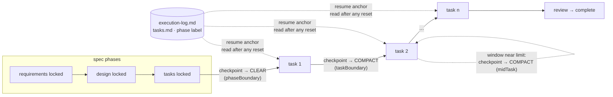

# Design: manage the context window efficiently

> Phase 2 of 3, derived from [`requirements.md`](requirements.md). Records the
> checkpoint-then-reset decision in
> [decision-027](../../decisions/decision-027.md). No UI artifacts: skill/process work.

## Overview

The feature is **instruction-level, not code**: a new skill reference
(`reference/context.md`) defines the protocol, the operating commands
(`work-on`, `execute-tasks`) invoke it at the right steps, and a `contextManagement`
config section makes the policy tunable. Nothing forces a reset in code — consistent
with how every other process rule in the loop ships (and with the open
hooks-vs-instructions question in `reference/workflow.md` § predictability).

The core insight: the-loop's existing rules already externalize all durable state
(specs, `tasks.md` checkmarks, execution log, phase label), which is exactly the
"structured note-taking / external memory" leg of Anthropic's context-engineering
guidance. Resets are therefore cheap — context management is just **resumability
applied within a session, at moments the loop chooses** instead of moments the
auto-compactor stumbles into.



## 1. Clearing vs. compaction (the analysis the ticket asked for)

| | Clearing | Compaction |
|---|---|---|
| Mechanism | Empty the window; next turn starts fresh | Summarize history in place; summary replaces transcript |
| What survives | Only disk state (specs, code, logs, git) | A lossy summary chosen at compaction time |
| Failure mode | Un-checkpointed intent is lost | Needed detail silently dropped; loss compounds across repeats |
| Applicable at | **Boundaries** between units of work (phase transitions, optionally task transitions) | **Continuations** of one unit (mid-task, or between tightly-coupled tasks) |

Vendor grounding (Requirement 1.2): Anthropic recommends `/clear` frequently between
tasks and `/compact` at natural breakpoints within one, and frames context as a finite
attention budget with compaction / note-taking / subagents as the three levers
([best practices](https://www.anthropic.com/engineering/claude-code-best-practices),
[context engineering](https://www.anthropic.com/engineering/effective-context-engineering-for-ai-agents)).
Cursor auto-summarizes long chats and recommends starting a new conversation when focus
degrades, recovering history selectively via `@Past Chats`
([summarization](https://cursor.com/docs/agent/chat/summarization),
[agent best practices](https://cursor.com/blog/agent-best-practices)). The protocol maps
these directly: clear at boundaries, compact in the middle, auto-compaction demoted to
safety net (Requirement 1.3).

## 2. The protocol (one rule, four boundaries)

**Checkpoint, then reset.** A checkpoint = checkmarks current + execution-log entry
(with a concrete **Next:**) + phase label in sync + WIP committed or noted
(Requirement 2.1). Then:

| Boundary | Default | Config key | Rationale |
|---|---|---|---|
| Phase transition across a locked artifact (esp. tasks → implementation) | `clear` | `contextManagement.phaseBoundary` | The locked files are the contract; drafting deliberation is noise — Claude plan-mode's move (Requirement 3) |
| Task completed in the DAG | `compact` | `contextManagement.taskBoundary` | Drop the finished task's noise, keep cross-task working knowledge; `clear` selectable for long DAGs (Requirement 4) |
| Mid-task, window near limit | `compact` (never clear) | `contextManagement.midTask` | An unfinished task has un-checkpointed intent by definition (Requirement 1.4) |
| High-volume exploration / log digging | isolate (subagents) | — | Cheapest management is not ingesting noise (Requirement 4.3) |

Re-entry after a clear reads the execution log's latest entry first, then only the spec
files the next unit needs (`tasks.md` names its requirements) — Requirement 2.2.

Headless / CLI-spawned sessions can't `/clear` themselves: they follow the protocol by
checkpointing and preferring to end the session at a phase boundary, letting the
existing resumability start the next session fresh (Requirement 3.2).

## 3. Touched surfaces

| Surface | Change |
|---|---|
| `skills/the-loop/reference/context.md` | **New** — the protocol, the clear/compact analysis, the durable-ledger rationale, per-harness mechanics table, vendor citations |
| `skills/the-loop/SKILL.md` | Reference-list entry; a *Manage the context window deliberately* operating principle; `contextManagement` in the config-section list |
| `skills/the-loop/reference/workflow.md` | A context-management section wiring the protocol into implementation + resumability |
| `commands/work-on.md`, `commands/execute-tasks.md` | Read-list gains `reference/context.md`; the implementation steps state the phase-boundary clear and per-task checkpoint-then-reset |
| `skills/the-loop/templates/execution-log.md` | The log is named the resume anchor; progress entries gain an optional **Context:** line recording a reset |
| `.the-loop/config.schema.json` | `contextManagement` section (`enabled`, `phaseBoundary`, `taskBoundary`, `midTask`); added to the `automation` onboarding group (advanced — sensible defaults, silently applied) |
| `.the-loop/config.yaml`, `skills/the-loop/templates/config.yaml` | The new section with defaults |
| `docs/capabilities/spec-workflow.md` | Behaviour bullets + history row (fold-in) |
| `docs/decisions/decision-027.md` | The decision record |

## 4. Config

```yaml
contextManagement:               # checkpoint-then-reset — see reference/context.md
  enabled: true
  phaseBoundary: clear           # clear | compact | off — locked spec → fresh window
  taskBoundary: compact          # clear | compact | off — after each completed task
  midTask: compact               # compact | off — never clear inside a task
```

`enabled: false` defers entirely to the harness's automatics (Requirement 5.3). A work
item can override via spec front-matter `overrides` like any other config subset.

## 5. Error handling

- **Reset without checkpoint** is the failure the protocol exists to prevent; the rule
  is stated as an invariant ("never reset without checkpointing first") in the skill,
  the commands and the capability doc, so every entry point repeats it.
- **Compaction loses a detail**: the checkpoint entry written immediately before the
  compaction bounds the loss — the log, not the summary, is authoritative; on doubt,
  re-read the artifacts.
- **Harness lacks a reset verb**: degrade to checkpoint + end-session (headless), or to
  `off` — the protocol never requires a capability the harness doesn't have.

## 6. Testing strategy

Process/documentation change — no runtime code. Verification:

- `markdownlint` over all touched markdown (same command as CI).
- `.the-loop/config.yaml` and `skills/the-loop/templates/config.yaml` validate against
  the updated `config.schema.json` (jsonschema check run as evidence).
- The schema's `x-onboarding` group membership stays consistent (every group key exists
  in `properties`) — asserted alongside the schema validation.
