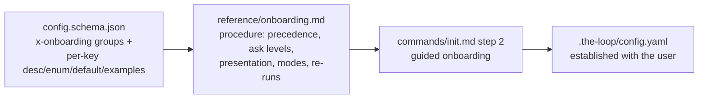

# Design: schema-driven grouped onboarding for `/init`

> Phase 2 of 3 (requirements → design → tasks). Derives from the requirements spec.

## Overview

The onboarding is data + procedure: the **data** (which keys club together, in what
order, and how eagerly the user is involved) lives in `config.schema.json` as an
`x-onboarding` annotation, next to the per-key descriptions/defaults/enums/examples
the walkthrough renders; the **procedure** (precedence of sensible defaults, how a
group is presented, modes, re-run behaviour) lives in a new skill reference,
`reference/onboarding.md`, which `commands/init.md` invokes as its step 2.

## Components & interfaces

- **`config.schema.json`** — gains a top-level `x-onboarding` keyword:
  `groups` (ordered; each `{id, title, ask, explain, keys}`) and `askLevels`
  (`always` / `confirm` / `advanced` semantics). Gap-prone free-form keys gain
  `examples`. `version` belongs to no group (init stamps it). Unknown `x-*` keywords
  are ignored by JSON-Schema validators, so nothing about validation changes.
- **`reference/onboarding.md`** *(new)* — the walkthrough procedure: the
  sensible-defaults precedence (existing > detected > schema default), the ask
  levels, per-group presentation rules (explain; mark value provenance; enums show
  ALL possibilities; free-form keys show examples; one interaction per group; the
  "accept defaults for the rest" fast path), modes (`interactive` / `--defaults` /
  `--dry-run`) and re-run gap-only behaviour.
- **`commands/init.md`** — new step 2 (onboarding) between detection and manifest
  reconciliation; `--defaults` mode added; downstream steps renumbered and the
  personas step now defers to the onboarding.
- **`skills/the-loop/SKILL.md`** / **README** / **template `config.yaml`** — pointers
  to the new reference and the guided-onboarding behaviour.

## Grouping (as encoded in the schema)

| Group | Keys | Ask |
|-------|------|-----|
| Project & ticketing | `ticketing`, `repository` | always |
| Languages & tooling | `tooling` | confirm |
| Workflow & phases | `workflow` | confirm |
| Quality gates | `hooks`, `testing`, `tdd`, `minimalism` | confirm |
| Reviews & autonomy | `reviews`, `autonomy` | confirm |
| People & communication | `personas`, `messaging`, `userInteraction` | always |
| API contracts & design artifacts | `apiSpecs`, `design` | advanced |
| Observability & local orchestration | `observability`, `localOrchestration`, `externalTools` | advanced |
| Automation ingress & self-improvement | `webhooks`, `polling`, `selfImprovement` | advanced |

## UI/UX design

Conversational only — no visual artifacts. Where the harness offers a structured
question UI (Claude Code `AskUserQuestion`) the group's enum keys become options with
the proposal marked recommended; otherwise plain chat, one compact prompt per group.

## Error handling

- Validation (init step 5) still runs after onboarding; any key the user left invalid
  or empty surfaces under **needs-user** with the schema example.
- `--dry-run` neither interacts nor writes — it reports what would be asked.

## Testing strategy

- `scripts/validate_config.py` (schema + both configs) stays green — proves the
  annotation is validation-neutral.
- `markdownlint` over the new/edited docs.
- Inspection: `x-onboarding.groups[].keys` covers every top-level schema property
  except `version`.

## Alternatives considered

- **Hardcode the groups in `commands/init.md`** — drifts from the schema as keys are
  added; rejected (single source of truth).
- **A separate `onboarding.yaml`** — a second file to keep in sync with the schema;
  rejected.
- **Ask about every key** — interaction fatigue; the ask levels + grouping exist
  precisely to avoid this.
