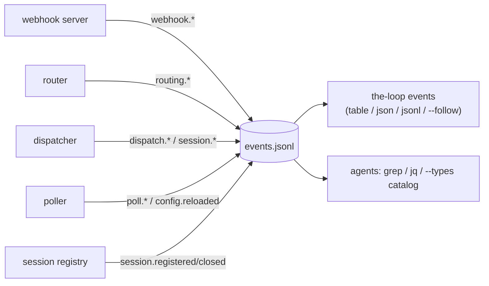

# Design: observability and logging of the-loop CLI's actions

> Phase 2 of 3, derived from [`requirements.md`](requirements.md). Records the
> JSONL-over-SQLite storage decision in
> [decision-025](../../decisions/decision-025.md). No UI artifacts: CLI/infra work.

## Overview

One new stdlib-only module, `the_loop/eventlog.py`, owns the whole feature: an
append-only JSONL writer, a module-level `emit()` that instrumentation calls, the
event-type catalog (`EVENT_TYPES` — the single source of truth for documentation), and
a tolerant reader with shared filter semantics. Every decision point in the webhook
server, router, dispatcher, poller and session registry calls `eventlog.emit(...)`
alongside its existing `logging` line (the human-readable stderr log and the structured
log tell the same story — dev-time == run-time, per the observability reference). A new
`the-loop events` command is the query surface.



## 1. Event schema

One JSON object per line. Common envelope:

| field | meaning |
|-------|---------|
| `ts` | UTC ISO-8601, millisecond precision (`2026-07-22T06:31:20.123Z`) |
| `source` | emitting process: `gh-webhook` \| `poll` \| `sessions` |
| `event` | dot-namespaced type — see the catalog (`the-loop events --types`) |
| `level` | `debug` \| `info` \| `warning` \| `error` |
| `pid` | emitting process id |

Common per-type fields: `work_item` / `work_items` (`github:owner/repo#15`),
`delivery_id` (`X-GitHub-Delivery` — the join key across a delivery's whole trail),
`gh_event` + `action`, `actor`, `harness`, `harness_session_id`, `reason`
(machine-readable rejection cause), `error` + `will_retry` (failure paths). `None`
fields are omitted from the record.

Type namespaces: `webhook.*` (ingress accept/reject), `routing.*` (filter/guard
decisions), `dispatch.*` (queueing + delivery to a session), `session.*` (lifecycle:
registered/spawned/spawn_failed/closed/autoclosed), `poll.*` (cycle summaries + poll
errors), `server.*`/`poller.*`/`config.reloaded` (process lifecycle). The full catalog
with per-type descriptions lives in `EVENT_TYPES` and is enforced against the emitted
types by a unit test (R5.2) — instrumentation cannot silently invent undocumented types.

## 2. Writer (`EventLog`) — multi-process-safe by construction

- **Append-only JSONL** at `observability.eventLog.path` (default
  `.the-loop/logs/events.jsonl`, git-ignored). Each emit opens the file in append mode
  and writes one `\n`-terminated line: POSIX `O_APPEND` semantics keep concurrent
  writers (receiver + poller + sessions CLI on the same repo) interleaving whole lines,
  never corrupting each other — the same reasoning that made the registry
  file-per-session (issue-15) applies here to a shared append-only file.
- **Fire-and-forget:** a write failure warns once on stderr and is swallowed (R3.4) —
  o11y must never take down ingress.
- **No-op until configured (R5.4):** library code calls the module-level
  `eventlog.emit(...)`, which does nothing until a CLI entry point calls
  `eventlog.configure_from_file(source)`. Pure unit tests and embedders pay zero I/O;
  the pure-function character of the router is preserved (emit is observation, not
  behaviour).

## 3. Instrumentation points

Mapping requirements → emit sites (each next to its existing `logging` call):

- `webhook/server.py`: `webhook.received` (verified flag), `webhook.rejected`
  (invalid-signature / invalid-payload) — R1.1, R2.1.
- `webhook/router.py`: `routing.routed`; `routing.dropped` with `reason` ∈
  disabled-event / duplicate-delivery / no-work-item / unauthorized-actor — R1.2, R2.2.
- `webhook/dispatcher.py`: `dispatch.queued`, `dispatch.succeeded`,
  `dispatch.failed`/`dispatch.error` (+`will_retry` mirroring the deduper-discard
  redelivery contract), `dispatch.dropped` (5 reasons), `session.spawned` (process and
  tmux paths, naming the triggering `gh_event`/`delivery_id`), `session.spawn_failed`,
  `session.autoclosed` — R1.3, R2.3, R3.1, R3.2.
- `poller/poller.py`: `poll.cycle`, `poll.provider_error`, `poll.item_error`
  (`will_retry: true` — the next cycle is the retry), `poll.unauthorized`,
  `poll.comment_forwarded`, `config.reloaded` — R2.4, R3.3.
- `sessions/registry.py`: `session.registered` (with `replaced` when `--force`),
  `session.closed` — R1.4. Emitting in the registry covers every caller (webhook
  spawn, poller spawn, `sessions` CLI).
- Entry points (`commands/gh_webhook.py`, `commands/poll.py`,
  `commands/sessions_cmd.py`): call `configure_from_file(...)` and emit
  `server.started/stopped`, `poller.started/stopped`, `config.reloaded`.

## 4. Query surface (`the-loop events`, R4)

`commands/events.py` — filters compose: `--type` (fnmatch, repeatable),
`--work-item` (matches scalar `work_item` or membership in `work_items`),
`--delivery-id`, `--source`, `--level` (minimum, inclusive), `--since` (ISO or relative
`30s/15m/2h/1d`), `--limit` (last N, default 50). Output `table` (envelope columns +
free-form detail column), `json` (one array), `jsonl` (stream). `--follow` polls the
file every 0.5s from the previous EOF, re-reading from 0 on truncation/rotation.
`--types` dumps the `EVENT_TYPES` catalog. Reader (`read_events`/`parse_lines`/
`record_matches` in `eventlog.py`) skips corrupt or torn lines (R4.3), so an
externally rotated or mid-write file still reads; the command and the reader share one
filter implementation.

Agents get three documented entry points: `the-loop events` (+ `--format json`), the
catalog (`--types`), and the raw file for grep/jq — all described in the observability
reference shipped with the plugin (`skills/the-loop/reference/observability.md`).

## 5. Config (R5)

```yaml
observability:
  eventLog:
    enabled: true                       # false ⇒ emit nothing
    path: .the-loop/logs/events.jsonl   # git-ignored runtime state
```

Schema addition in `.the-loop/config.schema.json`; read best-effort (missing
file/PyYAML ⇒ defaults) like every other config consumer. `.the-loop/logs/` joins the
git-ignored runtime-state family (pidfiles, sessions registry, poll state).

## 6. Testing

- Unit (`test_eventlog.py`): envelope shape, None-field dropping, disabled/unconfigured
  no-ops, write-failure swallowing, reader filters, corrupt-line tolerance, the
  catalog-vs-emitted-types drift guard, `events` command formats/filters/`--types`.
- Integration (`test_eventlog_integration.py`, Gherkin): live signed POSTs through the
  real server/router/dispatcher stack asserting the JSONL trail — full accepted-event
  trail joined by delivery id; rejection reasons (bad signature, disabled event,
  unauthorized actor); `dispatch.failed` with `will_retry`; spawn lifecycle; and
  `the-loop events` reading the live trail.

## Alternatives considered

- **SQLite as the store** — rejected as the primary store; JSONL wins on append-only
  multi-process safety without locking, greppability, and zero schema migrations. A
  SQLite/dashboard layer can be built *on top of* the JSONL later. Full trade-off in
  [decision-025](../../decisions/decision-025.md).
- **Structured logging via the `logging` module (JSON formatter)** — rejected: stderr
  interleaves processes and disappears with the terminal; the event log needs to be a
  durable artifact with a stable contract, independent of log-level configuration.
- **OpenTelemetry** — rejected for now: violates the zero-runtime-dependency rule and
  demands a collector; the JSONL file is the honest v0 the CLI's scale needs. An OTel
  exporter reading the JSONL is a possible follow-up.
