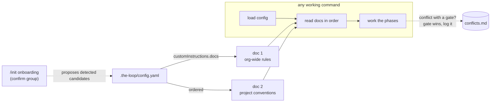

# Design: consider user prompt/instructions while working on a repo or workspace

> Phase 2 of 3, derived from [`requirements.md`](requirements.md). Records the
> config-registered-guidance decision in
> [decision-029](../../decisions/decision-029.md). No UI artifacts: skill/process work.

## Overview

The feature is **instruction-level, not code** — the same shape as the loop's other
process rules: a `customInstructions` config section registers the docs, a new skill
reference (`reference/instructions.md`) defines when they are read and who wins on
conflict, and the operating commands (`work-on`, `execute-tasks`) plus `/init`'s
onboarding wire it in. Nothing is enforced in code, consistent with the open
hooks-vs-instructions question (`reference/workflow.md` § predictability).

The design mirrors `externalTools` deliberately (issue-37's "one YAML" principle): an
inline registry in `.the-loop/config.yaml`, no separate file. The two are complementary
halves of one idea — externalTools registers *capabilities the harness may use*,
customInstructions registers *guidance the harness must follow*.



## 1. Config shape

```yaml
customInstructions:
  docs:                           # ordered; later docs win over earlier ones on conflict
    - path: docs/team-conventions.md          # repo-relative …
      notes: House TS style, naming, PR etiquette.
    - path: /home/me/company-wide-rules.md    # … or absolute (per-machine)
      notes: Org-wide security & dependency policy.
  onMissing: warn                 # warn | error | ignore
```

- **List of `{path, notes}` objects, not bare strings** — `notes` powers phase-scoped
  re-reading (the harness knows *when* a doc matters), matching how `externalTools`
  entries carry `notes` (Requirement 1.1).
- **Absolute paths allowed** — per-installation docs living outside the repo
  (Requirement 1.2). No URL fetching (out of scope; minimalism).
- **`onMissing`** (Requirement 1.3) defaults to `warn`: note the gap in the execution
  log and continue; `error` for operators who want a halt; `ignore` for optional docs.

## 2. Onboarding

A new `instructions` group in `x-onboarding.groups`, ask level **`confirm`**, placed
right after **Languages & tooling** (both answer "how do we build here?"). Init's
detection step proposes candidates from convention files the repo already has
(`CONTRIBUTING.md`, style guides under `docs/`); the user confirms/adjusts/adds —
including absolute paths detection can never see (Requirements 2.1, 2.2). Sensible
default is the empty list, so `--defaults` runs stay silent.

## 3. Read/precedence protocol (the heart of `reference/instructions.md`)

| Rule | Winner | Rationale |
|---|---|---|
| Hard gates (security, paper trail, phase/review gates, autonomy tiers) | the-loop — instruction ignored, conflict logged | Custom instructions must not become a rigor bypass (Requirement 4.3, fail-closed) |
| Keys the structured config models (tooling, counts, paths) | `.the-loop/config.yaml` — mismatch surfaced to the user | One contract; docs are prose, config is structure (Requirement 4.1) |
| Everything else (styles, conventions, domain guidance) | the instruction docs | This is what they exist for (Requirement 4.2) |
| Between docs in the list | later beats earlier | Layering: org-wide first, project-specific after (Requirement 4.2) |

Read points: at the start of any working command, immediately after loading the config
(Requirement 3.1); re-read after a context **clear** like every other artifact, and on
demand per each entry's `notes` under progressive disclosure (Requirement 3.2).
Harness-native memory files keep their own semantics and load independently.

## 4. Touched surfaces

| Surface | Change |
|---|---|
| `.the-loop/config.schema.json` | `customInstructions` section (`docs[{path,notes}]`, `onMissing`); new `instructions` onboarding group (`confirm`, after tooling) |
| `.the-loop/config.yaml`, `skills/the-loop/templates/config.yaml` | The new section with defaults (empty list, `warn`) |
| `skills/the-loop/reference/instructions.md` | **New** — config shape, read points, precedence table, security note |
| `skills/the-loop/SKILL.md` | Reference-list entry; an *Honor the user's custom instructions* operating principle; config-section list; a "Custom instructions the loop honors" section beside "Interacting with other tools" |
| `commands/init.md` | Detection proposes candidate docs; onboarding prose names the new confirm group |
| `commands/work-on.md`, `commands/execute-tasks.md` | Load-config step gains "then read every registered instruction doc" |
| `docs/capabilities/spec-workflow.md` | Behaviour bullet + history row (fold-in) |
| `docs/decisions/decision-029.md` | The decision record |

## 5. Error handling

- **Missing doc** → `onMissing` (`warn` default; log the gap and continue). Never
  crash the loop over guidance that is absent.
- **Doc contradicts a gate** → the gate wins; log to `docs/decisions/conflicts.md` and
  continue (fail-closed, no silent weakening).
- **Doc contradicts a config key** → the config wins; surface the mismatch to the user
  (ticket/PR comment per the paper-trail rule) so the drift gets fixed at the source.
- **Unreadable/huge doc** → treat as any other verbose read: sub-agent it and pull back
  the relevant conclusions (`tokenEconomy.subAgentDelegation`).

## 6. Testing strategy

Process/documentation change — no runtime code. Verification:

- `markdownlint` over all touched markdown (same command as CI).
- `.the-loop/config.yaml` and `skills/the-loop/templates/config.yaml` validate against
  the updated `config.schema.json` (`scripts/validate_config.py`, the pre-commit/CI
  hook).
- The schema's `x-onboarding` group membership stays consistent (the new group's key
  exists in `properties`).
