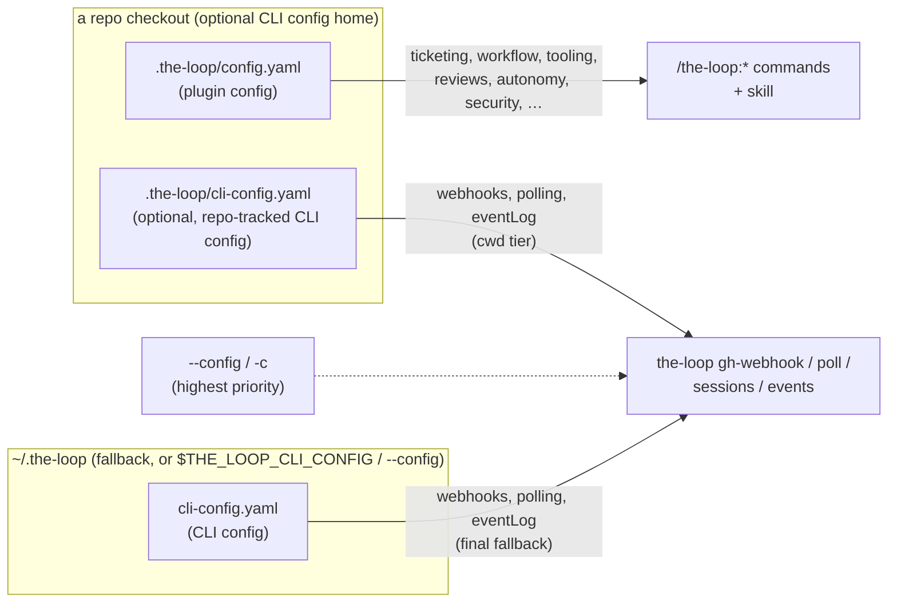

# Design: split the-loop's config into CLI config and plugin config

> Phase 2 of 3 (requirements → design → tasks). Derives from
> `docs/specs/issue-63/requirements.md`.

## Overview

Introduce a second, independent config file — the **CLI config**, `cli-config.yaml` —
read only by the CLI daemon commands (`gh-webhook`, `poll`, `sessions`, `events`). It
owns `webhooks`, `polling`, and `eventLog`, resolved in priority order: an explicit
`--config`/`-c` flag, the `THE_LOOP_CLI_CONFIG` env var (same priority as the flag),
`./.the-loop/cli-config.yaml` (repo-relative — an operator may choose to track it in a
specific repo), else `~/.the-loop/cli-config.yaml`. The existing `.the-loop/config.yaml`
becomes the **plugin config**: everything else, scoped to one repo, read by
`/the-loop:*` commands and the skill. Both are validated by their own JSON Schema. A
single new module, `the_loop.cli_config`, centralizes path resolution and the
best-effort YAML-load pattern the CLI already uses everywhere, so the four command
modules stop each hand-rolling it against the wrong (single, conflated) file.

> Revised from the original single-tier (`$THE_LOOP_CLI_CONFIG`, else
> `~/.the-loop/config.yaml`) design per PR #69 review: the location needed to be
> operator-configurable — including trackable inside a specific repo — not just
> globally-fixed-with-an-env-var-escape-hatch. See decision-032's Alternatives.

## Architecture



Note what's deliberately **not** in this diagram: no edge from the plugin config to the
CLI daemon. The first cut of this design had one (`ticketing.github.owner`/`repo` as a
convenience fallback); PR #69 review removed it — see below.

- **Plugin config** (`.the-loop/config.yaml`, unchanged location) — installed per repo;
  read by `commands/init.md`, `work-on.md`, `execute-tasks.md`, `upgrade-the-loop.md`,
  and `the-loop scenarios` (`testing.integrationTestGlobs`). Schema:
  `.the-loop/config.schema.json`, trimmed of `webhooks`/`polling`/`observability.eventLog`.
- **CLI config** (new) — read by `gh-webhook`/`poll`/`sessions`/`events` only. Schema:
  new `.the-loop/cli-config.schema.json` (shipped alongside the plugin schema; the
  "`.the-loop/`" prefix here names where the-loop's *own* schema files live in this
  repo/package — see Data models below for where an operator's resolved copy actually
  lives, which is configurable).
- **No plugin-config fallback, anywhere (Requirement 4).** `routing.authorizedUsers`
  (webhook + poll) and a GitHub poll source's `repos` are read **exclusively** from the
  CLI config — no fallback to any repo's `ticketing.github.owner`/`repo`. Unset means
  exactly that: the receiver/poller fail closed (no `authorizedUsers`) or raise clearly
  (`GitHubPollProvider.list_work_items` on no `repos`) rather than silently borrowing a
  value from a file whose entire purpose is the Claude/Cursor plugin. An operator who
  wants the old "zero-config in the repo I'm watching" convenience gets it through the
  cwd tier instead: put an explicit CLI config at `./.the-loop/cli-config.yaml`.

## Components & interfaces

### `the_loop.cli_config` (new)

```python
CLI_CONFIG_ENV = "THE_LOOP_CLI_CONFIG"
CLI_CONFIG_FILENAME = "cli-config.yaml"

_override: Optional[Path] = None  # set by cli.py's --config pre-scan

def set_override(path: Optional[Union[str, Path]]) -> None:
    """Set (or clear, with None) the --config/-c override."""

def default_cli_config_path() -> Path:
    """--config/-c override, else $THE_LOOP_CLI_CONFIG, else
    ./.the-loop/cli-config.yaml (if it exists), else ~/.the-loop/cli-config.yaml."""

def load_cli_config(path: Path, strict: bool = False) -> dict:
    """Best-effort (strict=False) or raising (strict=True) YAML parse of the
    whole CLI config. Mirrors the parse-error handling gh_webhook/poll already
    have (missing file / no PyYAML / bad YAML), extracted once."""
```

A module-level `_override` (rather than threading a parameter everywhere) fits this
codebase's existing style — `eventlog._log` is already a comparable module-level
singleton — and the CLI is a short-lived, single-invocation process, so there's no
concurrent-request concern to a mutable global the way there would be in a server.

`gh_webhook.py` and `poll.py` keep their own module-level `_CONFIG_PATH` (tests already
monkeypatch that attribute name directly — see `test_routing.py::test_read_gh_webhook_config_strict_vs_lenient`),
initialized from `cli_config.default_cli_config_path()` at import time as before. What's
new: `cli.py`'s `main()` **re-resolves and reassigns** both modules' `_CONFIG_PATH`
(`_refresh_cli_config_paths()`) immediately after pre-scanning `--config` and *before*
`build_parser()` runs — solving a real ordering constraint: `build_parser()` calls every
command's `add_arguments()` eagerly (existing behaviour, unrelated to this change), and
`add_arguments()` is what reads the CLI config to compute *other* flags' defaults (e.g.
`--host`). Argparse can't tell us `--config`'s value until parsing finishes, but parsing
finishes *after* those defaults are already computed — hence the tiny pre-scan.
`load_cli_config` replaces the duplicated try/except-ImportError/except-YAMLError block
in both files.

### `cli.py` (top-level entry point)

- `build_parser()` gains a global `--config`/`-c` argument (declared before the
  subparsers, so it must precede the subcommand: `the-loop --config PATH gh-webhook
  start`) — documents the flag and makes `args.config` available, though its *effect*
  already happened via the pre-scan below.
- `_peek_config_flag(argv)` — a throwaway `argparse.ArgumentParser(add_help=False)`
  declaring only `--config`/`-c`, parsed with `parse_known_args` (ignores every other
  flag) purely to learn the value before the real parser is built.
- `main()` — calls `cli_config.set_override(_peek_config_flag(argv))` (unconditionally,
  including to `None`, so an override never leaks across repeated `main()` calls in one
  process, e.g. under test), then `_refresh_cli_config_paths()`, *then* `build_parser()`.

### `gh_webhook.py`

- `_CONFIG_PATH` → `cli_config.default_cli_config_path()` at import time; reassigned by
  `cli.py`'s `_refresh_cli_config_paths()` before `add_arguments()` runs.
- `_read_gh_webhook_config` → unchanged behaviour, now reads `webhooks.ghWebhook` from
  the CLI config.
- No `_ticketing_owner()`, no `_PLUGIN_CONFIG_PATH` (Requirement 4) — the module has no
  code path that reads any repo's `.the-loop/config.yaml`. `_build_routing` lost its
  `owner` parameter; `resolve_authorized_users(config.authorized_users)` takes just the
  CLI config's list.

### `poll.py`

- `_CONFIG_PATH` → CLI config path (drives the `Reloader`, so `polling.sources` hot-reload
  continues to watch the CLI config file, satisfying Requirement 1.2).
- No `_load_plugin_config()`, `_repos_from_ticketing()`, `_ticketing_owner()`, or
  `_PLUGIN_CONFIG_PATH` (Requirement 4). `build_provider(source, default_label=...)` and
  `GitHubPollProvider.from_source` lost their `fallback_repos` parameter; a source with
  no `repos` is empty, not "whatever `ticketing.github` happens to say" — `list_work_items`
  raises a clear `ProviderError` for it rather than silently discovering nothing.

### `eventlog.py`

- `load_config(config_path=...)`'s default becomes `cli_config.default_cli_config_path()`
  instead of `.the-loop/config.yaml`.
- Reads the CLI config's top-level `eventLog` key (was `observability.eventLog` in the
  conflated file — the CLI config has no other reason to carry an `observability`
  wrapper key, so it is flattened; documented as a rename in the migration note).
- `configure_from_file` / `events.py`'s `--file` default are otherwise unchanged (they
  already call through `load_config()`).

### `sessions_cmd.py`

No change: `_default_registry_dir()` already goes through
`gh_webhook._load_config_defaults()`, which now transparently points at the CLI config.

## Data models

Two schema files ship in this repo (and in the published plugin/package), same tree,
new sibling name — **not** a location an operator's actual CLI config lives at (that's
resolved per the priority order above; these are the *validator* files):

- `.the-loop/config.schema.json` — plugin config. `additionalProperties: false`;
  `webhooks`, `polling` properties removed; `observability` keeps `devLevel` /
  `runtimeLevel` / `browserLogging` only (`eventLog` removed).
- `.the-loop/cli-config.schema.json` (new) — CLI config. `additionalProperties: false`;
  properties `version`, `webhooks`, `polling`, `eventLog` — the exact JSON Schema
  fragments moved verbatim from the plugin schema (no behavioural change to the shape
  of `webhooks`/`polling`; `eventLog`'s shape is `observability.eventLog`'s, unwrapped).

Templates mirror the split: `skills/the-loop/templates/config.yaml` (plugin, trimmed)
and a new `skills/the-loop/templates/cli-config.yaml` (CLI, commented, ships the same
documented defaults `webhooks`/`polling` had, plus the priority order). This repo's own
dogfood instance, `.the-loop/cli-config.yaml`, is checked in at exactly the repo-relative
path the cwd tier checks (`./.the-loop/cli-config.yaml`) — the-loop's own repo dogfoods
"track the CLI config in this repo" (the exact use case PR #69 review raised), and it's
picked up automatically with zero env var or flag when `the-loop <command>` runs from
this checkout. `scripts/validate_config.py` validates both this file and the shipped
template against `cli-config.schema.json`.

## Error handling

Identical to today, just re-homed:

- Missing CLI config file, missing PyYAML, or unparseable YAML → lenient callers
  (`strict=False`) get `{}` and fall back to built-in `_DEFAULTS`; the hot-reload path
  (`strict=True`) raises so the `Reloader` keeps the previous in-memory config rather
  than resetting to defaults on a transient broken save. Same contract as the pre-split
  `_read_gh_webhook_config`.
- No CLI config file resolvable at all (fresh install, nothing configured yet) is not
  an error — `gh-webhook`/`poll` start with built-in defaults, same as an empty
  `webhooks`/`polling` block today.

## Security design

> Enforcing `requirements.md`'s Security considerations.

- **AuthN/AuthZ:** `routing.authorizedUsers` (CLI config, exclusively — Requirement 4)
  gates which GitHub actors the receiver/poller act on; `resolve_authorized_users` now
  takes only the configured list (no `owner` fallback parameter) and still fails closed
  (warns, authorizes nobody) when it's empty (decision-023's fail-closed guarantee,
  strengthened rather than weakened by removing the fallback).
- **Input validation & injection surfaces:** no new untrusted-input surface for the
  `--config`/`$THE_LOOP_CLI_CONFIG` tiers — both are set by the operator who starts the
  process, same trust level as any other CLI flag/env var. The new cwd tier
  (`./.the-loop/cli-config.yaml`) is the one genuinely new consideration: it makes the
  *current working directory's contents* part of config resolution. Mitigated by scope —
  `load_cli_config` only ever parses YAML into the fixed `webhooks`/`polling`/`eventLog`
  shape (schema-validated, `additionalProperties: false`); a planted file cannot execute
  code or escape that shape, only misconfigure the daemon's own routing/polling
  behaviour. An operator who does not trust their cwd passes `--config` explicitly
  (highest priority, bypassing the cwd check entirely).
- **Secrets handling:** unchanged — `secretEnv` continues to *name* an env var; the
  webhook secret itself is never read from any config file or flag value.
- **Least privilege:** unchanged — file permissions on wherever the CLI config resolves
  to are the operator's OS-level responsibility, called out in `cli/README.md` (n/a to
  add code for; a stdlib-only CLI does not manage file ACLs).
- **Fail-closed behaviour:** a corrupt/missing CLI config still yields `{}` → empty
  `authorizedUsers` → the existing "warn, authorize nobody" fail-closed path. A bad edit
  to the CLI config while the daemon is running is logged and the previous validated
  config kept (`Reloader`), unchanged.
- **Abuse-case coverage:** requirements' abuse case 1 (secret never at rest) — covered by
  `secretEnv` staying an env-var name in both schemas (neither accepts a literal
  secret). Abuse case 2 (hostile/misconfigured `--config`/`$THE_LOOP_CLI_CONFIG` target)
  — covered by the unchanged strict/lenient parse-error handling; proven by
  `test_read_gh_webhook_config_strict_vs_lenient` reused against the new path. Abuse
  case 3 (planted cwd file) — covered by the schema-bounded parse (no code execution
  path) and the `--config` escape hatch; proven by `test_cli_config.py`'s cwd-tier tests.

## Testing strategy

- **Unit** (`cli/tests/test_cli_config.py`): the full priority chain — home default when
  nothing else set; cwd file wins over home; cwd file absent falls through to home; env
  var wins over cwd file; `set_override`/`--config` wins over everything; `set_override(None)`
  clears it (an autouse fixture resets the override before/after every test, since it's a
  module-level global). Plus `load_cli_config` lenient/strict behaviour on missing file /
  no PyYAML / bad YAML (mirrors the existing `_read_gh_webhook_config` coverage, now
  against the shared helper), and `cli.py`'s `--config` pre-scan: a value passed before
  the subcommand changes what `build_parser()` computes as other flags' defaults.
- **Unit** (existing `test_routing.py`): unaffected in behaviour since it monkeypatches
  `_CONFIG_PATH` directly; `test_cli_config.py` separately asserts
  `gh_webhook._CONFIG_PATH`/`poll._CONFIG_PATH` default to
  `cli_config.default_cli_config_path()` at import time and that neither module carries
  a `_PLUGIN_CONFIG_PATH` attribute (Requirement 4).
- **Unit** (`test_poller.py`, updated): `resolve_authorized_users`/`build_provider`/
  `GitHubPollProvider.from_source` calls dropped their `owner`/`fallback_repos`
  arguments; a new test asserts a source with no `repos` resolves to an empty list (not
  a borrowed value) and that `list_work_items` raises for it.
- **Config validation** (`scripts/validate_config.py`, extended): validates
  `.the-loop/cli-config.yaml` (checked in at the exact cwd-tier path) and
  `skills/the-loop/templates/cli-config.yaml` against the new `cli-config.schema.json`,
  alongside the existing plugin-config targets.
- **Manual evidence:** `the-loop gh-webhook start --route` and `the-loop poll start
  --once` exercised locally from this repo's root (picking up `.the-loop/cli-config.yaml`
  via the cwd tier, no flag or env var needed) and again with an explicit `--config`
  pointed at a different file, confirming the override wins and hot-reload still fires
  on an edit to whichever file was actually resolved.

## Trade-offs & decisions

Logged as `docs/decisions/decision-032.md`:

- **Configurable 4-tier resolution over a single fixed global default** — the first cut
  shipped only `$THE_LOOP_CLI_CONFIG`, else `~/.the-loop/config.yaml`: simple, but it
  forced "global" as the *only* option. PR #69 review: an operator wants their CLI
  config checked in and versioned in their own dev-box repo — a legitimate, common case
  ("not tied to a single repo" means "not forced into one," not "forbidden from one").
  `--config`/cwd/home covers both without reintroducing "the daemon needs a home repo to
  find its config": the cwd tier is opt-in by construction (only engages if the operator
  puts a file there) and the home tier remains the always-available, zero-setup default.
- **`--config` implemented via a pre-scan, not per-subcommand flags** — declaring
  `--config` once, globally, ahead of any subcommand keeps it uniform across
  `gh-webhook`/`poll`/`sessions`/`events` with no repetition; the pre-scan
  (`_peek_config_flag` + `_refresh_cli_config_paths`) is the mechanical cost of argparse
  building every subcommand's defaults before a normal parse would give us the flag's
  value — the same two-phase-parse pattern common CLIs (Docker, Git) use for exactly this
  "a global flag affects other flags' defaults" shape.
- **A module-level override (`cli_config.set_override`) over threading a parameter
  through every call site** — `gh_webhook.py`/`poll.py`/`eventlog.py`/`sessions_cmd.py`
  already read config via free functions, not an injected object; the CLI is a
  short-lived, single-invocation process (no concurrent-request state to corrupt), so a
  settable module global (reset every `main()` call, including to `None`) is the
  pragmatic fit — consistent with `eventlog._log`'s existing pattern.
- **Runtime *state* paths left alone (still out of scope)** — pidfiles/registry/poll-state/
  event-log defaults stay cwd-relative `.the-loop/...` strings; only the *config file*
  moved/became configurable. Migrating state defaults too is a reasonable follow-up
  (re-evaluation trigger below) but doubles the blast radius for no requirement raised
  by either issue #63 or the PR #69 review.
- **`eventLog` flattened out of `observability`** — the CLI config has nothing else to
  put under an `observability` wrapper once `devLevel`/`runtimeLevel`/`browserLogging`
  stay with the plugin, so nesting would be ceremony with no sibling keys.
- **No plugin-config fallback for `authorizedUsers`/`repos`, full stop** — the first cut
  kept `ticketing.github.owner`/`repo` as a convenience default. Review: that put the
  plugin config back in the CLI daemon's read path for exactly the case ("running in
  the one repo I watch") the split exists to not depend on. Removed entirely
  (Requirement 4); the cwd tier already covers the same convenience through a file
  whose purpose actually is the CLI daemon.
- **A plain yes/no onboarding question, not a full `x-onboarding`-style schema** — the
  CLI config has three top-level keys; the plugin's grouped, ask-level-driven onboarding
  machinery is built for a ~25-property schema and would be disproportionate ceremony
  here (Requirement 2.4, wired into `commands/init.md`).

**Re-evaluation triggers:** an operator needs per-poll-source `authorizedUsers`
(multi-tenant daemon watching repos with different trusted actors) — extend
`polling.sources[].authorizedUsers` rather than the flat list; runtime-state paths get
their own consolidation ask — revisit the "out of scope" note above; the CLI config
schema grows enough properties to warrant its own `x-onboarding`-style grouping.

## Open questions

None — mirrors requirements.md.
