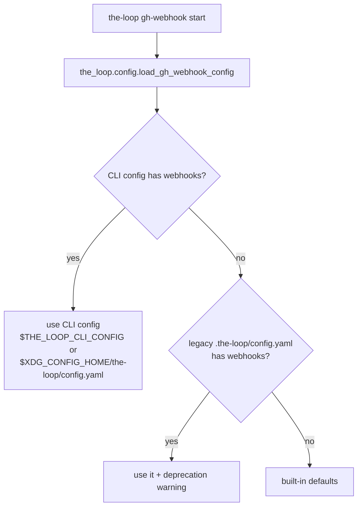

# Design: split the-loop's config into CLI config and plugin config

> Phase 2 of 3. Derives from [`requirements.md`](requirements.md). Decision record:
> [`decision-021`](../../decisions/decision-021.md).

## Overview

Move the `webhooks:` block out of the per-repo plugin config into a new
user/machine-level CLI config with its own schema, add a resolver in the CLI, and keep a
deprecating fallback to the old location.

## Components

### 1. Schemas

- `.the-loop/config.schema.json` (plugin): drop the `webhooks` property; sharpen the
  top-level description to state the split.
- `.the-loop/cli-config.schema.json` (new): top-level `version` + `webhooks.ghWebhook`,
  reusing the exact shape previously nested under the plugin config.

### 2. CLI config loader — `cli/the_loop/config.py`

- `cli_config_path()` → resolves `$THE_LOOP_CLI_CONFIG` → `$XDG_CONFIG_HOME/the-loop/
  config.yaml` → `~/.config/the-loop/config.yaml`.
- `load_cli_config()` → best-effort YAML read of that path (`{}` on missing file / no
  PyYAML / parse error).
- `load_gh_webhook_config()` → returns `webhooks.ghWebhook` from the CLI config; if the
  CLI config carries no `webhooks`, falls back to the legacy repo `.the-loop/config.yaml`
  with a deprecation warning; else `{}`.

### 3. Command wiring

- `gh_webhook.py::_load_config_defaults()` delegates to
  `config.load_gh_webhook_config()`; the flag-override precedence is unchanged.
- `sessions_cmd.py` continues to import `_load_config_defaults` from `gh_webhook` — no
  change needed there.
- `scenarios.py` is untouched: `testing.integrationTestGlobs` is per-repo data and stays
  in the plugin config.

### 4. Templates, manifest, docs

- New `.the-loop/templates/cli-config.yaml`; the repo's own `.the-loop/config.yaml` and
  the init template lose their `webhooks:` block (replaced by a pointer comment).
- `manifest.yaml` gains the new schema and template entries.
- READMEs (root + CLI), new `configuration` capability doc, and updates to `cli` and
  `webhook-triggers` capability docs + decision index.

## Testing

`cli/tests/test_config.py`: path resolution (override / XDG / home default), CLI-config
read, legacy fallback with warning, precedence, and empty-when-absent. Existing tests
already construct `RoutingConfig` directly, so routing behaviour is unaffected.
