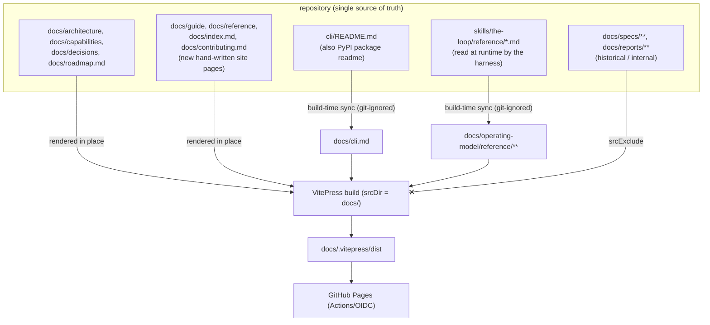

# Design: documentation site for the-loop

> Phase 2 of 3 (requirements → design → tasks). Derives from the approved requirements.
>
> **Retroactive note:** authored during PR #71 review. The design's central decision —
> VitePress reading `docs/` **in place** rather than a synced `docs-site/` mirror — was
> settled by owner feedback on the PR, and is captured here (and in `decision-033`) as
> the record.

## Overview

Stand up [VitePress](https://vitepress.dev/) with its **source directory set to the
existing `docs/` folder**. VitePress is a Markdown-first static-site generator (satisfies
"all content MUST be Markdown" and "good static site like VitePress"), ships a clean
default theme with light/dark and local search (satisfies "bare minimum good looking, no
fancy CSS"), and its build is a self-contained npm project scoped to docs only (satisfies
"don't maintain two toolchains" — the CLI stays Python per `decision-030`; the docs site
is orthogonal tooling, not a second authoring stack for the same content).

The key design tension is Requirement 3 (**reuse, don't duplicate**). VitePress treats
its `srcDir` as the site; by pointing `srcDir` at `docs/`, the files already in
`docs/architecture/`, `docs/capabilities/`, `docs/decisions/`, and `docs/roadmap.md`
**are** the site's pages — no copy exists. Only content that *cannot* live under `docs/`
for a functional reason is synced in at build time.

## Architecture

**Site root = `docs/`.** VitePress config at `docs/.vitepress/config.mts`:

- `base: "/the-loop/"` — project Pages URL is `https://<owner>.github.io/the-loop/`.
- `srcExclude: ["specs/**", "reports/**"]` — historical work-item artifacts and internal
  notes stay in the repo but are not built into the product site (Requirement 3.4).
- `ignoreDeadLinks: true` — the canonical `docs/decisions` and `docs/capabilities`
  content links out to `cli/README.md`, `skills/the-loop/SKILL.md`, and into
  `docs/specs/<id>/` (all outside the built site's scope). Rather than rewrite canonical
  docs to route around the site, dead-link checking is off; those files remain readable
  in the repo regardless. (Trade-off discussed below.)
- Default theme; `search: { provider: "local" }`. No custom CSS/animations.

**New hand-written site pages** (committed under `docs/`, Markdown):

- `docs/index.md` — VitePress `layout: home` hero + feature grid.
- `docs/guide/` — `what-is-the-loop`, `installation`, `quickstart`, `how-it-works`.
- `docs/reference/` — `commands`, `configuration`.
- `docs/contributing.md` — contributor + docs-site instructions.
- `docs/operating-model/index.md` — landing page that indexes the synced reference set.

**Build-time sync** (`docs/scripts/sync-content.mjs`), the *only* copying, limited to
files that structurally cannot be authored under `docs/`:

- `cli/README.md` → `docs/cli.md`. `cli/README.md` is declared as the CLI package's
  readme in `cli/pyproject.toml` (`readme = "README.md"`) and rendered on PyPI, so it
  must remain at `cli/README.md`.
- `skills/the-loop/reference/*.md` → `docs/operating-model/reference/`. These are read
  at **runtime** by the harness from `skills/the-loop/reference/` (progressive
  disclosure); they cannot move.

Both synced destinations are git-ignored and markdownlint-ignored (lint/version the
source, not the copy — Requirement 5.2). The script rewrites the handful of relative
links in the reference docs (`../../../docs/decisions/` → `/decisions/`) so they resolve
in the site.

**Deployment** (`.github/workflows/docs.yml`): on push to `main` touching docs sources
(or `workflow_dispatch`), Node 22 + `npm ci` + `npm run docs:build`, then the first-party
Pages actions with `pages: write` + `id-token: write` and single-flight `concurrency`.

## Components & interfaces

| Component | Responsibility | Interface |
|-----------|----------------|-----------|
| `docs/package.json` | Site toolchain + scripts | `docs:sync`, `docs:dev`, `docs:build`, `docs:preview` |
| `docs/.vitepress/config.mts` | Nav, sidebar, srcExclude, base | VitePress `defineConfig` |
| `docs/scripts/sync-content.mjs` | Build-time sync of the 2 external sources | Node script, run by `docs:sync` (prepended to dev/build) |
| `.github/workflows/docs.yml` | Build + deploy to Pages | GitHub Actions |

## Data models

No data models — a static site. The only "schema" is VitePress's config object and the
sidebar/nav structure, both typed by `vitepress`'s `defineConfig`.

## Error handling

- A build failure (bad link to a *site* page, invalid config) fails `docs:build` → fails
  the workflow → nothing is deployed; the previously published site stays live.
- Missing GitHub Pages enablement: the `deploy` job errors until the owner enables Pages
  (Settings → Pages → Source: GitHub Actions). Flagged as an open item on the PR.

## Security design

> Requirement's Security considerations enforced here.

- **AuthN/AuthZ:** none needed — public static site, no input, no server. The privileged
  action is the Pages deploy, gated by the `github-pages` environment and GitHub Actions
  **OIDC** (`id-token: write`) — no stored secret.
- **Input validation / injection surfaces:** none at runtime (no forms, no server). Build
  consumes only in-repo Markdown.
- **Secrets handling:** the workflow reads no secrets; the minimum scopes are
  `contents: read`, `pages: write`, `id-token: write` (least privilege).
- **Fail-closed:** a failed build publishes nothing.
- **No remote fetch at build:** pages are self-contained; the build does not pull
  untrusted remote content.

## Testing strategy

This is a docs/site work item; "tests" are build-and-render verifications rather than a
unit suite (no product code changes):

- `npm run docs:build` completes with 0 errors and renders the expected page set
  (guide, reference, cli, architecture, capabilities, decisions, operating-model,
  roadmap, contributing).
- `docs/specs/**` and `docs/reports/**` produce **no** HTML in `dist` (srcExclude works).
- `npm run docs:preview` serves the built site; key routes return HTTP 200.
- `pre-commit run --all-files` stays green (ruff, pyright, pytest, markdownlint, schema).

No Gherkin integration scenarios apply (no runtime behaviour to script); recorded here so
the absence is deliberate, not an omission.

## Trade-offs & decisions

- **`docs/` as srcDir vs. a separate `docs-site/` mirror (decided: `docs/`).** The first
  PR #71 revision used a `docs-site/` folder that synced *all* of `docs/` into itself.
  The owner rejected the duplication. Reading `docs/` in place removes the copy entirely;
  the residual sync is only the two files that genuinely cannot live under `docs/`.
  Recorded as `decision-033`.
- **`ignoreDeadLinks: true` vs. rewriting canonical links.** Rewriting `docs/decisions`
  and `docs/capabilities` to avoid links that leave the site would mutate the canonical
  historical record purely for the site's benefit, and would re-break every time upstream
  content changes. Disabling dead-link checking keeps the canonical docs authoritative;
  the cost is the build won't catch a genuinely broken *site* link. Mitigated by keeping
  hand-written pages' internal links consistent and preview-checked.
- **`srcExclude` for specs/reports vs. rendering them.** They are real, versioned content
  but are historical/internal, not product documentation; excluding them keeps the site's
  IA clean (the vite.dev/guide shape) without deleting anything.

## Open questions

- GitHub Pages must be enabled once by the owner (repository setting) — carried to the PR
  as the single blocking action outside automation's control.
