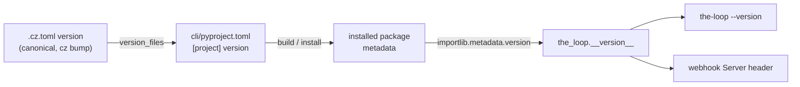

# Design: derive the CLI version from package metadata

> Phase 2 of 3 (bugfix → design → tasks).

## Approach

Replace the hardcoded `__version__` literal with a value read from the installed
distribution's metadata via the stdlib `importlib.metadata` (available on the CLI's
`requires-python = ">=3.9"` floor, keeping the zero-runtime-dependency guarantee). The
distribution name is `the-loopy-one` (import package `the_loop`, decision-019).

```python
from importlib.metadata import PackageNotFoundError, version as _dist_version

try:
    __version__ = _dist_version("the-loopy-one")
except PackageNotFoundError:
    # Running from an uninstalled source tree (no package metadata).
    __version__ = "0.0.0+unknown"
```

Everything downstream already reads `the_loop.__version__`:

- `cli/the_loop/cli.py` builds `--version` as `f"the-loop {__version__}"` — unchanged.
- `cli/the_loop/webhook/server.py` had its own hardcoded `"the-loop-gh-webhook/0.1.0"`;
  it now imports `__version__` and interpolates it into `server_version`, removing the
  second stale copy.

## Why metadata, not a `version_files` entry

Adding `__init__.py` to `.cz.toml` `version_files` would fix the number but keep a
duplicate that must stay in lockstep (guarded by `scripts/check_version_lockstep.py`).
Deriving from metadata removes the duplicate: there is exactly one source of truth
(`cli/pyproject.toml [project] version`, itself a `version_files` target bumped by
commitizen), and the CLI reflects whatever is installed. Fewer moving parts, no new guard.

## Data flow



## Failure modes

- **Uninstalled source tree** (e.g. running `python cli/the_loop/...` without an install):
  `PackageNotFoundError` → sentinel `0.0.0+unknown`. Never raises at import time.

## Testing strategy

Unit tests (`cli/tests/test_cli.py`):

- `__version__` equals `importlib.metadata.version("the-loopy-one")` and is not `"0.1.0"`.
- `the-loop --version` prints `the-loop <__version__>`.

The existing `test_version_exits_zero` continues to guard exit-code behaviour. The test
suite runs under `uv`, which installs the package, so metadata resolves in CI.

## Security design

No new trust boundary. `importlib.metadata` reads local install metadata only.
