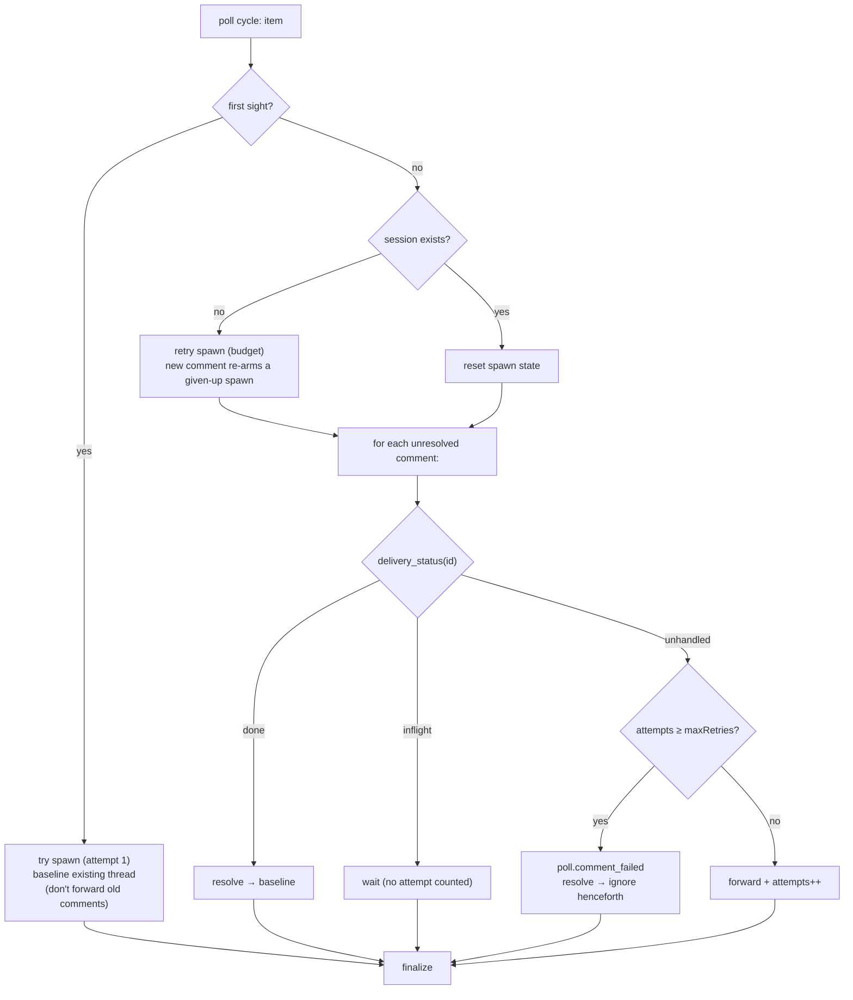

# Design: a bounded per-event retry policy on the poll path + respawn dead tmux sessions

> Phase 2 of 3 (bugfix → design → tasks). Derives from the approved bugfix spec.

## Overview

Three cooperating changes turn "a failed event is dropped" into "a failed event
is retried a bounded number of times, then given up with an audit record":

1. **Dispatcher respawns a dead tmux session on delivery** (AC7–9) — so a retry
   can actually land instead of hitting the same missing session.
2. **The poller keeps a durable, per-event retry budget** (AC1–6) — it stops
   baselining failures as "processed", re-drives them each cycle until success
   or exhaustion, and observes the async dispatch outcome instead of guessing.
3. **A tiny amount of new observability** — `session.respawned`,
   `poll.spawn_failed`, `poll.comment_failed`, and an `attempt` field on
   `poll.comment_forwarded`.

The retry budget lives on the **poll** path deliberately: polling is the pull
ingress that owns its own "next cycle" retries, and the reporter's scenario is a
poller one. The webhook path keeps GitHub-driven redelivery, which the respawn
fix repairs (see bugfix "Out of scope").

## 1. Respawn a dead tmux session (delivery path)

`TmuxResult` gains `session_missing: bool = False`; `TmuxRunner.deliver` sets it
`True` on the existing `has_session`-false early return — the one place that
means "the session vanished" (as opposed to tmux erroring while the session is
alive). No re-probe, no races.

`Dispatcher._dispatch_one`, tmux branch: when delivery fails **and**
`session_missing` is set, call `_respawn_tmux(session, routed, prompt)` and
return; any other failure keeps today's `dispatch.failed` + release path (AC8).

`_respawn_tmux` reuses the crashed session's own recorded fields — nothing is
re-derived from the untrusted payload:

- Resolve the adapter for `session.harness`; absent / CLI-not-on-PATH → fail the
  dispatch, `dispatch.failed`, release for retry (AC9) — mirrors the
  `_spawn_tmux` availability guard.
- Mint a fresh `session_id`; `tmux.spawn(work_item, adapter, prompt,
  cwd=session.cwd, session_id=…)`. `spawn` starts the TUI **with the already
  rendered event `prompt` as its boot prompt** (AC7 — the triggering event is
  delivered, not dropped) and clears any stale same-named pane first.
- `spawn` failure → `dispatch.failed`, release (AC9). Success → build a
  replacement `Session` (new id; same work item / cwd / `tmux_target`; carrying
  over `recent_deliveries` so dedup survives), `registry.register(force=True)`,
  `registry.touch(delivery_id)`, and emit `session.respawned`.

## 2. Poller per-event retry budget (poll path)

### The core problem: observing an async outcome

`dispatcher.handle` enqueues and returns; the real outcome lands later on the
per-session worker. The poller therefore **cannot** know success at
`state.update` time — which is exactly why the old code baselined everything.
The fix is to observe the outcome on a **later cycle** using state the dispatcher
already keeps, exposed by one new method:

```python
# Dispatcher — the dispatcher owns both the dedup cache and the registry, so
# it is the right place to answer "what happened to this delivery?".
def delivery_status(self, delivery_id, refs) -> str:   # "done" | "inflight" | "unhandled"
    if not delivery_id: return "unhandled"
    for ref in refs:                                    # durable success marker
        s = self.registry.find_by_work_item(ref)
        if s is not None and delivery_id in s.recent_deliveries:
            return "done"
    if delivery_id in self.deduper: return "inflight"   # enqueued/processing (or evicted-after-done)
    return "unhandled"                                  # failed (discarded) or never attempted
```

- **done** — the id is in the matched session's durable `recent_deliveries`
  (written by `registry.touch` only on success). Baseline it; stop.
- **inflight** — the id is still in the in-memory dedup cache: enqueued or
  processing. **Not** a failure (AC5) — a long `claude -p` resume can outlast
  several poll cycles; treat it as pending and wait.
- **unhandled** — neither: the dispatch failed (a failed `_dispatch_one`
  `discard`s the id) or it was never sent. This is the only state that consumes
  a retry attempt.

This reuses the existing at-most-once machinery (`recent_deliveries` +
`Deduper`) rather than adding a parallel outcome channel.

### PollState: from a flat "seen" set to a retry ledger

Per work-item ref, `PollState` now tracks:

- `seenComments` — **resolved** comment ids (delivered *or* given-up): the
  baseline to ignore, pruned to the live thread each cycle (as before).
- `commentAttempts` — `{comment_id: attempts}` for comments still in flight.
- `spawn` — `{attempts, gaveUp, deliveryId}` for the spawn/presence retry.

`is_known`/`seen_comments` keep their meaning; new accessors
(`comment_attempts`, `note_comment_attempt`, `resolve_comment`, `spawn_*`) and a
`finalize(ref, live_ids, polled_at)` that prunes both maps to live ids replace
the old unconditional `update`.

### `_process_item` flow



- **Spawn retry (`_try_spawn`)** mirrors the comment logic against the *stored*
  presence delivery id: `inflight` → wait; `done`/session-exists → reset;
  `unhandled` with `attempts < maxRetries` → emit a fresh presence event, store
  its delivery id, `attempts++`; `attempts >= maxRetries` → `poll.spawn_failed`
  (`will_retry=false`), set `gaveUp`. `has_session` → `reset_spawn`; a
  genuinely-new comment (attempts == 0, unseen) → `reset_spawn` to re-arm (AC6).
  Storing the per-attempt presence id (presence ids are otherwise fresh UUIDs)
  is what lets `delivery_status` see an in-flight spawn and avoids piling a
  second presence behind a long-running one.
- **Comments** are only processed when a session exists — without one there is
  nothing to deliver into, so the spawn budget (not the comment budget) governs
  that window.
- `maxRetries` = **total delivery attempts** per event before giving up
  (default 3); each `unhandled` cycle spends one.

### Config

`polling.maxRetries` (integer, default 3, minimum 1) in `cli-config.schema.json`
and `cli-config.yaml`; mirrored on `PollConfig` and a `--max-retries` flag
(parity with `--interval`). Read once at poller construction (like the other
dispatch knobs a reload doesn't touch).

## Data model & new event types

- `TmuxResult.session_missing: bool` — in-process signal only.
- `Session` — unchanged shape; a respawn rewrites the record (`force=True`),
  preserving `recent_deliveries`.
- New `EVENT_TYPES`: `session.respawned`, `poll.spawn_failed`,
  `poll.comment_failed` (registering them keeps the emitted-vs-catalog unit test
  green); `poll.comment_forwarded` gains an optional `attempt` field.

## Failure modes

- **Harness crashes on every boot.** Each *new* delivered event triggers at most
  one respawn (serialized per work item); the poll budget then bounds retries to
  `maxRetries` and gives up with `poll.*_failed` — no tight loop, operator-visible.
- **Long-running dispatch** (minutes) — `inflight` keeps it from being counted a
  failure (AC5); it resolves to `done` once `recent_deliveries` records it.
- **Restart mid-flight** — the in-memory dedup cache is empty, so an interrupted
  delivery reads `unhandled` and is retried; a delivery that had succeeded reads
  `done` from durable `recent_deliveries`. Both correct.
- **Respawn/spawn cannot proceed** — behaves exactly like today (fail, release,
  and emit a failure record); recovery resumes when the binary/host returns.

## Alternatives considered

- **Retry budget in the dispatcher, keyed by delivery id.** Rejected: presence
  (spawn) events use a fresh id per attempt, so a per-delivery-id counter can't
  bound spawn retries — the reporter's actual case. The poller is where
  per-cycle spawn retries live.
- **Synchronous poll dispatch.** Would give the poller the outcome directly but
  breaks the shared async FIFO the webhook path relies on. Observing via
  `delivery_status` reuses existing durable state with no concurrency change.
- **Interactive `--resume` of the crashed harness id** (preserve conversation) —
  needs a new adapter argv; deferred (see bugfix "Out of scope").

## Testing strategy

Unit (`test_tmux_runner.py`): `deliver` sets `session_missing` only on the
missing-session path.

Unit (`test_poller.py` / `test_dispatcher`): `delivery_status` returns
done/inflight/unhandled correctly; `PollState` ledger accessors + prune.

Integration (`test_tmux_runner_integration.py`, stub-tmux, Gherkin + requirement
link): (a) an event to a **dead** tmux session respawns `loop-<slug>` with the
event as boot prompt, re-registers, marks the delivery processed, emits
`session.respawned`; (b) a non-missing delivery failure does **not** respawn.

Integration (`test_poller_integration.py`, Gherkin + requirement link): a comment
whose dispatch keeps failing is re-forwarded each cycle up to `maxRetries`, then
emits `poll.comment_failed` and is ignored; a **new** comment afterward is
forwarded afresh; an event that succeeds is baselined and not re-sent.

## Security design

No trust-boundary change (see bugfix "Security considerations"). All recovery is
parameterised by previously-validated durable state and the same
untrusted-payload-framed prompt; retries are bounded and fail-closed with an
audit record; no new input, network, or filesystem path is introduced.
