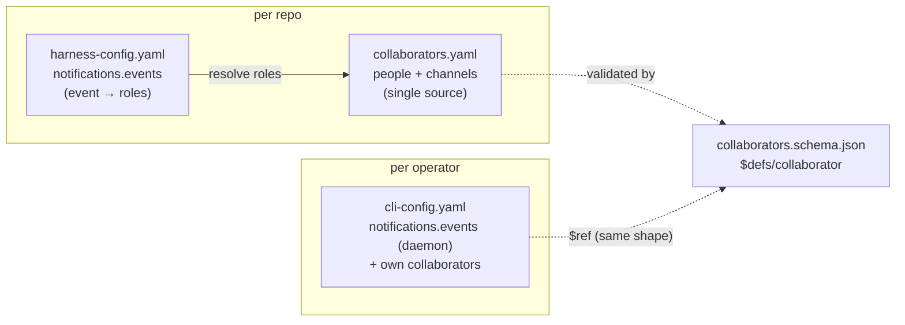

# Design: make the notification/escalation mechanism coherent

> Phase 2 of 3 (requirements → design → tasks). Derives from the approved
> requirements.
>
> **Provenance note (paper trail):** authored retroactively during PR #83 review (see
> requirements.md). The design below was actually iterated in the open, on issue #82
> itself — the two design comments (config layering / no-duplication proposal, then
> the answers to "fold collaborators into config.yaml?" and "rename config.yaml?"),
> each answered by the owner's principles comment — and is recorded canonically in
> [decision-035](../../decisions/decision-035.md). `status: approved` reflects that
> thread.

## Overview

Three config surfaces, each answering one question, with people defined exactly once
per side and event filters on both sides covering disjoint event sets:

| File | Question it answers | Owner |
|---|---|---|
| `harness-config.yaml` | how does the-loop behave in this repo? | the project |
| `collaborators.yaml` | who stewards this repo & how to reach them? | the project |
| `cli-config.yaml` | how does my daemon run & who do I notify? | the operator |

Collaborators exist in two places by **declaration**, never by **lookup**: the harness
reads the repo's `collaborators.yaml`; the operator declares their own recipients in
`cli-config.yaml`. The daemon never reads any repo file (decision-032 intact).

## Components & interfaces

### `collaborators.schema.json` (new)

- `$defs/collaborator`: `handle` (required), `kind` (individual|group), `roles`
  (required, the shared role enum), `notifications { enabled, channels[] }`.
- `$defs/notificationChannel`: `type` (enum: `slack` — grows as types ship),
  `enabled`, `via` (`mcp`|`cli`|`api` — the `externalTools.kind` primitives), and
  `config` (channel-type-specific; slack: `channel-list: string[]`).
- Reused by `cli-config.schema.json` via the relative cross-file
  `$ref: collaborators.schema.json#/$defs/collaborator` — one definition, zero drift
  (requirement 3.2). `scripts/validate_config.py` registers the schema in a local ref
  store so resolution never touches the network.

### `harness-config.schema.json` (renamed from `config.schema.json`)

- `personas`/`messaging` removed. New `notifications { enabled, events }` where
  `events` enumerates the harness-side taxonomy — `decision-pending`,
  `phase-approval-pending`, `pr-review-pending`, `security-sign-off-pending`,
  `conflict-escalated`, `work-item-complete` — each mapping to a role list. Omitted
  event ⇒ nobody notified (fail-quiet by default, requirement 2.2).
- `x-onboarding` "people" group now establishes `collaborators.yaml` +
  `notifications` (+ `userInteraction`).

### `cli-config.schema.json`

- New top-level `collaborators` ($ref above) and `notifications { enabled, events }`
  with the daemon-side taxonomy: `work-item-spawned`, `dispatch-failed`,
  `session-died`, `event-dropped-unauthorized`. Disjoint from the harness taxonomy by
  construction — the two filter layers cover different notification paths.

### CLI (`cli/the_loop/`)

- Only `commands/scenarios.py` changes: it is a repo-local utility (not the daemon),
  so it may read the repo's harness config; it now tries `harness-config.yaml` then
  falls back to the pre-rename `config.yaml` (requirement 4.3). The daemon commands
  are untouched — config load stays best-effort/lenient, so the new keys need no code.

### Migration (`manifest.yaml` + `upgrade-the-loop.md`)

- Two `manifest.deprecated` entries for the old paths, with reasons that instruct
  MIGRATION (rename preserving values; `personas` → collaborators; slack
  `messaging.channels` targets → a collaborator's `channel-list`; `whatsapp`/`email`
  flagged `# TODO: verify`) rather than deletion. `collaborators.yaml` flips to
  `managed: true` and gains a schema entry.

## UI/UX design

N/A — config schemas, templates, docs and CLI-internal changes only.

## Security design

The one trust boundary touched is decision-032's: repo-controlled files must not
configure the daemon. Enforced by design: CLI-side recipients live only in the
operator-owned `cli-config.yaml`; the shared shape is reused via schema `$ref`, not by
the daemon reading repo files. No secrets are added to any config (slack
`channel-list` is channel names). Delivery (task 21) will add its own boundaries and
must bring its own threat model.

## Error handling

- Schema validation (pre-commit + CI) rejects malformed collaborator/notification
  config in all six checked-in files.
- `scenarios.py` keeps its lenient posture: missing file/PyYAML ⇒ built-in defaults.
- An event absent from a filter map ⇒ no notification (never an error).

## Alternatives considered

Recorded in [decision-035](../../decisions/decision-035.md): folding collaborators
into the plugin config (rejected — CODEOWNERS-like ownership statement, different
review sensitivity, and the CLI-side reuse would blur decision-032); the daemon
reading the checked-out event repo's collaborators.yaml (rejected in favor of
declaration — kept as an explicitly-carved future option); `coding-harness-config.yaml`
as the rename target (rejected for the established shorter term of art).
