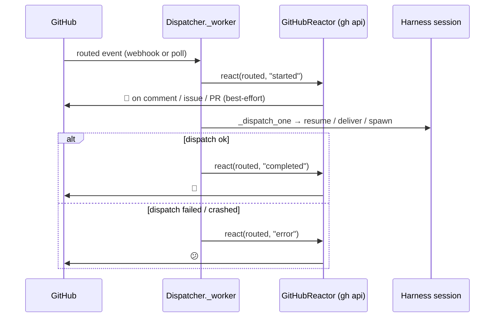

# Design: dispatch-lifecycle emoji reactions

> Phase 2 of 3 (requirements → design → tasks). Derives from `requirements.md`.

## Overview

A single new module, `cli/the_loop/reactions.py`, plus three small wiring
points in the dispatcher. The dispatcher is deliberately the integration seam:
**both** ingress paths (webhook receiver and poller) funnel every event through
`Dispatcher._worker` → `_dispatch_one`, so reacting there covers issue
comments, PR comments, poll-synthesized comments and presence/spawn events with
one implementation — and events that are dropped *before* dispatch (authz,
dedup, spawn policy, PR-close) naturally get no reaction (AC1.6).

## 1. `reactions.py` — config, target resolution, reactor

### `ReactionConfig`

Dataclass mirror of `routing.reactions` (`enabled` default **False**,
`started="eyes"`, `completed="hooray"`, `error="confused"`, `gh_binary="gh"`),
with `from_mapping` following the existing `*Config.from_mapping` idiom and a
`content_for(state)` accessor. The state names are module constants
(`STATE_STARTED/COMPLETED/ERROR`).

### Target resolution — `target_from_event(routed) -> Optional[ReactionTarget]`

Pure function (unit-testable, no I/O), returning where the reaction lands or
`None` for "no-op" (AC3.1/3.2):

1. **Provider guard:** no `github` work item among `routed.work_items` → `None`
   (a future Jira provider's events no-op by construction).
2. `repository.full_name` → `owner`/`repo`; each segment must match
   `[A-Za-z0-9._-]+` or `None`.
3. `payload["comment"]` present → react on the **comment**:
   - webhook payloads: prefer `node_id` (GraphQL id, works for issue comments
     AND review comments) → GraphQL target;
   - numeric `id` (webhook without node_id) → REST target
     `repos/{o}/{r}/{issues|pulls}/comments/{id}/reactions` (the `pulls` form
     for `pull_request_review_comment` events);
   - poll-path comments carry the GraphQL node id **in `id`** (see
     `GhClient._comment_from_json`) → GraphQL target. Node ids must match
     `[A-Za-z0-9_=+/-]+`.
4. else `issue`/`pull_request` number present → REST target
   `repos/{o}/{r}/issues/{number}/reactions` (GitHub treats PRs as issues for
   reactions), covering presence/labeled/spawn events and `pull_request_review`
   (a review body is not reactable on GitHub; the PR is).
5. else (`workflow_run`, malformed) → `None`.

`ReactionTarget` is a frozen dataclass: `owner`, `repo`, and either `rest_path`
or `node_id`.

### `GitHubReactor`

Shells the operator's **`gh` CLI** — the same auth posture as the poller
(`GhClient`): no token of its own, inherits `gh`'s enterprise config. Injectable
`runner=subprocess.run` + `timeout` (default 30 s) for tests, mirroring
`GhClient`.

`react(routed, state) -> bool` short-circuits, in order: disabled → content
`""` → content not in the fixed palette (warn) → no target → `gh` not on PATH
(warn **once**, AC3.3). Then:

- REST target: `gh api --method POST <rest_path> -f content=<name>`
- GraphQL target: `gh api graphql -f query='mutation($subjectId:ID!,$content:ReactionContent!){addReaction(input:{subjectId:$subjectId,content:$content}){clientMutationId}}' -f subjectId=<node> -f content=<ENUM>`

with the REST↔GraphQL name mapping in a module `REACTION_CONTENTS` dict
(`eyes`→`EYES`, `+1`→`THUMBS_UP`, …). Success emits `reaction.added` (debug
log); any failure (non-zero exit, OSError, timeout) emits `reaction.failed`
at warning level and returns `False` — never raises (AC1.5).

## 2. Dispatcher wiring

- `RoutingConfig` gains `reactions: ReactionConfig` (parsed in `from_mapping`),
  so the poller inherits it for free and `Dispatcher.reload` hot-swaps it with
  the rest of the soft policy (AC2.4) — the reactor is rebuilt on reload unless
  a caller injected one (same override pattern as `workspace`).
- `Dispatcher.__init__` gains an optional `reactor` parameter (tests inject a
  fake); default `GitHubReactor(config.reactions)`.
- `_worker` wraps the dispatch: `react(started)` before `_dispatch_one`, then
  `react(completed)` / `react(error)` from its boolean outcome (exception path
  included). To report that outcome, `_dispatch_one`, `_spawn_for`,
  `_spawn_tmux` and `_respawn_tmux` now **return `bool`** (True exactly on the
  paths that emit `dispatch.succeeded` / `session.spawned` /
  `session.respawned`) — a pure signature change, no behavioural edits.
- PR-close and all pre-dispatch drops happen in `handle()` before any enqueue,
  so they never reach the reactor (AC1.6).

## 3. Config + schema + observability

- `cli-config.schema.json`: `routing.reactions` object (`additionalProperties:
  false`); `started`/`completed`/`error` enum = 8 palette names + `""`;
  defaults documented, including why ✅/⁉️ are unavailable.
- `.the-loop/cli-config.yaml`: reactions block, `enabled: true` (dogfood).
- `eventlog.EVENT_TYPES` += `reaction.added`, `reaction.failed` (the
  observability reference defers to `EVENT_TYPES` as the catalog's source of
  truth, so registering there is sufficient).

## Decisions

- **Dispatcher-level, not router/poller-level.** One seam covers both ingress
  paths and inherits their guards; the poller's bounded-retry ledger
  (issue-80) is untouched — a retried event just re-adds an (idempotent)
  reaction.
- **`gh` CLI, not a bundled HTTP client.** Keeps the zero-runtime-dependency
  guarantee and the established auth posture; reactions are best-effort, so
  the extra subprocess cost (~2 per event) inside the throttled worker is
  acceptable.
- **Completed ≠ removing 👀.** The started reaction stays — reactions are an
  append-only visible trail (👀 then 🎉), and removal would need reaction-id
  bookkeeping for no user value.
- **Default off.** First GitHub write surface of the daemon → opt-in, matching
  the CLI's fail-closed philosophy (see requirements security section).

## Error handling

Every failure inside the reactor degrades to a logged no-op; the only warnings
that can repeat per-event are actual `gh` invocation failures
(`reaction.failed`). Dispatch outcome, dedup and retry semantics are
byte-for-byte unchanged.

## Testing strategy

- **Unit** (`cli/tests/test_reactions.py`): config parsing/defaults;
  `target_from_event` across webhook comment (node_id and numeric-id), review
  comment, poll comment (node id in `id`), presence issue/PR, review,
  `workflow_run` → None, non-github provider → None, malformed owner/id →
  None; reactor argv construction (REST + GraphQL) via fake runner; no-op
  short-circuits (disabled, empty content, unknown content, missing gh
  warn-once); failure → `False` without raising.
- **Integration** (Gherkin-docstringed, in `test_webhook_routing_integration.py`
  style): dispatch success → started+completed on the comment; dispatch
  failure → started+error; spawn (labeled) → reactions on the issue;
  unauthorized/duplicate events → no reactions. Fake reactor records calls —
  no network.
