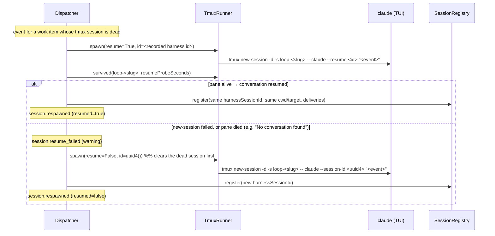

# Design: resume-on-respawn for tmux-hosted sessions

> Phase 2 of 3 (requirements → design → tasks). Derives from `requirements.md`.

## Overview

Three seams, each small, all on the existing respawn path:

1. **`harness/base.py` + `harness/claude_code.py`** — a second interactive argv
   builder, `interactive_resume_argv(prompt, session_id)`, defaulting to the
   same `UnsupportedRunnerError` the contract already uses for "this harness
   can't do interactive". Claude Code implements it as `--resume <id> … <prompt>`.
2. **`runner.py`** — `TmuxRunner.spawn(..., resume=False)` picks the resume argv,
   and a new `survived(target, delay)` waits out a grace period and re-reads pane
   liveness, so "tmux started" is not mistaken for "the harness is running".
3. **`webhook/dispatcher.py`** — `_respawn_tmux` becomes *try to resume, verify,
   fall back to a fresh spawn*, keeping the resumed id in the registry.



## 1. Adapter contract — `interactive_resume_argv`

`HarnessAdapter` already models "can this harness be tmux-hosted?" by having
`interactive_argv` raise `UnsupportedRunnerError`. Resuming interactively is the
same *kind* of capability question, so it gets the same shape:

```python
# harness/base.py
def interactive_resume_argv(self, prompt: str, session_id: str) -> List[str]:
    raise UnsupportedRunnerError(
        f"the {self.name or self.binary} harness cannot resume a conversation "
        "in interactive mode"
    )
```

```python
# harness/claude_code.py
def interactive_resume_argv(self, prompt: str, session_id: str) -> List[str]:
    return ["--resume", session_id] + self.extra_args + [prompt]
```

Same flags-first/prompt-last ordering as `interactive_argv`, for the same
reason. `--resume <id>` without `-p` keeps Claude Code in its interactive TUI
(verified against the shipped CLI: `-r, --resume [value]` — "Resume a
conversation by session ID"), and the positional prompt is submitted into the
resumed conversation. Resume lookup is scoped to the project directory, which is
why the respawn keeps running in `session.cwd` (unchanged from today).

**Cursor is deliberately not implemented** (R1.4, and the issue's own
instruction): `CursorAgentAdapter` has no `interactive_argv` either, so a cursor
session can never be tmux-hosted and there is nothing to resume. Adding a resume
builder it can never reach would be dead code; the base default already gives
the dispatcher the fallback signal it needs.

## 2. `runner.py` — resume spawns and a liveness probe

- `TmuxRunner.spawn(work_item, adapter, prompt, cwd, session_id, timeout=None,
  resume=False)` — `resume` selects `adapter.interactive_resume_argv` over
  `adapter.interactive_argv`. Everything else (stale-session clearing,
  `new-session -d -s loop-<slug> -c cwd -- <binary> <argv>`, `remain-on-exit`)
  is untouched, so the fallback path re-enters the *same* method and its
  stale-clearing kills the dead-on-arrival resume session before respawning.
  `UnsupportedRunnerError` keeps surfacing as `TmuxResult(ok=False, …)`, which
  the dispatcher now reads as "fall back" rather than "fail".
- `TmuxRunner.survived(target, delay, sleeper=time.sleep) -> bool` — sleep
  `delay` (skipped entirely when `delay <= 0`), then return
  `has_live_session(target)`. `sleeper` is injectable so tests never wait.

Why a probe at all: `tmux new-session -d` returns 0 as soon as tmux forks the
pane, and `claude --resume <unknown-id>` exits 1 within a fraction of a second.
Without the probe, an unresumable id would register a "successful" respawn whose
pane is already dead — and with `remain-on-exit` that dead pane persists, so
every subsequent event would respawn-and-report-success forever while the events
went nowhere. The probe converts that silent black hole into one logged
`session.resume_failed` plus a working fresh session.

Why `has_live_session` (already there, issue-86) rather than a new check: it is
exactly the "session exists AND a pane is not dead" question, including its
degrade-to-live behaviour on an unreadable `#{pane_dead}` (R2.4).

## 3. `dispatcher.py` — try-resume-then-fall-back

`TmuxConfig` gains `resume_on_respawn: bool = True` and
`resume_probe_seconds: float = 2.0` (parsed from `resumeOnRespawn` /
`resumeProbeSeconds`), hot-reloading with the rest of `RoutingConfig`.

`_respawn_tmux(session, routed, prompt)` keeps its current skeleton — same
adapter-availability guard, same "release the delivery for retry" failure
handling — and gains a first attempt in front:

```python
resumed_id = self._try_resume(session, adapter, prompt)   # -> str | None
session_id = resumed_id or str(uuid.uuid4())
if resumed_id is None:
    result = self.tmux.spawn(..., session_id=session_id, resume=False)
    if not result.ok:  # unchanged failure handling
        ...
```

`_try_resume` is the whole feature, and every branch in it returns `None`
(= "spawn fresh"), never an exception:

| Condition | Outcome |
|---|---|
| `tmux.resume_on_respawn` false | `None`, silent (opted out) |
| no recorded `harness_session_id` | `None`, silent |
| id fails `^[A-Za-z0-9][A-Za-z0-9._-]{0,127}$` | `None` + `session.resume_failed` |
| adapter raises `UnsupportedRunnerError` (probed via `interactive_resume_argv`) | `None` + `session.resume_failed` (debug-ish reason: harness can't) |
| `tmux.spawn(resume=True)` not ok | `None` + `session.resume_failed` |
| `survived()` false (pane died) | `None` + `session.resume_failed` |
| otherwise | the recorded id |

The registry write after a successful resume records the **same**
`harnessSessionId` (R1.2) with the existing `recent_deliveries` carry-over, so a
second crash resumes the same conversation again. `session.respawned` gains
`resumed=<bool>`; the log line says "resumed the existing conversation" vs
"started a fresh conversation". `_respawn_tmux` still posts no announcement
(issue-86 AC3.2 / R2.6) — the tmux name is unchanged either way.

The `UnsupportedRunnerError` probe happens *before* touching tmux (call
`adapter.interactive_resume_argv(prompt, id)` inside a `try` and discard the
result, letting `TmuxRunner.spawn` build it again). One redundant list build
buys a clean "can this harness resume?" answer without leaking argv construction
into the dispatcher or adding a `supports_*` flag to the contract.

## Decisions

- **Resume, verify, then fall back — never resume blindly.** The unresumable-id
  failure mode is real (`claude --resume <unknown>` → exit 1) and silent by
  construction. A 2-second probe is the cheapest honest verification; anything
  smarter (parsing the harness's session store, `claude --resume` dry runs)
  couples the-loop to harness internals for no extra safety.
- **Keep the same session id in the registry on a resumed respawn.** The
  alternative (`--fork-session`, or minting a new id and recording that) would
  make every crash branch the conversation and orphan the previous transcript.
  Repeat crashes should converge on one conversation.
- **Default on.** Continuing the conversation is what the issue asks for, and
  the fallback keeps the worst case at today's behaviour plus one log line.
  `resumeOnRespawn: false` restores the pre-issue-89 path exactly.
- **`resumeProbeSeconds: 2`, configurable, `0` = don't wait.** Comfortably
  covers a fast startup failure without noticeably delaying a real respawn; the
  probe runs inside the per-session worker that already serializes this work
  item.
- **Claude only, via a raising base default.** Matches the issue's instruction
  and the existing `interactive_argv` precedent; cursor cannot be tmux-hosted at
  all, so a cursor resume builder would be unreachable code.
- **Shape-check the id (`[A-Za-z0-9][A-Za-z0-9._-]{0,127}`).** It comes from a
  local file that the-loop wrote, but it becomes argv; `announce.py` sets the
  precedent of validating registry-derived values before they reach a command
  line. The leading character must be alphanumeric: a dash-led "id" would pass a
  naive character-class check and land in the invocation as a *flag*
  (`claude --resume --dangerously-skip-permissions …`), which is the one thing
  this check exists to prevent.
- **No new module.** The change is ~60 lines across three existing files; a
  `resume.py` would be indirection for its own sake (minimalism ladder).

## Error handling

Every new failure degrades to the previous behaviour: an unsupported harness, a
malformed id, a failed resume spawn or a dead pane all fall through to today's
fresh spawn, each with a `session.resume_failed` record explaining why. If the
*fresh* spawn then fails, the existing path takes over unchanged (log, emit
`dispatch.failed`, discard the delivery id so a redelivery retries). Nothing new
can raise out of `_respawn_tmux`.

**Known bound, stated rather than hidden:** the probe answers "was the harness
still alive after `resumeProbeSeconds`", so a harness that takes *longer* than
that to fail its resume is recorded as a successful respawn and that one event is
lost with the pane (the next event respawns again). `claude --resume <unknown-id>`
fails in well under a second, so 2s is a generous margin; an operator on a slower
box raises the value. The alternative — waiting long enough to be certain — would
put a multi-second stall on every legitimate respawn, which is the common case.

## Testing strategy

- **Unit** (`cli/tests/test_tmux_runner.py`):
  `ClaudeCodeAdapter.interactive_resume_argv` argv shape (flags first, prompt
  last, `extra_args` honoured); `CursorAgentAdapter.interactive_resume_argv`
  raises `UnsupportedRunnerError`; `TmuxRunner.spawn(resume=True)` emits
  `-- claude --resume <id> <prompt>`; `survived()` true/false for live/dead
  panes, no sleep when `delay <= 0`, injected sleeper called with the delay;
  `TmuxConfig` parsing/defaults for the two new keys.
- **Integration** (Gherkin-docstringed,
  `cli/tests/test_tmux_runner_integration.py`, stub-tmux pipeline):
  1. a dead session is respawned **with `--resume <recorded id>`** and the
     registry keeps that id (`session.respawned` resumed=true);
  2. a resume whose pane comes up dead falls back to a fresh `--session-id
     <uuid>` spawn that still carries the event as its boot prompt, and the
     delivery is marked processed;
  3. `resumeOnRespawn: false` respawns fresh, as before this change;
  4. a resumed respawn still posts no announcement.
- **Regression:** the existing issue-80/issue-86 respawn scenarios are updated
  where they assert `--session-id` on a respawn, since the default path now
  resumes; the fresh-spawn assertions move to the opt-out/fallback scenarios so
  both behaviours stay covered.
- **Gates:** `make check` (ruff, markdownlint, format, pyright, config
  validation, pytest) green, with the output recorded in the execution log.
