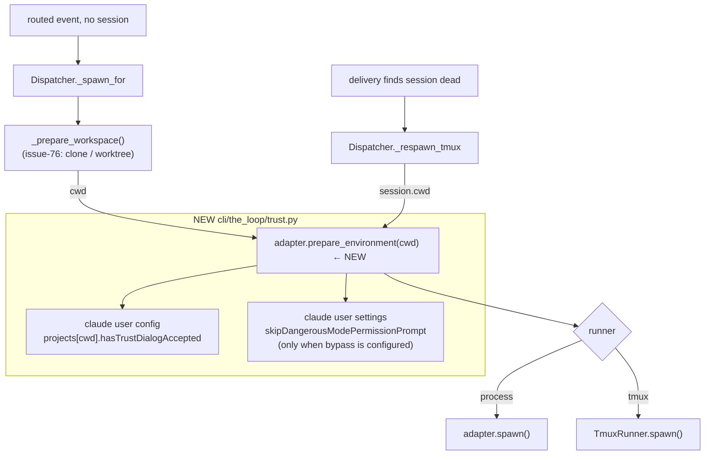

# Design: pre-trust the workspace before spawning a harness session

> Phase 2 of 3. Derived from [`requirements.md`](requirements.md).

## 1. Where the dialogs actually come from

Before designing anything, the exact mechanism (read off the shipped Claude Code
CLI, not guessed):

| Dialog | Where the "already answered" state lives | Notes |
|---|---|---|
| Workspace trust | `projects["<normalised path>"].hasTrustDialogAccepted: true` in the **user config file** | The lookup tries the canonical (git-root) key first, then walks **up** from the resolved cwd — so an ancestor's entry also grants trust |
| First-run onboarding | `projects["<path>"].hasCompletedProjectOnboarding: true`, same file | Read from the **exact** project key (`xd()` → `projects[<canonical cwd>]`) with **no** ancestor walk — unlike trust. This asymmetry drives the scope design in §3.3 |
| Bypass-permissions disclaimer | `skipDangerousModePermissionPrompt: true` in the **user settings file**; legacy `bypassPermissionsModeAccepted: true` at the top level of the user config file | Current builds migrate the legacy key into the settings one, so writing both is forward- and backward-compatible |

Path resolution, same source:

- config dir = `$CLAUDE_CONFIG_DIR` if set, else `~/.claude`
- user settings file = `<config dir>/settings.json`
- user config file = `<config dir>/.config.json` **if that file exists**, else
  `${CLAUDE_CONFIG_DIR:-$HOME}/.claude.json`
- project key = `path.normalize(...)` of the git root or the resolved cwd

`--dangerously-skip-permissions` is a *permission-mode* flag; none of the above
is a permission rule, which is precisely why the flag does not silence them
(issue #90's observation, now explained).

## 2. Shape of the change



Three seams, mirroring how `reactions`/`announce` were added:

1. **`cli/the_loop/trust.py` (new)** — everything that knows the on-disk layout
   of a harness's config, plus the safe read-merge-write.
2. **`harness/base.py` + `harness/claude_code.py`** — a `prepare_environment()`
   hook on the adapter contract. Base = no-op (satisfies R3.6 for
   cursor-agent); Claude Code delegates to `trust.py`. The adapter is the right
   home because it already holds the two inputs: which harness, and the
   configured `extra_args` that decide whether bypass mode was requested.
3. **`webhook/dispatcher.py`** — call the hook on both spawn paths, log and
   event-log the outcome, never fail the dispatch.

### Why the adapter, not the dispatcher

The dispatcher must stay harness-agnostic: it already treats "how do I start
this harness" as adapter knowledge (`_spawn_argv`, `interactive_argv`,
`UnsupportedRunnerError`). "What does this harness need on disk before it can
start unattended" is the same kind of knowledge. Putting it on the dispatcher
would hard-code Claude Code into the routing core and leave no seam for a future
cursor-agent equivalent.

## 3. Components and interfaces

### 3.1 `TrustConfig` — mirror of `routing.harnessTrust`

```python
@dataclass
class TrustConfig:
    enabled: bool = True                      # master switch
    scope: str = "workspace-root"             # workspace-root | directory
    accept_bypass_permissions: str = "auto"   # auto | always | never

    @classmethod
    def from_mapping(cls, data: dict) -> "TrustConfig": ...
```

Three knobs (minimalism ladder: the config dir already has an env var, the file
names are the harness's own). Default `enabled: true` follows the
`reactions`/`announce` precedent — the daemon's job is to run unattended, and an
operator who does not want the-loop touching their config flips one boolean.
`scope` defaults to `workspace-root` per the owner's decision on PR #92
(decision-036): the workspace root exists *for* the-loop, so trusting it once
covers every checkout under it — including folders the-loop never spawned into.
An unknown value degrades to the default rather than to something accidentally
wider or narrower.

### 3.2 `TrustResult`

```python
@dataclass
class TrustResult:
    ok: bool = True
    applied: List[str] = []   # human-readable notes, e.g. "trusted /path (~/.claude.json)"
    error: str = ""
```

`ok=True, applied=[]` is the "nothing needed / no-op" case — indistinguishable
from success on purpose, since both mean "the spawn may proceed".

### 3.3 `ClaudeTrustStore`

Owns the layout table from §1 and nothing else:

```python
class ClaudeTrustStore:
    def __init__(self, env=os.environ, home=None): ...
    def config_dir(self) -> Path                    # $CLAUDE_CONFIG_DIR or ~/.claude
    def config_path(self) -> Path                   # <dir>/.config.json if present else ~/.claude.json
    def settings_path(self) -> Path                 # <dir>/settings.json
    def project_keys(self, path: str) -> List[str]  # abspath-normalised (+ realpath if different)
    def trust(self, cwd: str, root: Optional[str] = None) -> TrustResult
    def accept_bypass_permissions(self) -> TrustResult
```

`project_keys()` always returns the **exact** directory, never a parent:
widening is a decision the *caller* makes by passing a `root`, never something
this function does silently. Trailing separators are stripped and the path is
`os.path.normpath`-ed so the key matches the harness's `path.normalize` form.

`trust()` writes the two project keys with **different scoping**, because §1
shows the harness reads them differently:

| Key | Written on | Why |
|---|---|---|
| `hasTrustDialogAccepted` | `root` when given, else `cwd` | The lookup walks up, so one root entry covers every checkout beneath it |
| `hasCompletedProjectOnboarding` | always `cwd` | No ancestor walk — root trust alone would just reveal the onboarding screen |

Guard rails, so a root can never mean more than the operator meant: a `root`
that does not contain `cwd` (`is_within`, compared component-wise so `/ws` does
not "contain" `/ws-other`) is ignored, and the dispatcher refuses a root broad
enough to be meaningless (`is_too_broad`: `/`, or the home directory itself),
falling back to per-directory trust with a warning.

### 3.4 The safe write

One private helper used by both writes:

```python
def _update_json(path: Path, mutate: Callable[[dict], bool]) -> TrustResult
```

- Missing file → start from `{}` (and `mkdir -p` the parent).
- Present but unparseable / unreadable → **return an error, write nothing**
  (R3.3).
- `mutate(data)` returns `True` only when it actually changed something; `False`
  short-circuits with no write at all (R1.5 — the anti-clobber rule).
- Write: `tempfile.NamedTemporaryFile` in the same directory → `os.replace()`
  (atomic on POSIX), `chmod 0600` on the temp file before the replace so a
  freshly created config is never world-readable. An existing file's mode is
  preserved.
- Guarded by a module-level `threading.Lock` keyed by resolved path, because the
  dispatcher runs one worker thread per session and several may spawn at once.

**Residual risk, stated:** a *different process* (an interactive Claude Code the
operator is running) could write the same file between our read and our replace,
losing its change. The no-write-when-unchanged rule means we only write on the
first spawn into a given directory, which makes the window small but not zero.
File locking across an editor-managed JSON file we do not own is not worth the
complexity here (YAGNI); the trade is recorded in `decision-037`.

### 3.5 Adapter hook

```python
# harness/base.py
class HarnessAdapter:
    def __init__(self, binary=None, extra_args=None, trust: Optional[TrustConfig] = None): ...

    def prepare_environment(self, cwd: str, root: Optional[str] = None) -> TrustResult:
        """Put whatever this harness needs on disk to start unattended in ``cwd``."""
        return TrustResult()          # no-op by default (cursor-agent)
```

```python
# harness/claude_code.py
class ClaudeCodeAdapter(HarnessAdapter):
    def prepare_environment(self, cwd: str, root: Optional[str] = None) -> TrustResult:
        if not self.trust.enabled:
            return TrustResult()
        store = ClaudeTrustStore()
        result = store.trust(cwd, root if self.trust.roots_allowed else None)
        if self._wants_bypass():
            result = result.merge(store.accept_bypass_permissions())
        return result

    def _wants_bypass(self) -> bool:
        mode = self.trust.accept_bypass_permissions
        if mode == "always": return True
        if mode == "never":  return False
        return _args_request_bypass(self.extra_args)
```

`_args_request_bypass` recognises `--dangerously-skip-permissions` and
`--permission-mode bypassPermissions` (both spellings: separate arg and
`--permission-mode=bypassPermissions`). A failure in the trust step does **not**
skip the bypass step: they are independent files, and the results are merged so
the caller sees every note and the first error.

### 3.6 Dispatcher wiring

`_spawn_for()` — right after `_prepare_workspace()` returns the cwd, and before
either runner starts anything:

```python
self._prepare_environment(adapter, work_item, cwd)   # resolves the root itself
```

`_trust_root()` supplies the root: None under `scope: directory`, None when no
workspace is configured (a `spawnWorkdir` setup has no root — the spawn
directory *is* the scope, so both scopes behave identically), None with a
warning when the configured root is `/` or the home directory, else the
workspace root.

`_respawn_tmux()` — same call with `session.cwd` (R1.4), placed **before
`_try_resume()`**, not merely before the fresh-spawn fallback. Since issue-89 a
respawn starts the harness up to twice: once asking it to *resume* the dead
session's conversation, and again for a fresh one if that resume is doubtful.
Both are real harness starts in `session.cwd`, so trusting between them would
leave the resume path — the common case — still stalling on the dialog. The
integration test asserts the invariant over *every* recorded start, not the last
one.

`_prepare_environment` is a small private method that logs and event-logs:

| outcome | log | event |
|---|---|---|
| `applied` non-empty | `info` "prepared claude config for <ref>: …" | `workspace.trusted` (work_item, harness, cwd, applied) |
| `ok`, nothing applied | `debug` | — (no event: nothing happened) |
| `not ok` | `warning` naming file + reason | `workspace.trust_failed` (work_item, harness, cwd, error) |

It never raises and never changes the dispatch outcome (R3.4). Both event types
are added to `eventlog.EVENT_TYPES` and to the observability reference.

`build_adapters(harness_args, trust=None)` grows the optional `trust` argument;
`Dispatcher.__init__`/`reload()` pass `config.harness_trust` through, so the
knobs hot-reload like the rest of `routing`.

## 4. Data model — what lands on disk

For a spawn into `/home/op/.the-loop/workspace/.worktrees/github.com/acme/app/github--acme-app-42`:

```jsonc
// ~/.claude.json   (only these keys touched; everything else preserved)
{
  "projects": {
    "/home/op/.the-loop/workspace/.worktrees/github.com/acme/app/github--acme-app-42": {
      "hasTrustDialogAccepted": true,
      "hasCompletedProjectOnboarding": true
    }
  }
}
```

```jsonc
// ~/.claude/settings.json  — ONLY when bypass mode is configured
{ "skipDangerousModePermissionPrompt": true }
```

An existing `projects[...]` entry is merged into, not replaced, so a directory
Claude Code already knows about keeps its `allowedTools`, MCP server lists, etc.

## 5. Error handling

| Failure | Behaviour |
|---|---|
| `$HOME` unset / config dir unresolvable | `ok=False` with the reason; spawn proceeds |
| Config file unreadable or invalid JSON | `ok=False`, **file untouched**; spawn proceeds |
| Config file is not a JSON *object* | treated as invalid (above) |
| Temp-file write / `os.replace` fails | `ok=False`, temp file cleaned up; spawn proceeds |
| `cwd` empty / not a directory | `ok=False` with the reason; spawn proceeds (the runner will report the real problem) |
| `trust.enabled: false` | immediate no-op `TrustResult()` |

## 6. Security design (enforcing the requirements' boundaries)

- **No payload-derived path.** `prepare_environment(cwd)` takes the string the
  dispatcher already computed. Nothing in `trust.py` reads a webhook payload;
  there is no new use of `_safe_component`-guarded data because there is no new
  data.
- **Exact-directory trust only.** `project_keys()` returns the spawn directory
  (and its realpath). It never emits a parent. A regression here is the
  highest-impact bug this feature could have, so it gets a dedicated test that
  asserts no ancestor key is written.
- **No unrequested permission widening.** The bypass acceptance is written only
  when the operator's own `harnessArgs` ask for bypass mode (or they set
  `acceptBypassPermissions: always`). Default `auto` + a test asserting
  "no bypass flag ⇒ settings file untouched".
- **Least-privilege on new files.** Files we create are `0600`; we never relax
  an existing file's mode.
- **Non-destructive by construction.** Merge-not-replace, atomic rename,
  refuse-on-unparseable. The operator's config is never rewritten wholesale.
- **Auditable.** Every applied change is an event-log record naming the
  directory, so `the-loop events --type workspace.trusted` answers "what has the
  daemon trusted on this machine?" — which is exactly the question a security
  reviewer will ask.
- **Human sign-off.** Tier 4 ⇒ `security.review.humanSignOffMinTier: 4` is met,
  so the PR briefing explicitly requests a named security sign-off rather than
  assuming the PR approval covers it.

## 7. Testing strategy

Unit (`cli/tests/test_trust.py`), all against a `tmp_path` fake HOME — no test
ever touches a real `~/.claude.json`:

- path resolution: default, `CLAUDE_CONFIG_DIR` override, `.config.json`
  preference when that file exists
- scope: root trust + per-directory onboarding under `workspace-root`; a root
  that does not contain the cwd is ignored; a sibling checkout under the same
  root reuses the root entry; `scope: directory` drops a root the dispatcher
  offers; `is_within` compares components (`/ws` vs `/ws-other`); `is_too_broad`
  is true for `/` and `$HOME` but false for a directory under `$HOME`
- trust write: fresh file created (`0600`), existing unrelated keys preserved,
  existing `projects` entry merged not replaced
- idempotence: second call writes nothing (assert mtime/inode unchanged)
- symlinked cwd ⇒ both keys written; non-symlinked ⇒ exactly one
- **no ancestor key is ever written** (trust-creep guard)
- bypass: written for `--dangerously-skip-permissions`, for
  `--permission-mode bypassPermissions`, and for `always`; **not** written for
  plain args, and not for `never`
- invalid JSON ⇒ `ok=False` and the file's bytes are byte-for-byte unchanged
- `enabled: false` ⇒ nothing written anywhere
- cursor adapter ⇒ no-op result, no files created

Integration (`cli/tests/test_trust_integration.py`, Gherkin docstrings per
`testing.gherkinDocstrings`, matching `integrationTestGlobs`):

- *Scenario: a spawned session's workspace is trusted before the harness starts* —
  drive `Dispatcher._spawn_for` with a fake adapter/registry and a fake HOME,
  assert the trust key exists **and** that it was written before the spawn call
  (ordering assertion via a recording adapter).
- *Scenario: a respawned tmux session's workspace is trusted too* — asserted
  over **every** harness start the respawn makes (the issue-89 resume attempt
  and the fresh-conversation fallback), not just the last.
- *Scenario: a configured workspace root is trusted wholesale* — the root
  carries the trust key, the checkout carries the onboarding key.
- *Scenario: `scope: directory` keeps trust on the checkout alone*.
- *Scenario: a too-broad workspace root (`$HOME`) degrades to the checkout*.
- *Scenario: a failing preparation does not fail the dispatch* — unparseable
  config file ⇒ spawn still succeeds, `workspace.trust_failed` emitted.
- *Scenario: trust preparation is skipped when disabled*.

## 8. Alternatives considered (minimalism ladder)

| Option | Verdict |
|---|---|
| Set `CLAUDE_CODE_SANDBOXED=1` in the spawned env (the CLI short-circuits trust on it) | **Rejected.** It is a sandbox-mode signal with other behavioural effects; abusing it to mean "trusted" is a lie to the harness and would break unpredictably. |
| Write `.claude/settings.local.json` inside the checkout | **Rejected.** Workspace settings are *ignored until the workspace is trusted* — chicken-and-egg — and it dirties a git worktree the agent then has to avoid committing. |
| Tell operators to run `claude` once per workspace root by hand | **Rejected.** Worktree/clone paths are created per work item; there is no stable directory to pre-trust, which is the whole bug. |
| A generic "merge this JSON into the harness config" config block | **Rejected (YAGNI).** Two well-understood keys beat an open-ended footgun. |
| Trust the **workspace root** once instead of each checkout | **Now the default** (`scope: workspace-root`, owner decision on PR #92 — decision-036). Originally rejected here on least-privilege grounds; the owner's counter is that the workspace root exists *for* the-loop, so every path under it is a checkout the daemon made. Exact-directory survives as `scope: directory`. The surviving technical point — root trust does not cover `spawnWorkdir`-only setups, which have no root — is handled by falling back to per-directory trust when no root is configured. |
| Trust the root **instead of** any per-directory write | **Rejected on the facts.** `hasCompletedProjectOnboarding` is read from the exact project key with no ancestor walk, so a root-only write leaves the onboarding screen in front of every fresh checkout. It is written per spawn directory under both scopes. |

## 9. Documentation touched in this PR

- `.the-loop/cli-config.schema.json` — the new `routing.harnessTrust` block
- `.the-loop/cli-config.yaml` — the dogfooded values + explanatory comment
- `cli/README.md` — a short "why sessions used to stall on a dialog" note
- `skills/the-loop/reference/observability.md` — the two new event types
- `skills/the-loop/reference/automation.md` — one line in the CLI/daemon section
- `docs/capabilities/interactive-sessions.md` + `docs/capabilities/webhook-triggers.md`
  — current behaviour + history rows
- `docs/decisions/decision-037.md` + the index
