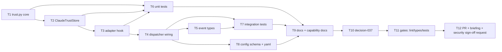

# Tasks: pre-trust the workspace before spawning a harness session

> Phase 3 of 3. Derived from [`requirements.md`](requirements.md) and
> [`design.md`](design.md). Each task names the requirements it satisfies.

## DAG

## Tasks

- [x] **T1 — `trust.py`: `TrustConfig`, `TrustResult`, safe JSON update.**
  New module with the two dataclasses (`from_mapping`, `merge`) and the private
  `_update_json` helper: missing→`{}`, unparseable→error-without-writing,
  no-change→no-write, temp-file + `os.replace`, `0600` on creation, per-path
  `threading.Lock`. *(R3.2, R3.3, R3.4, R1.5)*

- [x] **T2 — `trust.py`: `ClaudeTrustStore`.**
  Path resolution (`CLAUDE_CONFIG_DIR`, `.config.json` preference, settings
  file), `project_keys()` (exact dir + realpath, never a parent), `trust()` and
  `accept_bypass_permissions()` (settings key + legacy config key).
  *(R1.1, R1.2, R1.3, R2.2, R3.7)*

- [x] **T3 — adapter hook.**
  `HarnessAdapter.__init__(..., trust=None)` + `prepare_environment(cwd)`
  returning a no-op `TrustResult`; `ClaudeCodeAdapter.prepare_environment`
  delegating to `ClaudeTrustStore`, with `_wants_bypass()` honouring
  `auto | always | never` and recognising both bypass spellings;
  `build_adapters(harness_args, trust=None)`. *(R2.1, R2.3, R2.4, R3.1, R3.6)*

- [x] **T4 — dispatcher wiring.**
  `RoutingConfig.harness_trust` (+ `from_mapping`), pass it through
  `build_adapters` in `__init__` and `reload`, and call the new private
  `_prepare_environment(adapter, work_item, cwd)` from `_spawn_for` (before
  either runner) and from `_respawn_tmux`. Never raises, never changes the
  dispatch outcome. *(R1.1, R1.4, R3.1, R3.4)*

- [x] **T5 — event types.**
  `workspace.trusted` / `workspace.trust_failed` in `eventlog.EVENT_TYPES`.
  *(R3.5)*

- [x] **T6 — unit tests (`cli/tests/test_trust.py`).**
  Every bullet in design §7's unit list, including the trust-creep guard and the
  "no bypass flag ⇒ settings untouched" assertion. Fake HOME via `monkeypatch`;
  no test may touch a real `~/.claude.json`. *(all)*

- [x] **T7 — integration tests (`cli/tests/test_trust_integration.py`).**
  The four Gherkin scenarios from design §7, including the ordering assertion
  (prepared **before** spawn) and the failure-does-not-fail-dispatch scenario.
  *(R1.1, R1.4, R3.1, R3.4, R3.5)*

- [x] **T8 — config surface.**
  `routing.harnessTrust` in `.the-loop/cli-config.schema.json` and the dogfooded
  block in both `.the-loop/cli-config.yaml` and the scaffolding template
  `skills/the-loop/templates/cli-config.yaml`, commented with *why* it exists.
  *(R2.4, R3.1)*

- [x] **T9 — documentation.**
  `cli/README.md`, `skills/the-loop/reference/observability.md` (event types),
  `skills/the-loop/reference/automation.md`, and the capability docs
  (`interactive-sessions.md`, `webhook-triggers.md`) with history rows —
  same-PR rule.

- [x] **T10 — `docs/decisions/decision-037.md`** (+ index row): pre-seed the
  harness's own config before spawning, with the alternatives from design §8 and
  the residual concurrent-write risk.

- [x] **T11 — gates.** `ruff`, `pyright`, `pytest`, `markdownlint` from the repo
  root; execution log updated.

- [x] **T12 — PR + reviewer briefing**, explicitly requesting the tier-4 named
  human **security sign-off** (`security.review.humanSignOffMinTier: 4`).

## Review follow-ups (added after PR #92 feedback)

- [x] **T13 — rebase onto #91 (issue-89).** Resolve the `_respawn_tmux` conflict
  by placing `_prepare_environment` above `_try_resume`, so it precedes *every*
  harness start rather than only the fresh-spawn fallback; strengthen the
  respawn assertion to cover all recorded starts. *(R1.4)*

- [x] **T14 — configurable trust scope, defaulting to the workspace root**
  (owner decision on PR #92). `harnessTrust.scope: workspace-root | directory`;
  `ClaudeTrustStore.trust(cwd, root)` writing the trust key on the root and the
  onboarding key per directory; `is_within` / `is_too_broad` guard rails and
  `Dispatcher._trust_root()`; schema + both yamls + README + capability docs +
  decision-037's "Scope: the owner's call" section; 10 new tests.
  *(R1a.1–R1a.6)*
