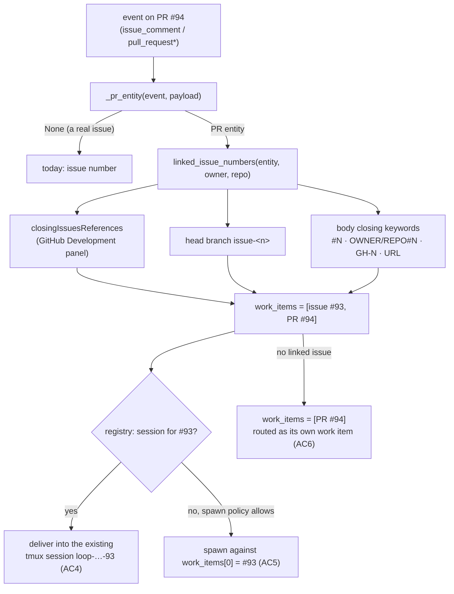

# Design: resolve a PR's linked issues first, so PR events reuse the issue's session

> Phase 2 of 3 (bugfix → design → tasks). Derives from the approved bugfix spec.

## Overview

The whole fix lives in **one shared seam** plus one provider enrichment:

1. **`webhook/router.py` — `extract_work_items`** learns (a) that an
   `issues`/`issue_comment` event whose `issue` carries a `pull_request` key is
   a **PR event**, (b) how to read GitHub's own `closingIssuesReferences`, (c) a
   wider but repo-qualified closing-keyword grammar, and (d) to emit **linked
   issues before the PR number**.
2. **`poller/github.py` — `GitHubPollProvider`** asks `gh` for
   `closingIssuesReferences` in the PR listing it already performs, and injects
   it into the webhook-shaped payload it synthesises.

Nothing else changes. `Dispatcher.handle` already iterates *all* of an event's
work items and enqueues into every matched session, and `_on_unmatched` already
spawns for `work_items[0]` — so reordering the list is what turns "spawn a
second session for the PR" into "reuse the issue's session" (AC4) and
"spawn against the issue" (AC5). `Poller._process_item` already computes
`has_session` across all refs, so it inherits the fix for free.



## 1. Router: what counts as a PR event

```python
def _pr_entity(event: str, payload: dict) -> Optional[dict]:
    """The pull-request-shaped entity this event concerns, or None."""
    if event.startswith("pull_request"):
        return payload.get("pull_request") or None
    if event in ("issues", "issue_comment"):
        issue = payload.get("issue") or {}
        if issue.get("pull_request"):   # GitHub delivers PR conversation
            return issue                # comments as issue_comment
    return None
```

The `issue_comment`-on-a-PR entity is the `issue` object: it carries `number`
(the PR's), `body` (the **PR description**) and `labels` (the PR's) — enough for
closing-keyword and `closingIssuesReferences` resolution. It has no `head`, so
the branch convention simply yields nothing there; the webhook `pull_request*`
payloads keep supplying it. (AC1)

## 2. Router: linked-issue resolution

```python
def linked_issue_numbers(entity: dict, owner: str, repo: str) -> List[int]:
    """Issues this PR-shaped entity is linked to, most authoritative first."""
```

Sources, in order (deduplicated, `entity["number"]` itself never included):

| # | Source | Why it is here |
|---|--------|----------------|
| 1 | `entity["closingIssuesReferences"]` → `[{"number": n}, …]` | GitHub's own linkage (Development panel **and** parsed closing keywords). Authoritative. Present on the poll path (§3); absent from webhook payloads, which is why 2–3 stay. (AC2) |
| 2 | `entity["head"]["ref"]` matched by the existing `issue[-/](\d+)` | the-loop's own branch convention (`claude/github-issue-93-…`). |
| 3 | `entity["body"]` matched by the widened closing-keyword regex | The written link, in every form GitHub itself accepts. (AC3) |

The closing-keyword grammar becomes:

```python
_CLOSING_KEYWORD_RE = re.compile(
    r"\b(?:close[sd]?|fix(?:e[sd])?|resolve[sd]?)\b\s*:?\s+"
    r"(?:"
    r"https?://[^\s/]+/(?P<url_repo>[\w.-]+/[\w.-]+)/issues/(?P<url_number>\d+)"
    r"|(?P<repo>[\w.-]+/[\w.-]+)?#(?P<number>\d+)"
    r"|GH-(?P<gh>\d+)"
    r")",
    re.IGNORECASE,
)
```

- The URL alternative is tried first so a `https://…/issues/93` reference is not
  half-matched by the `#` alternative.
- `\s*:?\s+` accepts `Closes #93` and `Fixes: #93` alike.
- **Cross-repo guard (AC3):** when the match carries a qualifier (`url_repo` or
  `repo`) that is not `OWNER/REPO` of the event's repository (case-insensitive),
  the match is **dropped**. This is strictly narrower than today, where
  `Closes other/repo#5` is read as this repo's `#5`.

## 3. Poll provider: ask `gh` for the linkage

`GhClient.list_labeled_prs` already runs one `gh pr list --json …` per repo per
cycle. `closingIssuesReferences` is a documented field of that command
(`api.PullRequestFields` in `cli/cli`), so it is appended to the **existing**
field list — no extra API round-trip (AC7). `gh` flattens the GraphQL connection
to `[{"number": 93, "title": …, "url": …}, …]`.

**Old-`gh` degradation.** The field was added to `gh` relatively recently; an
older binary exits non-zero with `Unknown JSON field: "closingIssuesReferences"`.
`list_labeled_prs` therefore catches `GhError`, and **only when the message
names the field** (a precise check — a network/auth failure must still surface)
retries once with the legacy field list, latches `_no_link_field = True` on the
client so later cycles skip the doomed attempt, and logs a one-time warning
naming the upgrade. Routing then falls back to the
branch/keyword conventions — the current behaviour, never worse. (AC7)

The resolved numbers ride along as `WorkItem.raw["linkedIssues"]` and are
injected by `_item_payload` as
`entity["closingIssuesReferences"] = [{"number": n}, …]`, i.e. **the same shape
the router reads from a real webhook payload** — the provider keeps synthesising
webhook-shaped payloads and the router keeps one code path.

## 4. Ordering, and why it is the whole fix

`extract_work_items` for a PR-shaped event becomes:

```python
entity = _pr_entity(event, payload)
if entity is not None:
    for number in linked_issue_numbers(entity, owner, repo):
        add(number)          # linked issues FIRST (issue-93)
    add(entity.get("number"))
elif event in ("issues", "issue_comment"):
    add((payload.get("issue") or {}).get("number"))   # unchanged
```

Consequences, all of them intended:

- **`Dispatcher.handle`** matches sessions over every work item, so the issue's
  session is found and the event enqueued into it (AC4). If a session *also*
  exists for the PR ref (e.g. registered by the Jira flow) both receive it, as
  today.
- **`Dispatcher._on_unmatched`** spawns for `work_items[0]`, now the linked
  issue (AC5).
- **`Poller._process_item`** computes `has_session` over the refs, so a labelled
  PR whose issue already has a session no longer looks unmatched, and
  `_try_spawn` never fires (AC4 on the poll path). `PollState` stays keyed by
  the PR's own `item.ref`, and `delivery_status(delivery_id, refs)` already
  checks every ref, so the retry ledger keeps working across the two refs.
- **PR-close** (`_is_pr_close`) closes every matched session — unchanged, since
  the issue ref was already present for `pull_request` events.
- **A PR with no linked issue** yields `[PR]` exactly as before (AC6).

## Data model & config

No new config keys, no new event-log types, no registry schema change.
`GhItem` gains `linked_issues: List[int]`; `WorkItem.raw` gains a
`linkedIssues` entry. Both are in-process only.

## Failure modes

| Case | Behaviour |
|------|-----------|
| Old `gh` without the field | One warning, legacy field list thereafter; branch/keyword conventions still resolve the-loop's own PRs (AC7). |
| `closingIssuesReferences` present but malformed (missing/non-integer `number`) | Entry skipped; other sources still apply. |
| PR body references another repo | Dropped (AC3) — narrower than today. |
| PR linked to several issues | All are work items, most authoritative first; every matching session receives the event, and a spawn keys to the first. |
| Duplicate session already exists for the PR ref (pre-fix leftovers) | Both sessions match and receive the event; the operator closes the stray one (bugfix "Out of scope"). |

## Alternatives considered

- **Fetch the linked issue with a dedicated `gh pr view` call per event.**
  Rejected: an extra API round-trip per PR per poll cycle, and the webhook path
  (which must stay zero-API — `event_carries_label` sets that precedent) could
  not use it at all.
- **Resolve the linkage in the dispatcher instead of the router.** Rejected: the
  router is the one place both ingress paths share; splitting the knowledge
  would leave the poller's `has_session` check (which calls `provider.refs`, not
  the dispatcher) still blind.
- **Keep the PR first and teach `_on_unmatched` to prefer an issue.** Rejected:
  it would need a second notion of "which of these is the ticket" in the
  dispatcher, and would not help `Poller._process_item`. Ordering the list once,
  at extraction, fixes every consumer.
- **Re-key an existing PR-ref session onto the issue when a link appears.**
  Rejected as out of scope (bugfix) — it would break the deliberate Jira flow.

## Testing strategy

**Unit — `cli/tests/test_routing.py`** (pure `extract_work_items`):
a PR conversation comment (`issue_comment` + `issue.pull_request`) yields
`[issue, PR]`; `closingIssuesReferences` is honoured; the widened keyword forms
(`OWNER/REPO#N`, `GH-N`, `Fixes: #N`, issue URL) resolve; a cross-repo reference
is ignored; a plain issue comment is unchanged; a PR with no linkage still
yields `[PR]`.

**Unit — `cli/tests/test_poller.py`**: `GhClient.list_labeled_prs` requests
`closingIssuesReferences` and parses it; an `Unknown JSON field` error triggers
exactly one downgrade retry and is not repeated on the next call; an unrelated
`GhError` still propagates; `GitHubPollProvider.refs` puts the linked issue
first.

**Integration — `cli/tests/test_webhook_routing_integration.py`** (Gherkin
docstring + requirement link): with a session registered for the **issue**, a
labelled PR's conversation comment resumes that session and registers **no** new
session.

**Integration — `cli/tests/test_poller_integration.py`** (Gherkin docstring +
requirement link): a poll cycle over a labelled PR whose `closingIssuesReferences`
names an issue with a live session forwards the comment into that session and
spawns nothing.

Both integration tests fail before the change (a second session appears) and
pass after — AC8.

## Security design

Enforces the bugfix's threat model unchanged, and narrows one boundary:

- **Trust boundary: GitHub payload → work-item ref.** All newly-read fields
  (`issue.pull_request`, `closingIssuesReferences`, PR body) are parsed into
  **integers only**; a non-integer or absent `number` is skipped. The integer is
  formatted into `WorkItemRef`, whose `slug` is already regex-sanitised before it
  ever reaches a filesystem path or a tmux target name.
- **Ordering of guards is unchanged:** `Router.route` still runs the self-reply
  marker guard and the `authorizedUsers` guard before an event is dispatched, so
  an unauthorized actor cannot reach any session through the new resolution.
- **Narrowed, not widened:** the cross-repo qualifier check removes a
  pre-existing (if minor) mis-routing — `Closes other/repo#5` no longer resolves
  to this repo's `#5`.
- **No new I/O:** no new subprocess, no new network call, no new file. The `gh`
  invocation is the existing one with one more `--json` field, run with the same
  argv-list (no shell) and the operator's own credentials.
- **Fail-closed degradation:** an unsupported field falls back to today's
  conventions with a warning; it never causes an unbounded retry and never
  broadens what is routed.
