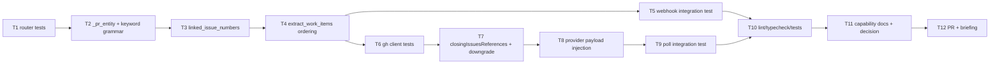

# Tasks: resolve a PR's linked issues first (issue-93)

> Phase 3 of 3. Derived from the locked `design.md`. TDD (`tdd.mode: standard`):
> the failing test comes first for every behavioural task.

## DAG

## Tasks

- [x] **T1 — Failing router unit tests.** In `cli/tests/test_routing.py`: PR
  conversation comment (`issue_comment` with `issue.pull_request`) → `[issue, PR]`;
  `closingIssuesReferences` honoured; `OWNER/REPO#N`, `GH-N`, `Fixes: #N`, issue
  URL resolve; cross-repo reference ignored; plain issue comment unchanged; PR
  with no linkage → `[PR]`. *(AC1–3, AC6, AC8)*
- [x] **T2 — `_pr_entity` + widened `_CLOSING_KEYWORD_RE`** in
  `cli/the_loop/webhook/router.py`, with the cross-repo qualifier guard. *(AC1, AC3)*
- [x] **T3 — `linked_issue_numbers(entity, owner, repo)`** — `closingIssuesReferences`
  → head branch → body keywords, deduplicated, never the entity's own number. *(AC2)*
- [x] **T4 — `extract_work_items`: linked issues before the PR number** for every
  PR-shaped event; non-PR events unchanged. *(AC4, AC5, AC6)*
- [x] **T5 — Webhook integration test** (`test_webhook_routing_integration.py`,
  Gherkin + requirement link): a labelled PR's conversation comment resumes the
  **issue's** session; no new session is registered. *(AC4, AC8)*
- [x] **T6 — Failing `GhClient`/provider unit tests** (`cli/tests/test_poller.py`):
  the PR listing requests `closingIssuesReferences`; an `Unknown JSON field` error
  downgrades exactly once and is not retried on the next call; an unrelated
  `GhError` still propagates; `refs()` puts the linked issue first. *(AC7)*
- [x] **T7 — `GhClient.list_labeled_prs`**: request + parse the field, with the
  latched one-time downgrade and warning. *(AC7)*
- [x] **T8 — Provider plumbing**: `GhItem.linked_issues`,
  `WorkItem.raw["linkedIssues"]`, `_item_payload` injecting
  `closingIssuesReferences`. *(AC2, AC7)*
- [x] **T9 — Poll integration test** (`test_poller_integration.py`, Gherkin +
  requirement link): a labelled PR whose linked issue has a live session forwards
  the comment into it and spawns nothing. *(AC4, AC8)*
- [x] **T10 — Green gates**: `ruff`, `pyright`, `pytest`, `markdownlint` from the
  repo root (`hooks.prePush` parity).
- [x] **T11 — Docs**: update `docs/capabilities/webhook-triggers.md` (current
  behaviour + history row) and record the routing-precedence decision in
  `docs/decisions/`.
- [x] **T12 — PR + reviewer briefing** from
  `skills/the-loop/templates/pr-briefing.md`, phase label → `loop:needs-review`.
