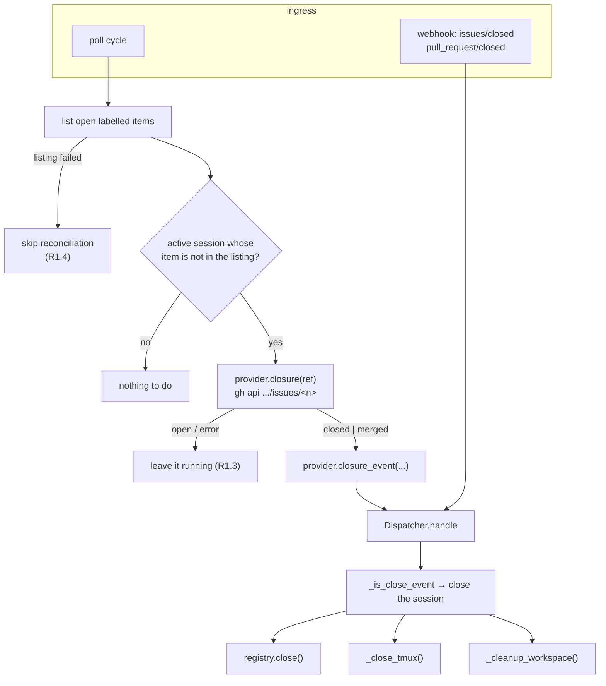

# Design: closing a work item ends its harness session (poller + tmux)

> Phase 2 of 3 (requirements → design → tasks). Derives from `requirements.md`.

## Overview

Four seams. The first two make a closure *reach* the dispatcher from both
ingress paths; the third makes the close actually end the conversation; the
fourth makes the retained record read-only.

1. **`poller/base.py`** — the provider contract grows a closure trio:
   `owns(ref)`, `closure(ref) -> Optional[Closure]` and
   `closure_event(ref, closure)`. Defaults mean "this provider does not do
   closure reconciliation" so nothing else has to change for it.
2. **`poller/github.py` + `poller/poller.py`** — GitHub answers the closure
   question through one `gh api repos/{o}/{r}/issues/{n}` call (the REST issues
   endpoint answers for PRs too, carrying `pull_request.merged_at`), and the
   poller core reconciles *active registry sessions* against the open listing
   after every successful discovery pass.
3. **`webhook/dispatcher.py` + `webhook/router.py` + `runner.py`** — the
   auto-close rule generalises from "PR closed" to "work item closed"
   (`issues`/`closed` too), and closing a **retained** tmux session now
   terminates the harness process inside its pane
   (`TmuxRunner.terminate_harness`) instead of leaving a live TUI behind.
4. **`commands/sessions_cmd.py`** — `sessions close` uses the same termination,
   and `sessions attach` forces `-r` for a closed session.



## 1. Provider contract — closure

```python
# poller/base.py
@dataclass(frozen=True)
class Closure:
    """Why a work item is no longer open (provider-neutral)."""
    state: str          # "closed" | "merged"
    kind: str = ""      # provider vocabulary, e.g. "issue" | "pull-request"
    title: str = ""
    url: str = ""

class PollProvider:
    def owns(self, ref: WorkItemRef) -> bool:
        """Whether ``ref`` falls inside this source's configured scope."""
        return False

    def closure(self, ref: WorkItemRef) -> Optional[Closure]:
        """Ask the backing system whether ``ref`` has ended. ``None`` = still
        open (or this provider does not answer closure questions)."""
        return None

    def closure_event(self, ref: WorkItemRef, closure: Closure) -> RoutedEvent:
        raise NotImplementedError
```

`owns` defaulting to `False` is what makes this backwards-compatible: the
poller skips reconciliation entirely for a provider that has not opted in
(R1.7). A provider that raises `ProviderError` from `closure` is treated as
"cannot answer" (R1.3).

GitHub's implementation:

- `owns(ref)` — `ref.provider == "github"` and `owner/repo` is one of the
  source's configured repos (case-insensitive, as GitHub is).
- `closure(ref)` — `gh api repos/{owner}/{repo}/issues/{number}`. One endpoint
  covers both kinds: on GitHub's REST API a pull request *is* an issue, and the
  response carries a `pull_request` object whose `merged_at` distinguishes
  merged from closed. `state != "closed"` ⇒ `None`.
- `closure_event(ref, closure)` — the same webhook shape the dispatcher already
  consumes: `pull_request`/`closed` (with `merged`) for a PR, `issues`/`closed`
  for an issue, `work_items=[ref]`, `labeled=False`, delivery id
  `poll-close-<ref>-<state>` (stable, so a repeat within the dedup window is a
  no-op).

## 2. Poller — reconcile sessions against the open listing

```python
# poller/poller.py — inside _poll_provider, after a SUCCESSFUL list_work_items()
open_refs = {r.ref for item in items for r in provider.refs(item)}
...                                   # existing per-item processing
self._reconcile_closures(provider, open_refs, summary)
```

`open_refs` is built from `provider.refs(item)` — an item's *linked* refs, not
just its own — so a session registered against issue #94 is left alone while its
PR #95 is still open and labelled (the work is still live), and is reconciled
once that PR is gone from the listing too.

```python
def _reconcile_closures(self, provider, open_refs, summary):
    for session in self.registry.list_sessions(status="active"):
        ref = session.work_item
        if ref.ref in open_refs or not provider.owns(ref):
            continue
        closure = provider.closure(ref)     # ProviderError → log, keep, retry
        if closure is None:
            continue                        # still open / unknowable (R1.3)
        self.dispatcher.handle(provider.closure_event(ref, closure))
        self.state.forget(ref.ref)          # a reopen is first-sight again (R1.5)
        summary.closures += 1
```

Three properties fall out of where the call sits:

- it runs **only after a successful listing** (the `ProviderError` path returns
  before it) — R1.4;
- it is **registry-driven**, so it catches items that vanished while the poller
  was down, not just ones it watched close — the poller has no memory to lose;
- it costs **one API call per active session that is not in the listing**, i.e.
  zero on a steady-state cycle where every session's item is still open.

`PollState.forget(ref)` drops the item's whole ledger entry (seen comments,
attempt counters, spawn state).

`PollSummary` grows a `closures` counter, logged in the cycle line and on
`poll.cycle`.

## 3. Dispatcher/router/runner — close means close

### 3.1 Generalised close detection

```python
# dispatcher.py
_CLOSE_EVENTS = ("issues", "pull_request")

def _is_close_event(routed) -> bool:
    return routed.event in _CLOSE_EVENTS and routed.action == "closed"

def _close_reason(routed) -> str:
    if routed.event == "issues":
        return "issue-closed"
    return "pr-merged" if (routed.payload.get("pull_request") or {}).get("merged") else "pr-closed"
```

`handle()`'s existing close branch switches to `_is_close_event` and records
`reason=` on `session.autoclosed` (R2.4). Everything else about that branch —
close the registry entry, handle tmux, clean the workspace, never spawn — is
unchanged, so the poller's synthesised events and real webhooks take exactly
the same path.

`router.py`'s authorization exemption widens the same way: `is_lifecycle_close`
covers `issues`/`closed` as well as `pull_request`/`closed` (R2.3).

### 3.2 Ending the harness in a retained session

```python
# dispatcher.py
def _close_tmux(self, session):
    if not self.config.tmux.keep_session_on_close:
        ... existing kill-session path ...        # R3.3
        return
    if self.config.tmux.kill_harness_on_close:
        result = self.tmux.terminate_harness(
            session,
            grace=self.config.tmux.harness_kill_grace_seconds,
            timeout=self.config.dispatch_timeout_seconds,
        )
        eventlog.emit("session.harness_terminated", ...)   # or a warning line
    eventlog.emit("session.retained", ...)                 # unchanged
```

```python
# runner.py
def terminate_harness(self, session, grace=5.0, timeout=None,
                      sleeper=time.sleep, killer=os.kill) -> TmuxResult:
    target = session.tmux_target
    if not self.has_session(target):
        return TmuxResult(ok=True, session_missing=True, error=...)
    self._set_remain_on_exit(target, timeout)        # R3.2 — keep the scrollback
    pids = self.live_pane_pids(target)               # list-panes -F '#{pane_pid} #{pane_dead}'
    if not pids:
        return TmuxResult(ok=True)                   # already dead — nothing to do
    self._signal(pids, signal.SIGTERM, killer)
    for _ in range(int(max(0.0, grace) / _TERMINATE_POLL_SECONDS)):
        if not self.has_live_session(target):
            return TmuxResult(ok=True)
        sleeper(_TERMINATE_POLL_SECONDS)
    self._signal(self.live_pane_pids(target), signal.SIGKILL, killer)   # escalate
    return TmuxResult(ok=not self.has_live_session(target), error=...)
```

Notes on the shape:

- **`remain-on-exit` is re-set first**, not assumed: without it, killing the
  process would close the pane, close the window and take the whole session —
  and with it the transcript the retention exists for (R3.2).
- **Pids come from tmux, per pane, for this target only** (R3.6), and the target
  must look like a the-loop session (`^loop-[A-Za-z0-9._-]+$`) before any pane is
  listed — the registry is a plain file, and this step reaches *OS processes*, so
  a hand-edited `tmuxTarget` naming the operator's own tmux session must not be
  able to redirect a SIGTERM into it. A dead pane's pid is skipped, a
  non-positive one is dropped (`os.kill(0, …)` signals the caller's whole process
  group), and `ProcessLookupError`/`PermissionError` are caught and logged, never
  raised (R3.4).
- **The grace loop counts steps, not wall-clock**, so an injected `sleeper` in
  tests cannot spin: `grace=0` sends SIGTERM, skips the wait and escalates
  immediately.
- **`has_live_session` degrades to "live"** when it cannot read pane state (a
  tmux too old for `#{pane_dead}`) — inherited from issue-86. The worst case is
  therefore an unnecessary SIGKILL to a process that is already gone, which
  `ProcessLookupError` swallows.
- Cursor is not special-cased: the pane's process is whatever the-loop spawned
  there, so this is harness-neutral by construction.

### 3.3 `sessions close` / `sessions attach`

`sessions close` gains the same behaviour so the manual path and the automatic
path cannot drift: keep ⇒ terminate the harness (unless `killHarnessOnClose` is
false) and report it; `--kill-tmux` ⇒ today's `kill`. `attach_session` forces
`read_only=True` when `session.status != "active"` and says so in the existing
note (R4.1).

### 3.4 The event filter must be able to *see* a close

A close only reaches the receiver if `webhooks.ghWebhook.events` lets it
through, and nothing enforced that (PR #96 review). Two small changes in
`commands/gh_webhook.py`:

```python
DEFAULT_EVENTS = ["issues", "issue_comment", "pull_request",
                  "pull_request_review", "pull_request_review_comment",
                  "workflow_run", "check_run", "check_suite", "status"]
_LIFECYCLE_EVENTS = ("issues", "pull_request")

def resolve_events(cfg):            # omitted/empty -> the default set
    return [str(e) for e in (cfg.get("events") or []) if e] or list(DEFAULT_EVENTS)

def warn_on_missing_lifecycle_events(events):   # explicit list dropped a close
    ...
```

`DEFAULT_EVENTS` is exactly the set `extract_work_items` can resolve, so
replacing the old "empty = accept anything" with it changes no outcome —
anything outside the set could only ever be dropped as `no-work-item` — while
making `issues`/`pull_request` present by construction. Resolution stays in the
command layer: `Router(events=[])` keeps its "no filter" meaning for embedders.
Both the initial build and the hot-reload path (`apply`) run the check, so an
edit that drops a lifecycle event warns without a restart.

## 4. Configuration

Two additive keys under `routing.tmux`, defaulted to the behaviour the issue
asks for:

| Key | Type | Default | Meaning |
|-----|------|---------|---------|
| `killHarnessOnClose` | boolean | `true` | End the harness process inside a **retained** tmux session when the work item closes. `false` = pre-issue-94 behaviour (a live TUI is left behind). |
| `harnessKillGraceSeconds` | number ≥ 0 | `5` | How long SIGTERM is given before SIGKILL. `0` escalates immediately. |

Both are parsed by `TmuxConfig.from_mapping` and therefore hot-reload with the
rest of `RoutingConfig`.

## Decisions

- **Reconcile from the registry, not from a diff of listings.** A remembered
  "was open last cycle" set would miss everything that closed while the poller
  was down and would need its own persistence. The registry already knows every
  session that should be alive, so the reconciliation is stateless and
  self-healing after a restart.
- **One `gh api .../issues/<n>` call rather than `gh issue view` /
  `gh pr view`.** The registry ref does not record whether the item is an issue
  or a PR, and `gh issue view` refuses PR numbers (and vice-versa). The REST
  issues endpoint answers for both and distinguishes merged via
  `pull_request.merged_at` — one call, no kind-guessing, no double round-trip.
- **Synthesise a webhook-shaped close event instead of calling a new
  `Dispatcher.close_session()`.** The dispatcher's close path already does four
  things (registry, tmux, workspace, event log) that must not fork between
  ingress paths; reusing `handle()` keeps exactly one implementation and gives
  the poller the dedup ledger for free — the same reasoning that shaped the
  poller's spawn/comment events in issue-34.
- **Terminate rather than `kill-session` when retaining.** The issue wants both
  "the claude session is definitely closed" *and* "a read-only view of what
  happened". Killing the tmux session satisfies the first and destroys the
  second; killing only the harness satisfies both, because `remain-on-exit`
  keeps the pane's scrollback (issue-86's mechanism, now doing what it was
  meant to).
- **No transcript file.** `capture-pane` to disk was considered and dropped
  (minimalism ladder: the existing retained pane already *is* the read-only
  view). Noted in requirements § Out of scope if it is ever wanted durably.
- **Default `killHarnessOnClose: true`.** The issue is explicit ("the
  claude/cursor session should definitely be closed"), and an unsupervised live
  agent is the more dangerous default. The opt-out exists for anyone relying on
  the old behaviour.

## Error handling

| Failure | Behaviour |
|---------|-----------|
| `list_work_items()` raises | Existing `poll.provider_error`; reconciliation skipped for that source this cycle (R1.4). |
| `closure()` raises `ProviderError` (404/5xx/auth/timeout) | `poll.item_error` (`will_retry=True`), session left running, retried next cycle (R1.3). |
| Provider says "still open" | Nothing; the session stays routed (label-removed items keep working). |
| `dispatcher.handle` on the closure event | Same code path as a webhook close; a stale duplicate is dropped by the deduper. |
| tmux session already gone at close | `terminate_harness` reports `session_missing`, close completes (R3.4). |
| Pane already dead / no live pids | No signal sent; close completes. |
| `os.kill` raises `ProcessLookupError` / `PermissionError` | Logged at debug/warning; close completes. |
| Harness ignores SIGTERM | SIGKILL after `harnessKillGraceSeconds`; if it *still* looks live, a warning names the target — the registry entry is closed either way. |
| `remain-on-exit` cannot be set (old tmux) | Warning (existing helper); the harness is still terminated — the scrollback may be lost, which is strictly better than a live unsupervised TUI. |

## Testing strategy

- **Unit** — `TmuxConfig` parsing of the two new keys; `_is_close_event` /
  `_close_reason`; `GitHubPollProvider.owns`/`closure`/`closure_event` over
  canned `gh api` JSON (open, closed issue, merged PR, closed-unmerged PR,
  error); `PollState.forget`; `TmuxRunner.terminate_harness` with an injected
  killer/sleeper (happy path, escalation to SIGKILL, already-dead pane, missing
  session, `ProcessLookupError`).
- **Integration** (Gherkin docstrings, per `testing.gherkinDocstrings`) —
  - poll: a session spawned for a labelled issue is closed on the cycle after
    that issue is closed, with the tmux pane's process terminated and the
    registry entry `closed`; a merged PR does the same; a listing error, an
    unanswerable closure query and a still-open (label-removed) item all leave
    the session active;
  - webhook: `issues`/`closed` closes the matching session instead of
    delivering a prompt, matches no spawn, and records `reason: issue-closed`;
  - stub-tmux: closing a retained session sends SIGTERM to the pane pid and sets
    `remain-on-exit`, without `kill-session`; `killHarnessOnClose: false` sends
    nothing; `keepSessionOnClose: false` still kills the session.
- **Regression** — the issue-86 retention scenarios and the issue-80/89 respawn
  scenarios must stay green (a retained-but-dead session still respawns on a
  later event for a *reopened* item).
