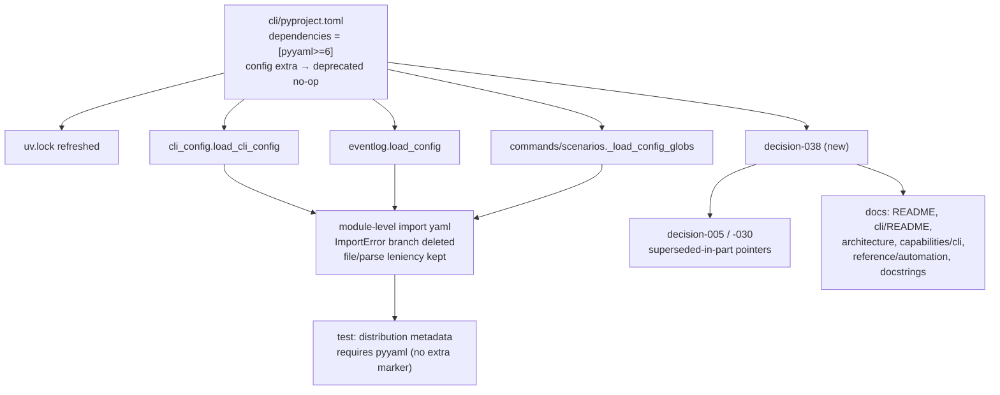

# Design: PyYAML is a required runtime dependency of the CLI

> Phase 2 of 3, derived from [requirements.md](requirements.md).

## Overview

Three edits, in dependency order: the **declaration** (`cli/pyproject.toml` +
`uv.lock`), the **code** the declaration unblocks (three optional-import guards
deleted), and the **record** (a decision doc plus every doc that repeated the old
guarantee). Nothing new is built; the change is a removal.



## Component 1 — the declaration

`cli/pyproject.toml`:

```toml
# The CLI's only runtime dependency is PyYAML — its whole configuration
# (CLI config + harness config) is YAML, so reading it is not optional
# (issue-97, decision-038). Everything else is stdlib.
dependencies = ["pyyaml>=6"]

[project.optional-dependencies]
# Deprecated no-op, kept so `pip install "the-loopy-one[config]"` (the pre-0.21
# documented line) keeps working without pip's "does not provide the extra"
# warning. PyYAML is now a required dependency.
config = []
dev = ["pytest>=8", "commitizen>=3"]
```

**Why keep an empty extra (R1.2).** pip does not fail on an unknown extra, it
warns — `WARNING: the-loopy-one 0.21.0 does not provide the extra 'config'` — and
carries on. That is cosmetically bad in every CI log that pinned the documented
line, for zero benefit. An empty extra is the standard deprecation shape, costs one
line, and can be dropped at a future major. It is listed under *Alternatives* below
because "just delete it" was the tempting option.

**Why `>=6` and not a tighter pin (R1.3).** It is the floor already declared, it is
above the CVE-2020-14343 line (fixed in 5.4), and a library floor-pin is correct for
a distributed package — the *application* pin lives in `uv.lock`, which is what this
repo and CI resolve from. PyYAML 6 supports Python ≥3.6, so `requires-python = ">=3.9"`
is unaffected (R1.4).

## Component 2 — the code

Each of the three sites collapses from a guarded local import to a module-level one.
The shape is identical everywhere; `cli_config.load_cli_config` is the only one with
subtlety:

```python
# before                                  # after
if not path.is_file():                    if not path.is_file():
    if strict: raise FileNotFoundError    #   (unchanged)
    return {}                             #
try:                                      # (import yaml moved to module scope)
    import yaml                           #
except ImportError:                       #
    if strict: raise                      #
    logger.debug("pyyaml not installed…") #
    return {}                             #
text = path.read_text()                   text = path.read_text()
if strict:                                if strict:
    return yaml.safe_load(text) or {}         return yaml.safe_load(text) or {}
try:                                      try:
    return yaml.safe_load(text) or {}         return yaml.safe_load(text) or {}
except Exception:                         except Exception:
    logger.warning("could not parse…")        logger.warning("could not parse…")
    return {}                                 return {}
```

What is **kept**, deliberately (R2.2, R2.3):

- the `path.is_file()` guard and its `strict` split — a *missing* file is a normal
  state (no config anywhere ⇒ built-in defaults), not a dependency problem;
- the broad `except Exception` around the lenient parse, with its existing
  `logger.warning` — a hand-edited, half-saved config must never break ingress;
- `strict=True` still propagating `FileNotFoundError` and `YAMLError`, so
  `the_loop.reload.Reloader` retains the last good config across a transient broken
  save. Only the `if strict: raise` for `ImportError` disappears, because
  `ImportError` can no longer be raised there.

`eventlog.load_config` and `scenarios._load_config_globs` are the same removal with
no `strict` dimension. Their `except Exception` blocks stay.

The three module docstrings that carry the *reasoning* ("the CLI has zero required
runtime deps, so a missing file or missing PyYAML degrades to `{}`") are rewritten
in the same edit — a docstring asserting a guarantee the package no longer makes is
a defect, not a comment (R3.3).

**Import cost.** PyYAML now imports on any module that touches config. `import yaml`
is ~10–15 ms cold. `cli_config` is already imported by the command registry on every
invocation, so this lands on `the-loop --help` too. That is inside the noise of
CPython's own ~120–250 ms cold start measured in decision-030 § 1, and decision-030's
lever 2 (lazy-import command modules) remains available and unaffected. Not worth a
lazy import: hiding the dependency behind a function-local import would recreate
exactly the indirection this change exists to delete.

## Component 3 — the record

A new `docs/decisions/decision-038.md`, `status: accepted`, `Revisits:` decision-005
and decision-030, stating: what the extra was for, why it stopped being optional (the
table in requirements.md § Introduction), what is retained (Python, stdlib-otherwise,
no framework), and the rejected alternatives. Indexed in `decisions.md`.

decision-005 and decision-030 get a one-line **superseded-in-part** pointer at the
top rather than an edit to their bodies (R3.2) — the decision log reads as history,
and rewriting the 2026-06-30 reasoning to match 2026-07-25 facts destroys the record
of *why* the guarantee was ever made.

Prose fixes (R3.3–R3.5), all mechanical:

| File | Change |
|---|---|
| `README.md` | "zero runtime deps" → "one runtime dependency (PyYAML)" |
| `cli/README.md` | intro line; both install blocks (`[config]` demoted to a compatibility note) |
| `docs/architecture/architecture.md` § CLI companion | same correction |
| `docs/capabilities/cli.md` | the `SHALL have zero runtime dependencies` behaviour bullet, plus a history row |
| `skills/the-loop/reference/automation.md` | "The core has **zero runtime dependencies** (stdlib only)." |
| `cli/the_loop/{cli_config,commands/gh_webhook,commands/scenarios,webhook/__init__}.py` | docstrings |

Explicitly **not** touched (R3.6): decision-016 and decision-025 describe decisions
that were sound under the rule in force at the time and whose conclusions do not
change; decision-019's zero-dep note is historical release-pipeline context. The
supersede pointer on decision-005 is what tells a reader the rule later moved.

## Testing strategy

| Requirement | Test |
|---|---|
| R1.1, R1.2, R1.3 | `test_pyyaml_is_a_required_runtime_dependency` — asserts `importlib.metadata.requires("the-loopy-one")` carries a bare `pyyaml` requirement with **no `extra ==` marker**, and that the `config` extra (if still declared) contributes nothing. Metadata is regenerated from `pyproject.toml` by the editable install, so demoting PyYAML back to an extra reddens the suite. |
| R1.4 | Covered by the same metadata assertion plus CI's existing matrix; PyYAML 6 predates and supports 3.9. |
| R2.1 | `test_cli_config.py`, `test_eventlog.py`, `test_cli.py` exercise every touched function; a leftover guard could not survive them, and `ruff` flags an unused local import. |
| R2.2, R2.3 | The **pre-existing** `test_missing_file_lenient_empty_strict_raises`, `test_unparseable_yaml_lenient_empty_strict_raises`, `test_valid_yaml_parses_full_document` and the `Reloader` tests stay green **unmodified** — that they need no edit is the evidence. |
| R2.4 | The full suite (406 tests) staying green in an environment that has PyYAML is the assertion. |
| R3.* | Docs; `markdownlint` in `make check` covers format, review covers content. |

No new test *file* is warranted for one metadata assertion; it belongs beside the
other packaging-metadata test in `cli/tests/test_cli.py` (which already asserts
`--version` derives from `importlib.metadata`, issue-78).

## Security design

Enforcing the requirements' threat model:

- **The parser boundary is unmoved.** `yaml.safe_load` at all three sites, before
  and after. No call site is added; a `safe_load`-only rule is now easier to hold
  because there is one import to grep for instead of three guarded ones.
- **The trust boundary is unmoved.** Only operator-local config files are parsed.
  Webhook payloads go through `json.loads` (stdlib) on a different path entirely and
  never reach `yaml`.
- **Fail-loud replaces misleading-empty — but no hole is closed.**
  `routing.authorizedUsers` (decision-023's prompt-injection allow-list) reads as
  empty when PyYAML is missing, and an empty allow-list **denies** every
  human-authored action (`authz.is_authorized`), with a startup warning. So the old
  behaviour was availability-failing, not security-failing, and this change is not
  a security fix. It removes a diagnostic that pointed the operator at a key they
  had already set.
- **Supply chain.** One dependency added, no transitives. Floor `>=6`; exact version
  pinned in the committed `uv.lock` for this repo and CI (decision-009's no-drift
  rule), so a supply-chain change is a reviewable lockfile diff.
- Risk tier 3 < `security.review.humanSignOffMinTier` (4): no named human security
  sign-off required.

## Alternatives considered

- **Delete the `config` extra outright.** Rejected: every pinned
  `pip install "the-loopy-one[config]"` in a script or Dockerfile starts printing a
  pip warning for no gain. An empty extra is one line and removable at a major.
- **Keep the extra *and* the fallbacks, only adding the required dep.** Rejected:
  the dead branches would remain, along with the docstrings asserting a guarantee
  the package no longer makes — the maintenance cost the issue is aimed at.
- **Stay optional; make the daemons fail loudly when PyYAML is absent.** Rejected:
  it keeps the branches, adds error-handling code, and still ships a package whose
  documented install line produces a CLI that cannot be configured. Strictly more
  code for a worse outcome.
- **Write a minimal stdlib YAML subset parser.** Rejected by the minimalism ladder
  itself — the ladder ends at "existing dep" *before* "hand-rolled abstraction", and
  a hand-rolled YAML parser is a correctness and security liability (anchors,
  merge keys, quoting, multiline scalars) far exceeding one well-known dependency.
- **Switch the config format to JSON/TOML to keep zero deps** (`tomllib` is stdlib
  from 3.11). Rejected: `requires-python` is `>=3.9` so `tomllib` is not universally
  available, and it would break every existing `.the-loop/*.yaml` in the wild plus
  the schemas, templates and `/the-loop:init` — an enormous change to preserve a
  guarantee that buys nothing.
- **`ruamel.yaml` instead of PyYAML.** Rejected: heavier, and its round-trip
  comment-preserving strength is irrelevant — the CLI only reads.
- **Vendor PyYAML.** Rejected: it carries a C extension, and vendoring forfeits
  the security updates that are the main reason to depend on a maintained parser.
