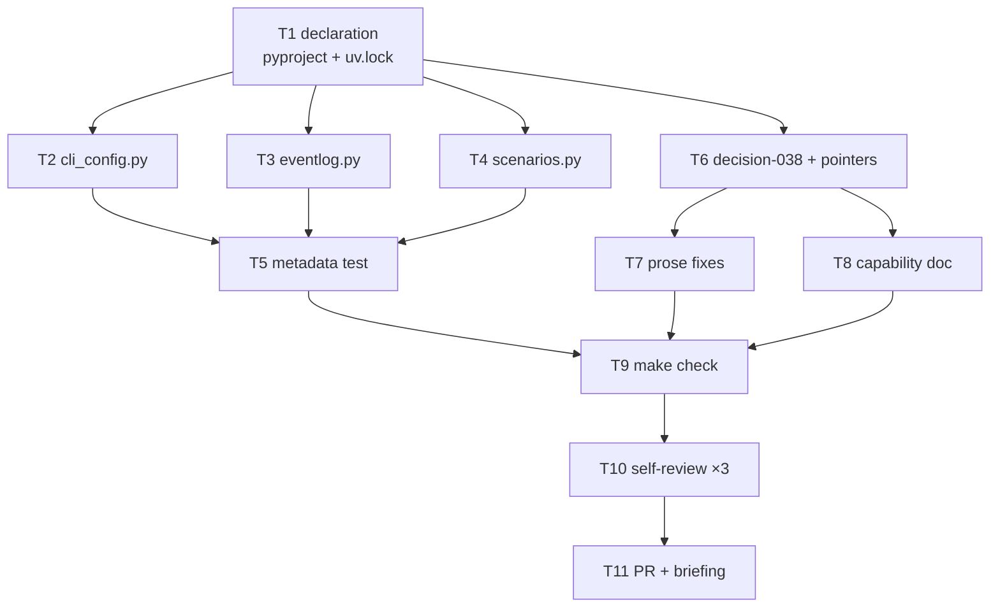

# Tasks: PyYAML is a required runtime dependency of the CLI

> Phase 3 of 3, derived from [requirements.md](requirements.md) and
> [design.md](design.md). A DAG — tasks with no unmet dependency can run in parallel.

## DAG

## Tasks

- [x] **T1 — Declare PyYAML as required.** `cli/pyproject.toml`: `dependencies =
  ["pyyaml>=6"]`, `config = []` as a deprecated no-op extra, comments updated.
  Refresh `uv.lock` via `uv sync`. *(R1.1, R1.2, R1.3, R1.4)*
- [x] **T2 — `cli_config.py`.** Module-level `import yaml`; delete the
  `try/except ImportError` in `load_cli_config`; keep the file/parse leniency and
  the `strict` semantics; rewrite the module docstring's zero-dep reasoning.
  *(R2.1, R2.2, R2.3, R3.3)*
- [x] **T3 — `eventlog.py`.** Same removal in `load_config`; update its docstring
  ("`{}` without PyYAML" is no longer how it can return `{}`). *(R2.1, R2.2, R3.3)*
- [x] **T4 — `commands/scenarios.py`.** Same removal in `_load_config_globs`;
  update the module and function docstrings. *(R2.1, R2.2, R3.3)*
- [x] **T5 — Metadata test.** `test_pyyaml_is_a_required_runtime_dependency` in
  `cli/tests/test_cli.py`: `importlib.metadata.requires("the-loopy-one")` carries a
  bare `pyyaml` requirement with no `extra ==` marker. *(R4.1)*
- [x] **T6 — decision-038 + supersede pointers.** New
  `docs/decisions/decision-038.md`; index row in `decisions.md`; a
  superseded-in-part pointer on decision-005 and decision-030. *(R3.1, R3.2)*
- [x] **T7 — Prose fixes.** `README.md`, `cli/README.md` (intro + both install
  blocks), `docs/architecture/architecture.md`,
  `skills/the-loop/reference/automation.md`, and the `webhook/__init__.py` /
  `commands/gh_webhook.py` docstrings. *(R3.3, R3.4)*
- [x] **T8 — Capability doc.** `docs/capabilities/cli.md`: correct the zero-dep
  behaviour bullet and the header line; add the issue-97 history row. *(R3.5)*
- [x] **T9 — Local gate.** `make check` green: ruff, markdownlint, `ruff format
  --check`, pyright, config validation, pytest — including the pre-existing YAML
  tests unmodified. *(R2.4, R4.2)*
- [x] **T10 — Self-review cycles** (`reviews.selfReviewCount: 3`, one with the
  security lens), findings recorded in the execution log.
- [x] **T11 — PR + reviewer briefing**, phase label → `loop:needs-review`.
