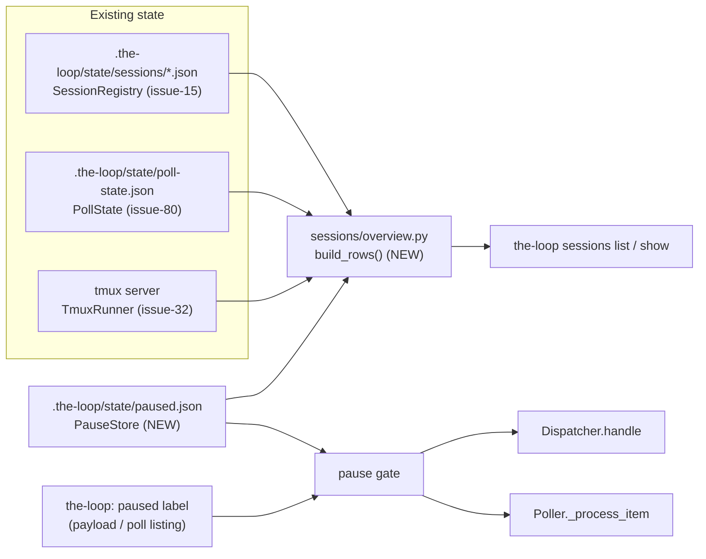

# Design: `the-loop sessions` — one place to see and manage tracked work

> Phase 2 of 3. Implements every requirement in `requirements.md`.

## 1. Shape of the change

Nothing new is invented where something already exists. The daemon already
holds every fact the table needs; they are simply scattered across three
stores and never joined:



Four pieces of new code:

| Module | Role |
|---|---|
| `the_loop/sessions/pauses.py` | `PauseStore` — the durable pause ledger + the label/local OR gate. |
| `the_loop/sessions/overview.py` | `Row` + `build_rows()` + `render_table()` — joins the three stores into the table (pure, unit-testable, no argparse). |
| `the_loop/labels.py` | `GitHubLabeler` — best-effort label create/add/remove through the operator's `gh`. |
| `the_loop/commands/labels.py` | `the-loop labels ensure` — creates the operational labels (init/onboarding). |

and four touched: `sessions/registry.py` (three new recorded fields),
`webhook/dispatcher.py` (pause gate + PR linkage + owner pid),
`poller/poller.py` (pause gate), `commands/sessions.py` (new subcommands).

## 2. The pause ledger (`sessions/pauses.py`)

One JSON file, default `.the-loop/state/paused.json` (`routing.pauseFile`), atomic
write via tempfile + `os.replace` — the same pattern as `SessionRegistry._write`
and `PollState.save`:

```json
{
  "paused": {
    "github:MadaraUchiha-314/the-loop#98": {
      "reason": "waiting on the design review",
      "pausedAt": "2026-07-25T22:10:00Z"
    }
  }
}
```

A **single file**, not file-per-ref like the registry: a pause is a tiny record,
the whole set is read on every poll cycle, and (unlike sessions) two daemons do
not race to write it — writes come from human-driven CLI invocations.

```python
class PauseStore:
    def __init__(self, path, paused_label: str = ""): ...
    def is_paused(self, ref) -> bool                     # local record only
    def state(self, ref, labels=()) -> PauseState        # local OR label (R5.3)
    def pause(self, ref, reason: str = "") -> bool       # False = already paused
    def resume(self, ref) -> bool                        # False = was not paused
    def record(self, ref) -> Optional[PauseRecord]
    def list_paused(self) -> List[PauseRecord]
```

`PauseState` carries `paused: bool` and `sources: List[str]` (`"local"`,
`"label"`), which is what R5.5 renders.

**Freshness.** The daemon is long-lived and the CLI writes the file
out-of-process, so the store re-reads when the file's `(st_mtime_ns, st_size)`
changes — checked on each query, one `stat` per poll cycle. **Failure mode
(R-security/availability):** a missing file means nothing is paused; an
unreadable/corrupt one logs a warning once and is treated as empty. Never
"everything paused", never an exception into the poll loop.

**Label side (R5.1/R5.2).** `PauseStore.state()` takes the labels the caller
already has:

- dispatcher — `event_carries_label(payload, paused_label)` from
  `webhook/router.py`, the exact helper auto-execute gating uses (no API call);
- poller — `item.labels`, already fetched by the listing each cycle.

## 3. Enforcing the pause

### 3.1 Dispatcher (webhook + poll both flow through it)

In `Dispatcher.handle`, after dedup and after the **close-event branch** — so
R3.6 holds by construction (a closure is processed even while paused):

```python
if not _is_close_event(routed):
    paused = self._paused_refs(routed)      # any ref paused, by label or record
    if paused:
        eventlog.emit("dispatch.dropped", reason="paused", ...)
        self.deduper.discard(routed.delivery_id)   # a resume must not find it "seen"
        return
```

Discarding the delivery id matters: the in-memory deduper is what
`delivery_status()` reads, and a paused drop must look like "not handled", not
like "in flight".

### 3.2 Poller

`Poller._process_item` gates in one place, immediately after the item's comments
are listed:

```python
if self.pauses.state(ref, item.labels).paused:
    if self.state.is_known(ref):
        self.state.baseline_comments(ref, live_ids, _utcnow())   # R3.4
    return
```

Two cases, and the difference matters:

- **already tracked** — keep the baseline current, so a resume does not replay
  everything said during the pause (R3.4);
- **never seen** — leave *no* trace. Baselining a first-sight item would make it
  "known but dormant", and the poller only ever wakes a dormant item on new
  activity (issue-80's spawn arming) — so a pause on an unspawned item would
  quietly become permanent. Untouched, it is still first-sight when resumed and
  gets its session then.

`_reconcile_closures` is untouched (R3.6).

The poller reads `routing.pauseFile` / `routing.pausedLabel` from the same
routing block the dispatcher does, so one config drives both ingress paths.

### 3.3 What pause does *not* touch

No session close, no tmux kill, no harness termination, no workspace cleanup
(R3.5) — the pause gate returns *before* any of those, and none of them are
reachable from the dropped path.

## 4. New recorded session fields (`sessions/registry.py`)

Three additions to `Session`, all optional and all defaulted so **existing
registry files load unchanged**:

| Field | JSON key | Written by | Why |
|---|---|---|---|
| `owner_pid: int = 0` | `ownerPid` | dispatcher at spawn/respawn (`os.getpid()`) | R2.3 — the daemon process hosting a `runner: process` session. |
| `pr_ref: str = ""` | `prRef` | `SessionRegistry.link_pr()` | R2.4 — the PR observed for this work item. |
| `pr_url: str = ""` | `prUrl` | ditto | R2.4 — clickable. |

`link_pr(work_item, pr_ref, pr_url)` is a no-op when unchanged, so it costs one
read (not a write) per event once a PR is known.

**Where the PR comes from.** `Dispatcher.handle` already receives events whose
payload carries `pull_request` (PR events, and issue-93's PR→issue routing puts
the issue's session on the matched list). When a matched session's own ref is
not the PR's, the PR is recorded against it. This is *observation*, not
inference: nothing is guessed from branch names here — issue-93's linkage
already decided which session the PR belongs to.

## 5. The table (`sessions/overview.py`)

```python
@dataclass
class Row:
    ref: str; url: str; kind: str
    status: str          # active | paused | closed | tracked | spawn-failed
    harness: str; session_id: str; runner: str
    host: str            # "tmux:loop-…" | "process:1234" | "-"
    host_live: Optional[bool]
    attach: str          # tmux attach command, "" when not applicable
    pr_ref: str; pr_url: str
    pause_sources: List[str]; pause_reason: str
    last_event_at: str; created_at: str; cwd: str
    tracked: bool; spawn_attempts: int; spawn_gave_up: bool
    def to_dict(self) -> dict          # --format json (R1.4)
```

`build_rows(registry, poll_state, pauses, tmux=None, status=None)`:

1. one row per registry session (`list_sessions()`);
2. one row per poll-state ref with no registry session → `status="tracked"`, or
   `"spawn-failed"` when `spawn_gave_up` (R1.3);
3. a session row's status becomes `paused` when the pause gate says so — the
   label is not available to the CLI without an API call, so the CLI checks the
   **local** record (and `show` says so); label-only pauses surface in `show`'s
   hint text rather than being invented;
4. `host`/`host_live`/`attach`: `tmux` sessions resolve through
   `TmuxRunner.has_live_session()`/`live_pane_pids()` when tmux is available,
   else `host_live=None` ("unknown", rendered `?`); `process` sessions use
   `owner_pid` with an `os.kill(pid, 0)` liveness probe;
5. sorted: active first, then paused, tracked, spawn-failed, closed; each group
   by most-recent activity.

`render_table(rows)` computes column widths and joins with two spaces — the
existing `_list` formatting, extracted and widened. Long ids are elided
(`…`) to keep the table readable; `--format json` and `show` carry the full
values (R1.5).

The URL is derived from the ref (`https://github.com/OWNER/REPO/issues/N`) for
`provider == "github"` only; other providers render `-` (R2.1).

## 6. CLI surface (`commands/sessions.py`)

| Command | Behaviour |
|---|---|
| `sessions list [--status S] [--format table\|json] [--work-item REF]` | R1/R2 table. Now reads poll state + pauses too. |
| `sessions show --work-item REF [--format text\|json]` | R2.5 detail block. |
| `sessions pause --work-item REF [--reason TEXT] [--no-label]` | R3/R5.4. |
| `sessions resume --work-item REF [--no-label]` | R4/R5.4. |
| `sessions prune [--dry-run] [--include-retained]` | R7. |
| `register` / `attach` / `close` | unchanged. |

Exit codes follow the existing convention: `2` for a malformed ref, `1` for "no
such thing", `0` for success **and** for idempotent no-ops (R3.7, R4.3).

`pause`/`resume` print a one-line summary plus, when the label write failed, a
`note:` on stderr naming the manual `gh` fallback (R5.4).

## 7. Labels (`labels.py` + `commands/labels.py`)

`GitHubLabeler` mirrors `GitHubReactor`: an injectable `runner`, `gh` resolved
from config, every failure a logged/returned error rather than an exception.

```python
LABEL_SPECS = [                      # names come from config, not these defaults
  LabelSpec(key="autoExecute", color="0E8A16",
            description="the-loop: work this item autonomously"),
  LabelSpec(key="paused",      color="D93F0B",
            description="the-loop: pause monitoring for this item"),
]
```

- `ensure(owner, repo, specs, dry_run=False)` — `gh api repos/{o}/{r}/labels
  --paginate` to read existing names, then `gh api --method POST
  repos/{o}/{r}/labels` for each missing one. Idempotent by construction (R6.1),
  `--dry-run` lists and writes nothing (R6.2), a missing/unauthenticated `gh`
  is a hard error with the install hint reused from `check_gh_dependency`
  (R6.3).
- `add(ref, label)` / `remove(ref, label)` — `gh api --method POST
  repos/{o}/{r}/issues/{n}/labels` and `--method DELETE …/labels/{label}`.
  The **issues** endpoint deliberately: on GitHub a PR *is* an issue, so one
  path serves both kinds (the same reasoning as `GhClient.fetch_item_state`).
  A DELETE for a label that is not there returns 404 → reported as "not
  present", not an error.

Owner/repo/label are validated against an explicit pattern before entering an
argv (the security note in `requirements.md`); the ref is already
`WorkItemRef.parse`d.

`the-loop labels ensure --repo OWNER/REPO [--dry-run]` is the command form, and
step 4 of `commands/init.md` gains: create the operational labels too (R6.4).

## 8. Config (`routing.*`)

| Key | Default | Meaning |
|---|---|---|
| `pausedLabel` | `the-loop: paused` | Label whose presence pauses a work item. |
| `pauseFile` | `.the-loop/state/paused.json` | The pause ledger's path (§11). |

Added to `.the-loop/cli-config.schema.json`, `templates/cli-config.yaml` and
this repo's `.the-loop/cli-config.yaml`. Defaults preserve today's behaviour
exactly: no label present + no ledger file = nothing paused (R8.3).

## 9. Testing (`config.testing`)

Unit (`pytest`):

- `test_pauses.py` — round-trip, idempotent pause/resume, label OR local, corrupt
  file degrades to empty, mtime-based reload picks up an out-of-process write.
- `test_overview.py` — the join: registry-only, poll-only, both; `spawn-failed`;
  status filter; JSON shape; missing-field rendering; sort order.
- `test_labels.py` — ensure skips existing, creates missing, dry-run writes
  nothing, add/remove argv shape, 404 on remove is "not present", bad
  owner/repo/label rejected before argv.
- `test_sessions_cmd.py` (extends existing CLI tests) — exit codes, `--no-label`,
  `show` output, `prune` refusals.

Integration (`cli/tests/test_*_integration.py`, Gherkin docstrings per
`config.testing.gherkinDocstrings`):

- `test_pause_integration.py` —
  *Scenario: a paused work item is ignored by the poller and resumes cleanly*
  (poll → pause → comment arrives → nothing dispatched, baseline advanced →
  resume → next comment is dispatched);
  *Scenario: the paused label alone stops webhook dispatch*;
  *Scenario: a paused work item that is closed upstream still closes its session*.

## 11. Runtime-state layout (`state.py`, added in review)

PR #100 review: *"we have all these files we're tracking now — `poll-state.json`,
`poll.pid`, everything in `sessions/` — and now another one. Can we
consolidate?"* Yes: `.the-loop/` was mixing **config** an operator writes with
**state** the daemon writes, and the state half had grown a top-level path (and a
`.gitignore` line) per feature. See [decision-040](../../decisions/decision-040.md).

```text
.the-loop/
  cli-config.yaml              # config — yours
  state/                       # runtime state — the daemon's, one ignore rule
    sessions/<slug>.json       # routing.registryDir
    paused.json                # routing.pauseFile
    poll-state.json            # polling.stateFile
    poll.pid  gh-webhook.pid   # polling.pidfile / webhooks.ghWebhook.pidfile
    logs/events.jsonl          # eventLog.path
```

`the_loop/state.py` owns the table (`PATHS`: current path, pre-move path, the
config key that overrides it) and three behaviours:

```python
resolve(default, configured)   # configured wins; else new path, unless only the
                               # pre-move one exists (logged once)
plan() / migrate(dry_run)      # move pre-move state over, idempotent, never
                               # clobbering a target that already exists
running_daemons()              # live pidfiles in either layout — migrate's guard
```

Every default site calls `resolve()`: `RoutingConfig.registry_dir`/`pause_file`,
`PollConfig.state_file`, both commands' pidfile defaults, `eventlog.DEFAULT_PATH`,
and the `sessions` command's own defaults. So an operator who upgrades and edits
nothing keeps their registry, their dedup ledger and their pidfiles exactly where
they are (R9.2), and one who set an explicit path is never second-guessed (R9.3).

**Migration is a command, not a start-up side effect** (R9.6). Moving a live
registry or pidfile out from under a running daemon is how two daemons end up
believing they own the same work item — so `the-loop state migrate` refuses while
a pidfile looks alive (`--force` overrides), and `the-loop state paths` shows
which layout each entry is on.

## 10. Alternatives considered

- **A separate `the-loop status` command.** Rejected: the issue explicitly
  offers the naming choice, and `sessions` is already the noun for "what the
  daemon is doing"; a second top-level command would split the surface.
- **Pause as a registry field on `Session`.** Rejected: an operator must be able
  to pause an item that has **no session yet** (R3.7) — pause is a property of
  the *work item*, not of a session.
- **Label as the only mechanism (no local ledger).** Rejected: it would make
  every pause check an API call for the webhook path's non-GitHub refs, and
  would leave an operator with no lever when `gh` is unavailable.
- **Local ledger as the only mechanism (no label).** Rejected: the issue asks
  for the label explicitly.
- **Making `sessions list` shell out to `gh` to read live labels.** Rejected:
  the table must stay instant and offline; label-driven pauses are surfaced by
  the daemon's own drop records (`the-loop events`) and by `show`'s hint.
