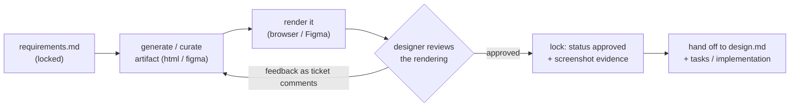

# UI/UX design artifacts reference

Config: `design.uiArtifacts` in `.the-loop/config.yaml`. This file codifies how **visual**
UI/UX design is captured, tracked and iterated in the **design phase** (issue #18), so the
essence is not lost.

## Why `design.md` alone is not enough

`design.md` is markdown + **mermaid** — perfect for architecture, HLD and LLD. It is the
wrong medium for **UI/UX** design, which is inherently visual. Modern UI/UX design is
represented as either:

- **Figma files** — the design-tool source of truth, shared as a **link**; and/or
- **HTML + CSS + JS prototypes** — increasingly how coding agents (e.g. Claude's design
  artifacts) express a rendered, clickable design that a human can open in a browser.

the-loop treats both as **first-class, tracked design-phase artifacts**, siblings of
`design.md` — not throwaway attachments. They live in the work item's spec folder, are
iterated-until-locked with the **designer** persona exactly like every other artifact, and
are referenced from the ticket (single source of truth).

## Where they live

Checked-in visual artifacts live under `<specDir>/<id>/<design.uiArtifacts.dir>/`
(default `docs/specs/<id>/design/`):

```
docs/specs/<id>/
  requirements.md
  design.md                 # architecture / HLD / LLD (markdown + mermaid)
  design/                   # UI/UX design artifacts (this reference)
    dashboard.html          # self-contained HTML+CSS+JS prototype
    checkout.html
    screenshots/            # rendered stills used as evidence
  tasks.md
  execution-log.md
```

- **HTML prototypes are checked in** (they are text, diffable, self-contained).
- **Figma is a link** recorded in `design.md`'s *UI/UX design* inventory. When a still is
  useful in the repo (for offline review / evidence), export a frame into `design/`.
- The inventory table in `design.md` is the index of every artifact, its type, location or
  link, the screens/requirements it covers, and its lock status.

## RULE: HTML prototypes are self-contained

When the format is `html` (`design.uiArtifacts.format`), a prototype is
**self-contained** (`design.uiArtifacts.selfContained`, default true) — the same
constraint Claude design artifacts render under:

- **Inline all CSS/JS**; embed assets as `data:` URIs. **No external network deps** (no
  CDN scripts, remote fonts, or fetch/XHR) so the file renders standalone in any browser
  and as a Claude-style artifact.
- **Responsive** (relative units, flex/grid, `max-width:100%` on media) and **theme-aware**
  (style light and dark) where the product is.
- Keep it a **prototype**, not production code: it communicates layout, flow, states and
  interaction — implementation derives from it, it is not lifted verbatim.

## The designer iteration loop (iterate-until-locked, applied to visuals)

Visual artifacts obey the same core rule as every artifact in the chain: **iterate with
feedback until locked (`status: approved`), then advance.** For UI/UX the feedback is on
the **rendered output**, not the raw markup:



1. **Generate / curate.** Produce the artifact from the locked requirements — an HTML
   prototype (agent-generated) and/or a Figma file (designer-authored). Record it in
   `design.md`'s UI/UX inventory as `status: draft`.
2. **Render, don't read.** The reviewer looks at the **rendered** prototype (open the HTML
   in a browser / view the Figma frame), not the source. Capture a screenshot.
3. **Designer review (paper trail).** The **designer** persona (`collaborators`, role
   `designer`) reviews. Every opinion/decision lands as a **ticket comment** — same
   paper-trail rule as any human decision. The `userInteraction` rules apply: give enough
   context to decide, educate on the low-level design choices.
4. **Iterate.** Fold feedback back into the artifact (regenerate the HTML / edit the
   Figma). Changes are **edits to the checked-in artifact, not new copies** — one
   canonical version, clean history.
5. **Lock.** When the designer approves, mark the artifact `status: approved` in the
   inventory and record the approver (paper trail). Only then does the design phase
   advance. This is gated by `workflow.requireHumanReviewPerPhase` just like `design.md`.

If no `designer` is assigned to the work item, the engineer/PM who owns the surface plays
that role — the *review-until-locked* step is what matters, not the title.

## Figma ↔ code: which is the source

- **Designer-led** work: **Figma is the source**; the link in `design.md` is canonical,
  and any checked-in HTML is a derived, illustrative export.
- **Agent-led** work (no Figma): the **self-contained HTML prototype is the source** — it
  is generated, reviewed and locked, and implementation conforms to it.

Either way the locked artifact is the **visual contract** the implementation must match —
the UI/UX analogue of contract-first APIs (`reference/testing.md`). Design-phase changes
edit the artifact; the design review reviews the rendered artifact.

## Evidence & hand-off to implementation

- **Evidence.** With `design.uiArtifacts.screenshotEvidence` (default true), rendered
  screenshots of the **locked** artifact are captured (into `design/screenshots/`) and
  embedded in the reviewer briefing (`${CLAUDE_PLUGIN_ROOT}/skills/the-loop/templates/pr-briefing.md`) so the human
  sees the intended UI at a glance, mapped to requirements.
- **Hand-off.** `tasks.md` references the locked artifact per screen/component; the
  implementation reproduces it with production components. Visual-regression / snapshot
  checks (where the stack supports them) assert the built UI against the locked design.
- **Accessibility & responsiveness are not traded away** (minimalism rule): the locked
  design states target breakpoints and keyboard/contrast intent, and implementation keeps
  them.

## How this feeds the loop

- **Design phase**: `design.md` gains a *UI/UX design* section — an inventory of the
  visual artifacts and the flows/states/design-system they cover. The artifacts live in
  `design/` and are locked with the designer before the phase advances.
- **Review/evidence**: screenshots of the locked artifacts go into the PR briefing.
- **Backwards compatible**: work items with **no user-facing surface** (backend, CLI,
  infra) simply have no `design/` folder and an empty/`N/A` UI/UX section — nothing forces
  a visual artifact.
